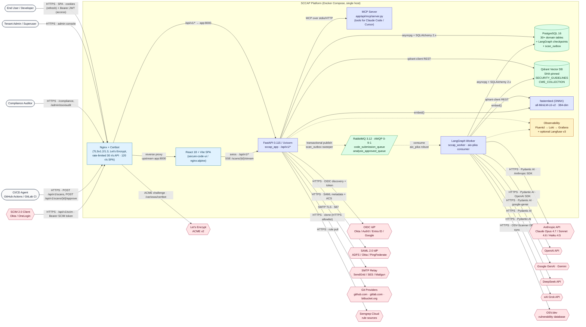

# 01 — System Overview (C4 Context)

Top-level black-box view of SCCAP. Shows every actor that talks to the system, every external service the platform depends on, and the high-level capabilities exposed across the SCCAP container boundary.

---

## Diagram

---

## Legend

### Actors

| Actor                | Authentication                    | Primary surface                                                 |
|----------------------|-----------------------------------|------------------------------------------------------------------|
| End User / Developer | Email+password, OIDC, SAML, Passkey | Submit scans, view findings, chat with advisor, download SARIF   |
| Tenant Admin         | Same + `is_superuser=true`        | Admin console: users, frameworks, agents, prompts, system config |
| Compliance Auditor   | Read-only (group-scoped)          | `/compliance`, control coverage, SSO audit log                   |
| CI/CD Agent          | Service-account JWT or API key    | Headless scan submission and result polling                      |
| SCIM 2.0 Client      | Bearer SCIM token                 | Automated user/group provisioning (`/api/v1/scim`)               |

### SCCAP boundary

| Box                   | Container name        | Image / source                                       | Listens on        |
|-----------------------|-----------------------|------------------------------------------------------|-------------------|
| Nginx + Certbot       | `sccap_ui`            | `secure-code-ui/Dockerfile` (`builder` → `nginx:alpine`) | 80, 443           |
| React SPA             | (served by `sccap_ui`) | Vite 6.3 build → `/dist`                            | n/a (static)      |
| FastAPI app           | `sccap_app`           | `Dockerfile` target `api`                            | 8000 (internal)   |
| MCP Server            | mounted inside `sccap_app` | `src/app/api/mcp/server.py`                     | shares 8000       |
| LangGraph Worker      | `sccap_worker`        | `Dockerfile` target `worker`                         | none (consumer)   |
| RabbitMQ              | `sccap_rabbitmq`      | `rabbitmq:3.12-management`                           | 5672 AMQP, 15672 mgmt |
| PostgreSQL            | `sccap_db`            | `postgres:16`                                        | 5432              |
| Qdrant                | `sccap_qdrant`        | `qdrant/qdrant@sha256:9472…`                         | 6333 (internal)   |
| fastembed (in-proc)   | bundled in app+worker | `sentence-transformers/all-MiniLM-L6-v2` (ONNX)      | n/a (library)     |
| Observability         | `sccap_fluentd`, `sccap_loki`, `sccap_grafana`, optional `langfuse-*` | see diagram 10 | 24224, 3100, 3000, 3001 |

### External systems

| External           | Protocol          | Purpose                                                                 |
|--------------------|-------------------|-------------------------------------------------------------------------|
| Anthropic API      | HTTPS · Pydantic AI · Anthropic SDK | Claude Opus/Sonnet/Haiku for analysis & chat agents      |
| OpenAI API         | HTTPS · OpenAI SDK              | Alternative analysis / chat provider                                     |
| Google GenAI       | HTTPS · `google-genai`          | Alternative analysis / chat provider (Gemini)                            |
| DeepSeek API       | HTTPS · Pydantic AI             | Alternative analysis / chat provider                                     |
| xAI Grok API       | HTTPS · Pydantic AI             | Alternative analysis / chat provider                                     |
| OIDC IdP           | HTTPS · OIDC 1.0 + PKCE         | SSO login (Okta, Auth0, Entra ID, Google Workspace, …)                  |
| SAML 2.0 IdP       | HTTPS · SAML 2.0                | SSO login via `python3-saml`                                             |
| SMTP relay         | SMTP/STARTTLS · 587             | Password-reset, scan-completion, approval-reminder emails                |
| Git providers      | HTTPS · `git clone`             | Repo ingest (github.com, gitlab.com, bitbucket.org allowlist)            |
| OSV.dev            | HTTPS                           | Dependency vulnerability database used by OSV-Scanner                    |
| Semgrep Cloud      | HTTPS                           | Cloud-hosted rule sources sync'd into `semgrep_rules` table              |
| Let's Encrypt      | ACME v2 over HTTPS              | TLS cert provisioning + auto-renewal via Certbot                         |
| SCIM 2.0 client    | HTTPS · RFC 7644                | User/group provisioning from external IAM                                |

### Edge labels of note

- **`HTTPS · SPA · cookies (refresh) + Bearer JWT (access)`** — access tokens live in `localStorage` (V15.1.5 risk-accepted); refresh tokens are HttpOnly+Secure cookies set by `/auth/refresh`.
- **`transactional publish · scan_outbox sweeper`** — the API never publishes directly to RabbitMQ; it writes a row to `scan_outbox`, then `outbox_sweeper.py` publishes durably and marks the row sent.
- **`consume · aio_pika robust`** — the worker uses `aio_pika.connect_robust` with exponential backoff and a duplicate-delivery idempotency precheck against `scans.status`.
- **`MCP over stdio/HTTP`** — the same FastAPI process mounts an MCP server so external Claude Code or Cursor sessions can hit scan/chat tools with the user's JWT.

---

## Source files

- `docker-compose.yml`
- `src/app/main.py`
- `src/app/api/v1/routers/*` (every router)
- `src/app/workers/consumer.py`
- `src/app/infrastructure/messaging/{publisher,outbox_sweeper}.py`
- `secure-code-ui/Dockerfile`, `nginx-https.conf`, `nginx-entrypoint.sh`
- `.env.example`
