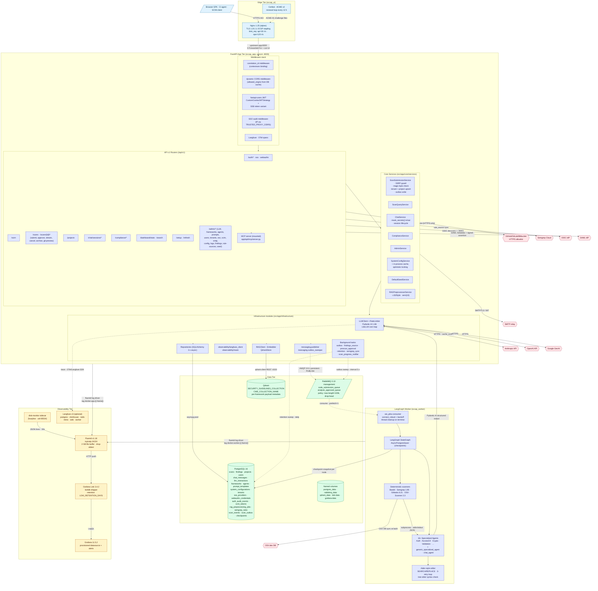

# 02 — Backend Architecture

Detailed view of every backend module, queue, store, and external dependency. Two-tier organization: **HTTP-facing app** (`sccap_app`) and **async worker** (`sccap_worker`), sharing Postgres, Qdrant and RabbitMQ.

---

## Diagram

---

## Legend

### Middleware stack (executes in this order on each request)

| Component                    | File                                                          | Role                                                                                       |
|------------------------------|---------------------------------------------------------------|--------------------------------------------------------------------------------------------|
| `correlation_id middleware`  | `src/app/api/middleware/correlation.py`                       | Mints a UUID per request, binds it via `correlation_id_var` ContextVar for structured logs |
| dynamic CORS middleware      | `src/app/main.py` lifespan + `system_config` cache            | Reads `security.allowed_origins` from `system_configurations` and applies at request time   |
| fastapi-users JWT            | `src/app/api/v1/routers/auth_*.py`                            | `CustomCookieJWTStrategy` (HttpOnly refresh cookie, Bearer access) + a `sse:scan-stream` variant for SSE |
| SSO audit middleware         | `src/app/infrastructure/auth/audit.py`                        | Writes login/MFA outcomes to `auth_audit_events` with `X-Forwarded-For` honoring `TRUSTED_PROXY_CIDRS` |
| Langfuse / OTel              | `src/app/infrastructure/observability/langfuse_client.py`     | Emits spans for every LLM call when `LANGFUSE_ENABLED=true`                                |

### API Routers (route_prefix → file)

| Prefix                                  | File                                          | Highlights                                                                 |
|-----------------------------------------|-----------------------------------------------|----------------------------------------------------------------------------|
| `/auth/login-guard`, `/auth/sso`, `/auth/webauthn` | `auth_login_guard.py`, `sso.py`, `webauthn.py` | OIDC PKCE, SAML 2.0 (python3-saml), WebAuthn passkeys (py_webauthn)        |
| `/scim`                                 | `scim.py`                                     | RFC 7643/7644 — Users + Groups + filter parsing                            |
| `/scans`                                | `projects.py`                                 | Submit, approve, cancel, stream-token, SSE stream, prescan-findings, archive preview |
| `/projects`                             | `projects.py`                                 | List, history, delete                                                      |
| `/chat/sessions`                        | `chat.py`                                     | Create, list, ask, delete, context (RAG-driven)                            |
| `/compliance`                           | `compliance.py`                               | `/stats`, `/frameworks/{name}/controls`                                    |
| `/admin/*`                              | `admin_*.py` (12 files)                       | Full admin console — see diagram 11                                        |
| `/refresh`                              | `auth_*.py`                                   | Refresh-token cookie ↔ access JWT mint                                     |
| `/setup`                                | `setup.py`                                    | First-run wizard (admin user, LLM mode, default LLM config)                |
| MCP server                              | `app/api/mcp/server.py`                       | Exposes scan + chat tools to Claude Code / Cursor; reuses JWT auth         |

### Core services

| Class                       | Path                                                                  | Notes                                                                                              |
|-----------------------------|-----------------------------------------------------------------------|----------------------------------------------------------------------------------------------------|
| `ScanSubmissionService`     | `src/app/core/services/scan/submission.py`                            | Validates upload (≤5000 files, ≤200 MB total, magic-byte block), upserts project, snapshots files, writes `scan_outbox` row inside one transaction |
| `ScanQueryService`          | `src/app/core/services/scan/query.py`                                 | Paginated history + filtering by tenant + group-visible users                                       |
| `ChatService`               | `src/app/core/services/chat_service.py`                               | Session CRUD + redacted message persistence (`mask_secrets()` both ways)                            |
| `ComplianceService`         | `src/app/core/services/compliance_service.py`                         | Per-framework rollup: control_count, findings_matched, score                                       |
| `AdminService`              | `src/app/core/services/admin_service.py`                              | Framework + agent + prompt + SSO provider + tenant CRUD                                            |
| `SystemConfigService`       | (cache in `src/app/core/services/system_config_cache.py`)             | Hot cache + optimistic-version updates; rollback DB row if cache update fails (V02.3.3)             |
| `RAGPreprocessorService`    | `src/app/core/services/rag_preprocessor_service.py`                   | Document → enriched JSON → vectors; `Semaphore(10)`, `MAX_JOB_COST_USD=25`, `MAX_DOC_TEXT_CHARS=8000` |
| `DefaultSeedService`        | `src/app/core/services/default_seed_service.py`                       | Seeds ASVS, Proactive Controls, Cheatsheets, agents, prompt templates                              |

### Infrastructure modules

| Module                                   | Role                                                                                                          |
|------------------------------------------|---------------------------------------------------------------------------------------------------------------|
| `infrastructure/llm_client.py`           | Provider-agnostic call site (Anthropic, OpenAI, Google) using Pydantic AI; Anthropic prompt caching via `cache_control` |
| `infrastructure/llm_client_rate_limiter.py` | Per-provider asyncio token bucket; configured at startup via `initialize_rate_limiters()`                  |
| `infrastructure/rag/embedder.py`         | fastembed `all-MiniLM-L6-v2` — pre-warmed at Docker build (`FASTEMBED_CACHE_PATH=/opt/fastembed-cache`)        |
| `infrastructure/rag/qdrant_store.py`     | Wraps `qdrant-client`; upsert with metadata (`framework`, `control_id`, `section`, `language`)                 |
| `infrastructure/rag/rag_client.py`       | `search_by_framework`, `search_by_control_id`, `get_framework_stats`                                          |
| `infrastructure/messaging/publisher.py`  | `aio_pika.connect_robust`, `DeliveryMode.PERSISTENT`, allowlisted payload keys                                |
| `infrastructure/messaging/outbox_sweeper.py` | Polls `scan_outbox WHERE published_at IS NULL`, publishes, marks `published_at` / `failure_count`            |
| `infrastructure/database/models.py`      | 30+ SQLAlchemy 2.x models (see diagram 13)                                                                    |
| `infrastructure/database/repositories/*` | Per-aggregate repos: `ScanRepository`, `FindingRepository`, `RAGJobRepository`, etc.                          |
| `infrastructure/observability/mask.py`   | Regex-based PII/secret redaction applied to all LLM in/out + log fields                                       |
| `infrastructure/scanners/registry.py`    | Extension → scanner mapping (1 MiB regular cap, 10 MiB minified cap)                                          |
| `infrastructure/scanners/{bandit,semgrep,gitleaks,osv}_runner.py` | Subprocess wrappers (120–180 s timeouts) with Pydantic-validated JSON output           |
| `infrastructure/scanners/staging.py`     | Stages files to a temp dir with deterministic relative paths before scanner invocation                        |
| `infrastructure/workflows/*`             | LangGraph nodes + state types (see diagram 14)                                                                |

### Background sweepers / tasks (asyncio loops)

| Task                       | Cadence  | Purpose                                                                              |
|----------------------------|----------|--------------------------------------------------------------------------------------|
| `outbox_sweeper`           | ~5 s     | Publishes any unpublished `scan_outbox` row → durable RabbitMQ delivery               |
| `findings_source_sweeper`  | ~60 s    | Normalizes legacy `findings.source` values (bandit/semgrep/gitleaks/osv)             |
| `prescan_approval_sweeper` | ~60 s    | Auto-times-out `PENDING_PRESCAN_APPROVAL` scans after 30 min                         |
| `retention_sweeper`        | daily    | Deletes rows where `expires_at <= now()` in `llm_interactions`, `chat_messages`, etc. |
| `semgrep_sync_sweeper`     | hourly   | Pulls rules from Semgrep Cloud per active `SemgrepRuleSource`                        |
| `scan_progress_notifier`   | event-driven | Persists `ScanEvent` rows from LangGraph callbacks → SSE stream                  |

### Data tier

| Store         | Notes                                                                                                                          |
|---------------|--------------------------------------------------------------------------------------------------------------------------------|
| PostgreSQL 16 | `postgresql+asyncpg://`; Alembic migrations under `/alembic/versions/`. Holds business state **and** LangGraph `checkpoints` table |
| RabbitMQ 3.12 | Three named queues; `sccap-bounded-queues` policy enforces `max-length=100000` + `overflow=drop-head`                          |
| Qdrant        | SHA256-pinned, mandatory `QDRANT_API_KEY`, internal-only (no host port)                                                        |
| Volumes       | Persistent Docker named volumes — see diagram 12                                                                               |

### Observability tier (full detail in diagram 10)

| Service        | Role                                                                                                         |
|----------------|--------------------------------------------------------------------------------------------------------------|
| Fluentd        | Docker `fluentd` log driver target; ships to Loki; protects itself with file buffer + drop-oldest             |
| Loki           | Log store with retention compactor (`LOKI_RETENTION_DAYS`)                                                   |
| Grafana        | Dashboards + provisioned alerts (`sccap-host-disk-warn/crit`, `sccap-fluentd-buffer-overflow`)               |
| disk-monitor   | 30-second emitter of `df` output to Fluentd                                                                  |
| Langfuse v3    | Optional self-hosted LLM observability (Postgres + ClickHouse + Redis + MinIO + web + worker)                |

### Worker tier (full detail in diagram 14)

The worker runs the same Python package but a different entrypoint: `python -m app.workers.consumer`. It consumes a RabbitMQ message, looks up the scan row, then drives a LangGraph `StateGraph` whose 13 nodes do **prescan → cost gate → analyze → correlate → consolidate → verify → persist**. Each LLM call goes back through the same `LLMClient` used by the app tier so cost math, rate limits and prompt caching are unified.

---

## Source files

- `src/app/main.py`
- `src/app/api/v1/routers/` (all routers)
- `src/app/core/services/` (all services)
- `src/app/infrastructure/` (all subpackages)
- `src/app/workers/consumer.py`
- `src/app/infrastructure/workflows/`
- `docker-compose.yml`, `Dockerfile`
