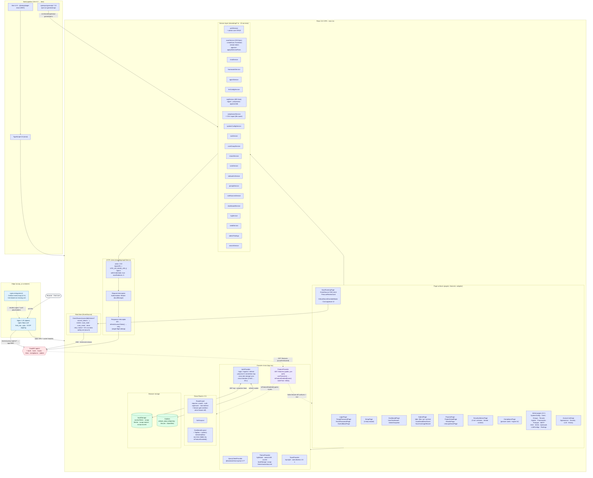

# 03 — Frontend Architecture

Detailed view of the SCCAP single-page application: build stack, routing, providers, service layer, real-time client, and asset pipeline.

---

## Diagram



---

## Legend

### Build stack

| Tool                       | Version  | Role                                                                                      |
|----------------------------|----------|-------------------------------------------------------------------------------------------|
| React                      | 18.3.1   | UI library (automatic JSX runtime, `react-jsx`)                                           |
| TypeScript                 | 5.8.3    | Strict mode (`noUnusedLocals`, `noUnusedParameters`, `noFallthroughCasesInSwitch`)         |
| Vite                       | 6.3.5    | Bundler with `@vitejs/plugin-react` (SWC transform)                                       |
| @tanstack/react-query      | 5.77.2   | Server-state cache (123+ `useQuery`/`useMutation` hooks)                                   |
| axios                      | 1.9.0    | HTTP client (`maxRedirects: 0` to prevent auth-header leakage on redirect)                 |
| react-router-dom           | 7.6.1    | Routing                                                                                   |
| openapi-typescript         | 7.13.0   | Generates `src/shared/types/api-generated.ts` from FastAPI's `/openapi.json`               |
| file-saver                 | 2.0.5    | Report and CSV blob downloads                                                            |
| eslint-plugin-security     | latest   | Lints for unsafe React/DOM patterns                                                       |

### Provider chain (composed top-down in `App.tsx`)

| Provider              | File                                              | Stores                                                                                          |
|-----------------------|---------------------------------------------------|-------------------------------------------------------------------------------------------------|
| `QueryClientProvider` | `src/app/App.tsx`                                 | Single `QueryClient`; default stale time + retry                                                |
| `AuthProvider`        | `src/app/providers/AuthProvider.tsx`              | `user`, `accessToken`, `isLoading`, `error`, `isSetupCompleted`, `initialAuthChecked`           |
| `ThemeProvider`       | `src/app/providers/ThemeProvider.tsx`             | `theme: "light" \| "dark"`, `variant: "A" \| "B"`, `accent`; writes `data-theme`/`data-variant` to `<html>` |
| `ToastProvider`       | `src/shared/ui/Toast.tsx`                         | Toast queue (max 5, 4.5 s TTL)                                                                  |

### Routing (React Router v7)

| Guard            | Effect                                                        |
|------------------|---------------------------------------------------------------|
| `unauth`         | Auth'd users redirected to `/account/dashboard`               |
| `auth`           | Unauth'd users redirected to `/login`                         |
| `superuser`      | Requires `auth` **and** `user.is_superuser`                   |
| `root-redirect`  | `/` → `/account/dashboard` (auth) or `/login` (anon)          |

| Section            | Route                                          | Page component                          |
|--------------------|-------------------------------------------------|-----------------------------------------|
| Unauth             | `/login`                                       | `LoginPage`                              |
| Unauth             | `/forgot-password`                             | `ForgotPasswordPage`                     |
| Unauth             | `/reset-password`                              | `ResetPasswordPage`                      |
| Unauth             | `/auth/sso/complete`                           | `SsoCallbackPage`                        |
| Setup              | `/setup`                                       | `SetupPage` (4-step wizard)              |
| Dashboard          | `/account/dashboard`                           | `DashboardPage`                          |
| History            | `/account/history`                             | `SubmissionHistoryPage`                  |
| Settings           | `/account/settings/{appearance,security,llm}`  | `Appearance/Security/LLMSettingsPage`    |
| Submission         | `/submission/submit`                           | `SubmitPage`                             |
| Scan runtime       | `/analysis/scanning/:scanId`                   | `ScanRunningPage` (SSE)                  |
| Results            | `/analysis/results`                            | `ProjectsPage`                           |
| Results            | `/analysis/projects/:projectId`                | `ProjectDetailPage`                      |
| Results            | `/analysis/results/:scanId`                    | `ResultsPage`                            |
| LLM logs           | `/scans/:scanId/llm-logs`                      | `LlmLogViewerPage`                       |
| Chat               | `/advisor`                                     | `SecurityAdvisorPage`                    |
| Compliance         | `/compliance`                                  | `CompliancePage`                         |
| Admin              | `/admin/{system,users,user-groups,tenants,findings,agents,frameworks,prompts,smtp,sso/providers,sso/audit,scim/tokens,appearance}` | matching `*Page` / `*Tab` components |

### Service layer (`src/shared/api/*.ts`)

22 single-file services, each a singleton object exporting strongly-typed async methods. Highlights:

| Service                | LOC | Notable methods                                                                                                   |
|------------------------|-----|-------------------------------------------------------------------------------------------------------------------|
| `authService`          | —   | `loginUser`, `refreshToken`, `registerUser`, `getCurrentUser`, `logoutUser`, plus admin user CRUD                  |
| `scanService`          | 332 | `createScan(FormData)`, `previewGitRepo`, `previewArchive`, `getScanResult`, `getPrescanReview`, `approveScan`, `applySelectiveFixes`, `cancelScan`, `getStreamToken`, `getLlmInteractionsForScan`, `createProject`, `deleteScan`, `deleteProject` |
| `chatService`          | —   | `createSession`, `getSessions`, `getSessionMessages`, `askQuestion`, `deleteSession`, `getSessionContext`          |
| `frameworkService`     | 122 | Framework CRUD                                                                                                    |
| `agentService`         | 60  | Agent CRUD                                                                                                        |
| `llmConfigService`     | 148 | LLM configuration CRUD                                                                                            |
| `ragService`           | 400 | `ingestDocuments`, `preprocessDocuments` (per-framework in-flight dedup), `approvePreprocessingJob`, `getJobStatus`, `getEnrichedDocuments` |
| `complianceService`    | —   | `getFrameworkStats`, `getControlsForFramework`, `exportControlsAsCSV` (file-saver blob)                           |
| `systemConfigService`  | 177 | Get/list/update; cross-field guard `is_secret=true ⇒ encrypted=true`                                              |
| `ssoService`           | 163 | Provider CRUD + audit log                                                                                         |
| `userGroupService`     | 197 | Group CRUD + add/remove members                                                                                   |
| `tenantService`        | 45  | Multi-tenant CRUD                                                                                                 |
| `scimService`          | 54  | SCIM bearer-token management                                                                                      |
| `webauthnService`      | 219 | FIDO2 passkey registration + assertion                                                                            |
| `promptService`        | 117 | Prompt template CRUD                                                                                              |
| `ruleSourcesService`   | 91  | Semgrep cloud rule source CRUD                                                                                    |
| `dashboardService`     | —   | Dashboard stats endpoint                                                                                          |
| `logService`           | 44  | Per-scan `llm_interactions` log fetch                                                                             |
| `seedService`          | 50  | Trigger `POST /admin/seed`                                                                                        |
| `adminFindings`        | 55  | Admin-wide findings dashboard                                                                                     |
| `searchService`        | —   | Global search                                                                                                     |

### HTTP client wiring (`src/shared/api/apiClient.ts`)

- **Base URL** = `import.meta.env.VITE_API_BASE_URL || "/api/v1"`. In production the SPA is same-origin with the API so the relative path goes through Nginx's `/api/v1/*` proxy.
- **Request interceptor** reads `localStorage.accessToken` and sets `Authorization: Bearer …`.
- **Response interceptor** intercepts `401`, calls `refreshAccessToken()`, retries the original request with the new token. Single-flight dedup via a `refreshInFlight` promise; on three consecutive failures the breaker opens for 30 s.
- **Proactive refresh** decodes the JWT `exp` and schedules a refresh `5 min` before expiry (`PROACTIVE_LEAD_MS = 5 * 60 * 1000`). Reset on every successful login / refresh.

### Real-time SSE client (`pages/submission/ScanRunningPage.tsx`)

```text
1. POST /api/v1/scans/{id}/stream-token  →  { access_token, expires_in: 60 }   (audience "sse:scan-stream")
2. new EventSource(`/api/v1/scans/{id}/stream?access_token=${access_token}`, { withCredentials: true })
3. es.addEventListener("scan_state", …)   // status transitions; carries cost_details
4. es.addEventListener("scan_event", …)   // per-stage / per-file progress
5. es.addEventListener("done", …)         // terminal status; close stream and redirect
```

Includes a 30-second no-data safety timer and a max-5-retry frontend bound on top of the browser's native EventSource backoff.

### Theming & accessibility

- CSS custom properties live in `src/app/styles/tokens.css` (colors `--bg`, `--fg`, `--primary`, `--accent`, …, radii `--r-xs` … `--r-pill`, motion `--ease`, shadows).
- Theme switching writes `data-theme` and `data-variant` to `<html>`.
- Fonts: **Inter Tight** / **Inter** (UI) · **JetBrains Mono** (code).
- No i18n layer today — UI text is English-only.

### Browser storage

| Item            | Storage          | Why                                                                          |
|-----------------|------------------|------------------------------------------------------------------------------|
| `accessToken`   | `localStorage`   | Needs to be read by axios interceptor; risk accepted (V15.1.5) with CSP + sanitized React |
| `refresh_token` | HttpOnly cookie  | Inaccessible to JS; sent on `/auth/refresh` via `withCredentials: true`       |
| `sccap-theme`, `sccap-variant`, `sccap-accent` | `localStorage` | Theme persistence; synced cross-tab via `storage` event |

### Feature-flag gating (modular setup — #103–111)

`FeatureProvider` fetches the enabled-feature set once from the **public, unauthenticated** `GET /api/v1/features` (so route guards and the login page can decide before any user exists). `useFeatures()` exposes `isFeatureEnabled(name)`; it fails *open* — while `/features` is in flight every feature reads as enabled, so a slow fetch never flashes a stripped-down UI. Each route guard, `TopNav`/`AdminSubNav` link, and feature-scoped surface consults it. `scan` is `always_on` — the product floor is never gated off.

| Feature           | Frontend surface gated off when disabled                                                  |
|-------------------|--------------------------------------------------------------------------------------------|
| `scan`            | — (always on: submission, scan runtime, results, dashboard)                                |
| `chat`            | `/advisor` route + `SecurityAdvisorPage`, TopNav **Advisor** link                          |
| `compliance`      | `/compliance` route + `CompliancePage`, TopNav **Compliance** link                         |
| `multi_user`      | `/admin/users`, self-service registration                                                  |
| `user_groups`     | `/admin/user-groups`, group-membership UI                                                   |
| `sso`             | SSO buttons on `LoginPage`, `/admin/sso/providers` + `/admin/sso/audit`                     |
| `scim`            | `/admin/scim/tokens`                                                                         |
| `multi_tenant`    | `/admin/tenants`                                                                             |
| `email`           | `/forgot-password` + `/reset-password` flow                                                  |
| `log_stack`       | `LlmLogViewerPage`, `/scans/:scanId/llm-logs`, LLM-log links on results                      |
| `tracing`         | — (no dedicated SPA surface; Langfuse has its own UI — see diagram 10)                       |
| `mcp`             | — (no SPA surface; the `/mcp` tool endpoint is backend-only)                                 |
| `admin_authoring` | `/admin/{agents,frameworks,prompts}` + RAG ingest UI                                         |

A disabled feature is enforced server-side too: `bootstrap_enabled_features_sync()` skips mounting the corresponding routers at import time, so hiding a link is defence-in-depth, not the security boundary.

### Code-gen flow

```text
npm run generate:api
└─► fetch ${SCCAP_OPENAPI_URL:-http://localhost:8000/openapi.json}
└─► openapi-typescript → src/shared/types/api-generated.ts
└─► hand-maintained facade in src/shared/types/api.ts re-exports + adds UI-only types
```

---

## Source files

- `secure-code-ui/package.json`, `vite.config.ts`, `tsconfig*.json`
- `secure-code-ui/src/main.tsx`, `src/app/App.tsx`
- `secure-code-ui/src/app/providers/{AuthContext,AuthProvider,ThemeProvider}.tsx`
- `secure-code-ui/src/shared/api/*.ts` (22 services)
- `secure-code-ui/src/shared/api/apiClient.ts`, `authService.ts`
- `secure-code-ui/src/pages/**/*.tsx`, `src/features/**/*.tsx`, `src/widgets/**/*.tsx`
- `secure-code-ui/Dockerfile`, `nginx-http.conf`, `nginx-https.conf`, `nginx-entrypoint.sh`
