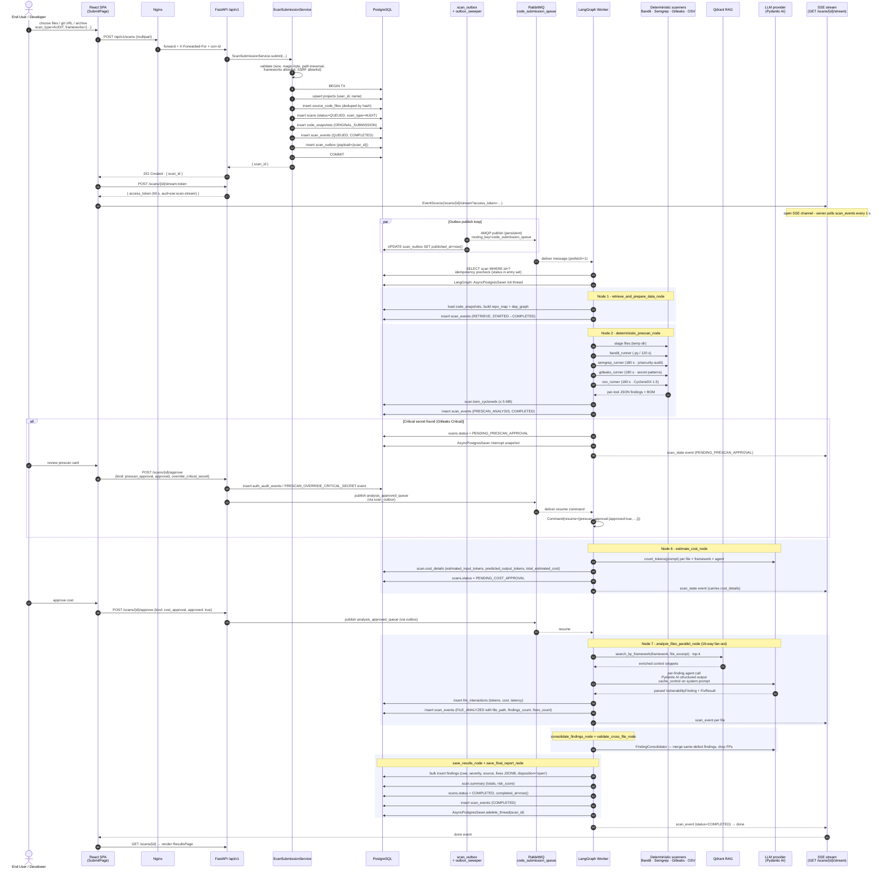
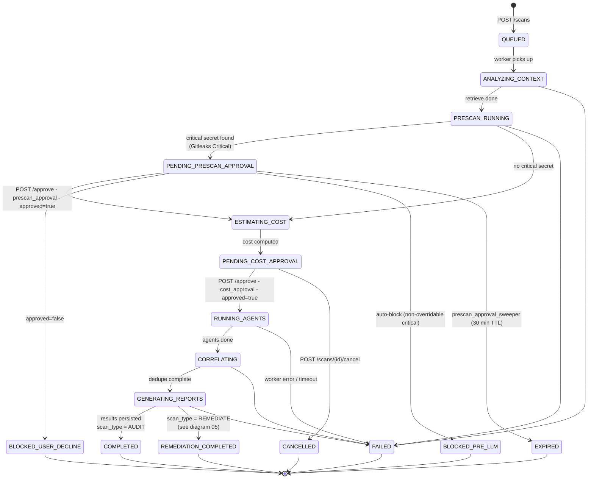

# 04 — Audit Scan Flow

End-to-end behavior of an **AUDIT** scan: from the upload form in the SPA to a final `COMPLETED` scan with persisted findings. Two diagrams here:

1. A **sequence diagram** showing every API/queue/DB interaction in time order.
2. A **state machine** of the `scans.status` column with all approval gates and terminal states.

(Remediation-only logic lives in diagram **05**; the LangGraph worker itself is detailed in diagram **14**.)

---

## 1. Sequence diagram

---

## 2. State machine — `scans.status`

---

## Legend

### Validation gates inside `ScanSubmissionService` (`src/app/core/services/scan/submission.py`)

| Constant                    | Value                  | Defense                                                     |
|-----------------------------|------------------------|-------------------------------------------------------------|
| `MAX_FILES_PER_SCAN`        | 5 000                  | Resource exhaustion                                         |
| `MAX_TOTAL_BYTES`           | 200 MB                 | Storage/perf bound                                          |
| `MAX_FILE_BYTES`            | 10 MB                  | Per-file outlier guard                                      |
| `_VALID_FRAMEWORKS`         | `{asvs, proactive_controls, cheatsheets, llm_top10, agentic_top10}` | Allowlist                          |
| Magic-byte blocklist        | PE · ELF · Mach-O · shebang | Reject pre-compiled / native binaries                  |
| Path-traversal              | `..`, NUL, `\` rejected | Filesystem safety                                          |
| Git URL allowlist           | `github.com`, `gitlab.com`, `bitbucket.org` (HTTPS only) | SSRF                                       |
| `mask_secrets()` on `repo_url` | strips userinfo     | Prevent leaking credentials to logs / DB                    |

### Tables touched (in order)

| Table              | Write kind                                                                |
|--------------------|---------------------------------------------------------------------------|
| `projects`         | upsert (unique `user_id, name`)                                           |
| `source_code_files`| insert (deduped by content hash)                                          |
| `scans`            | insert (`status=QUEUED`, `scan_type`, `frameworks` JSONB)                 |
| `code_snapshots`   | insert (`type=ORIGINAL_SUBMISSION`, `files` JSONB hash-keyed)             |
| `scan_events`      | append per stage (`stage_name`, `status`, `details` JSONB)                |
| `scan_outbox`      | insert (payload + target queue, `published_at=NULL`)                       |
| `checkpoints`      | per-node LangGraph snapshot (`thread_id=scan_id`)                         |
| `llm_interactions` | one row per LLM call (prompt context redacted, cost, tokens, `expires_at`)|
| `findings`         | bulk insert at end (CWE, CVSS, severity, source, `fixes` JSONB)           |
| `auth_audit_events`| append on prescan override (`PRESCAN_OVERRIDE_CRITICAL_SECRET`)            |

### Queues used

| Queue                          | Direction          | Routing key   | Purpose                                                              |
|--------------------------------|--------------------|---------------|----------------------------------------------------------------------|
| `code_submission_queue`        | API → Worker       | same          | Start of every scan                                                  |
| `analysis_approved_queue`      | API → Worker       | same          | Resume after a `*_APPROVAL` interrupt                                |

Both carry `DeliveryMode.PERSISTENT`; the `sccap-bounded-queues` RabbitMQ policy caps each at 100k messages with `overflow=drop-head` so a runaway producer cannot exhaust disk.

### Interrupt payloads (`Command(resume=...)`)

| Gate                 | Resume payload shape                                                                                                  |
|----------------------|-----------------------------------------------------------------------------------------------------------------------|
| Prescan approval     | `{"prescan_approval": {"approved": bool, "override_critical_secret": bool}}`                                          |
| Cost approval        | `{"cost_approval": {"approved": bool}}`                                                                               |

### SSE event types emitted by `scan_progress_notifier`

| Event         | Payload                                                                                                          |
|---------------|------------------------------------------------------------------------------------------------------------------|
| `scan_state`  | `{ scan_id, status, cost_details? }` — every status transition                                                   |
| `scan_event`  | `{ scan_id, event_id, stage_name, status, timestamp, details? }` — per-stage / per-file                          |
| `done`        | sent once on terminal status                                                                                     |

### Terminal statuses

| Status                  | Cause                                                                                                      |
|-------------------------|------------------------------------------------------------------------------------------------------------|
| `COMPLETED`             | AUDIT scan finished successfully                                                                            |
| `REMEDIATION_COMPLETED` | REMEDIATE scan finished (see diagram 05)                                                                    |
| `CANCELLED`             | User canceled at cost gate                                                                                  |
| `BLOCKED_USER_DECLINE`  | User declined at prescan gate                                                                               |
| `BLOCKED_PRE_LLM`       | Non-overridable critical secret; LLM tokens never spent                                                     |
| `EXPIRED`               | Prescan-approval sweeper timed the scan out after 30 min                                                    |
| `FAILED`                | Worker exception; full trace persisted via Fluentd → Loki + `scans.error_message`                            |

### Cleanup

When any terminal status is reached, the worker calls `AsyncPostgresSaver.adelete_thread(thread_id=scan_id)` so the `checkpoints` table does not grow unboundedly (mitigation **M5**).

---

## Source files

- `src/app/api/v1/routers/projects.py` (`POST /scans`, `/stream-token`, `/approve`, `/cancel`, `/stream`)
- `src/app/core/services/scan/submission.py`
- `src/app/infrastructure/messaging/{publisher,outbox_sweeper}.py`
- `src/app/workers/consumer.py`
- `src/app/infrastructure/workflows/nodes/*.py`
- `src/app/infrastructure/scanners/{registry,bandit_runner,semgrep_runner,gitleaks_runner,osv_runner,staging}.py`
- `src/app/infrastructure/database/models.py` (`Scan`, `ScanEvent`, `ScanOutbox`, `CodeSnapshot`, `SourceCodeFile`, `Finding`)
- `secure-code-ui/src/pages/submission/SubmitPage.tsx`, `ScanRunningPage.tsx`
