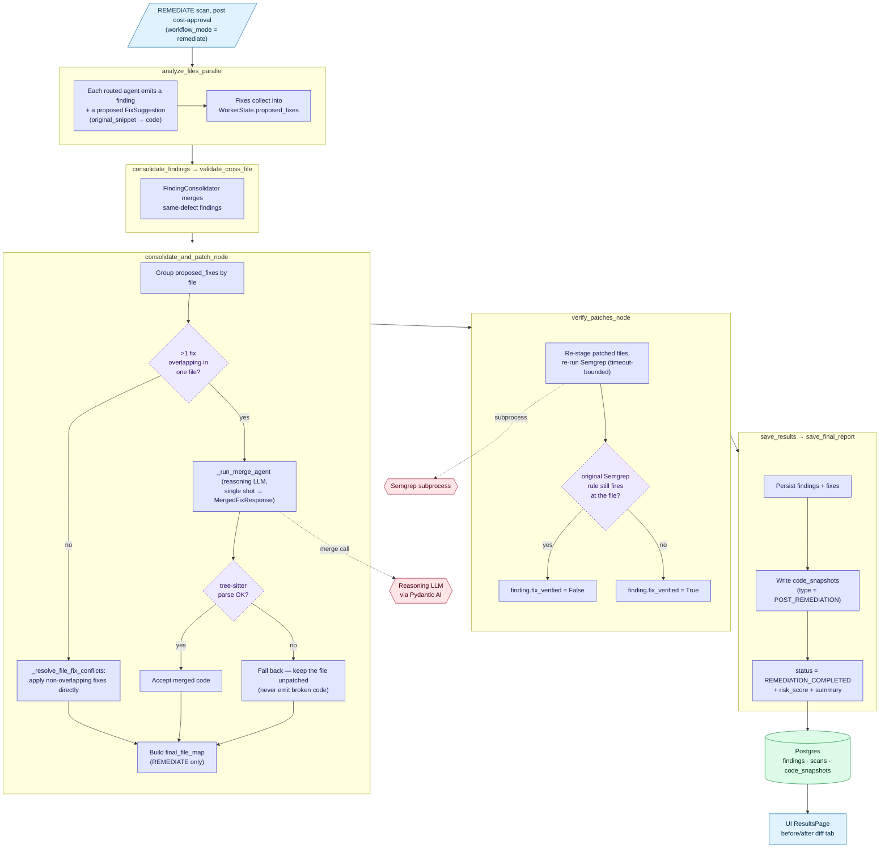
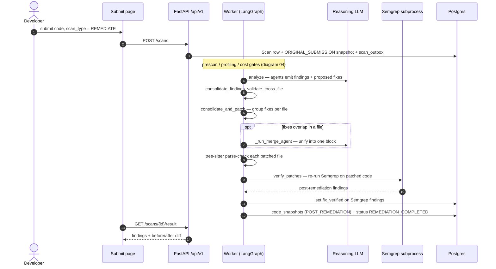

# 05 — Remediation Flow

What happens when a scan is submitted with `scan_type=REMEDIATE`: the
analysis agents propose fixes, the worker merges and syntax-verifies
them in-graph, re-runs Semgrep over the patched code, and persists a
`POST_REMEDIATION` snapshot.

There is **no separate "apply fixes" trigger.** Remediation is not a
post-hoc action on a finished scan — it is a scan *type*, chosen at
submit time. A `REMEDIATE` scan travels the exact same path as `AUDIT`
/ `SUGGEST` (outbox → `code_submission_queue` → worker graph; prescan,
profiling-cost and cost-approval gates from diagram **04**); the only
difference is in three graph nodes near the end.

A `SUGGEST` scan also produces per-finding fixes and runs the same
merge/conflict resolution, but **stops short of writing a patched
snapshot** — it is advisory. `AUDIT` produces no fixes at all.

---

## 1. Flow diagram

---

## 2. Sequence

---

## Legend

### Where fixes come from

In `remediate` workflow mode every analysis agent that reports a
finding also returns a `FixSuggestion` (`original_snippet` → `code`).
These ride through `WorkerState.proposed_fixes`; remediation does not
make a fresh LLM round per finding — the only extra LLM call is the
**merge agent**, and only when fixes collide.

### consolidate_and_patch_node

`proposed_fixes` are grouped per file. `_resolve_file_fix_conflicts`
applies non-overlapping fixes directly; when two or more fixes touch
the same region, `_run_merge_agent` makes a **single** reasoning-LLM
call that returns a `MergedFixResponse`
(`original_snippet_for_replacement` + `merged_code` + `explanation`)
unifying them. (The older 3-attempt retry loop was removed — it was
weak-model scaffolding.) Every candidate file is parse-checked by
`_verify_syntax_with_treesitter`; if it fails to parse, the merge is
discarded and the file is left unpatched — the graph never emits
syntactically broken code. The patched `final_file_map` is built only
for `REMEDIATE` scans; `SUGGEST` runs the same merge but writes no
snapshot.

### verify_patches_node — Semgrep regression check

After patching, Semgrep is re-run over the patched tree (the only
deterministic scanner replayable this way). For each **Semgrep-emitted,
applied** finding, `fix_verified` is set: `True` when the original rule
no longer fires for that CWE in that file, `False` when it still does.
Findings from other sources (Bandit / Gitleaks / OSV / LLM agents)
keep `fix_verified = NULL` — this node can't replay their detection. A
Semgrep failure here is swallowed; verification is best-effort and
never blocks the scan.

### Tables touched

| Table            | Write                                                            |
|------------------|------------------------------------------------------------------|
| `findings`       | `fixes`, `fix_verified`, `is_applied_in_remediation`             |
| `scans`          | `status = REMEDIATION_COMPLETED`, `risk_score`, `summary`        |
| `code_snapshots` | `INSERT` row `type = POST_REMEDIATION` from `final_file_map`     |
| `scan_events`    | stage events across the patch + verify nodes                    |
| `llm_interactions` | one row per merge-agent call (token + cost accounting)         |

### Reviewing the result

A completed `REMEDIATE` scan's ResultsPage gains a before/after diff
tab (`ORIGINAL_SUBMISSION` vs `POST_REMEDIATION`). There is no
"apply fix" button — the patched snapshot *is* the output of the scan.

---

## Source files

- `src/app/infrastructure/workflows/nodes/consolidate.py` — `consolidate_and_patch_node`, `_resolve_file_fix_conflicts`, `_run_merge_agent`, `_verify_syntax_with_treesitter`
- `src/app/infrastructure/workflows/nodes/verify.py` — `verify_patches_node`
- `src/app/infrastructure/workflows/nodes/results.py` — `save_results_node`, `save_final_report_node`
- `src/app/core/schemas.py` — `FixSuggestion`, `FixResult`, `MergedFixResponse`
- `src/app/infrastructure/scanners/semgrep_runner.py`
- `secure-code-ui/src/pages/analysis/ResultsPage.tsx` — before/after diff viewer
