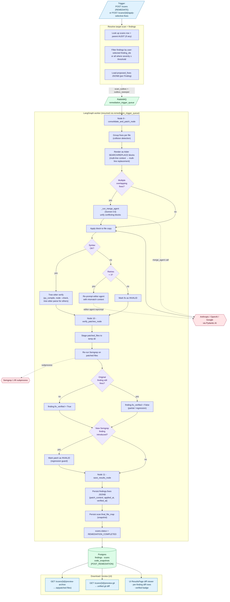
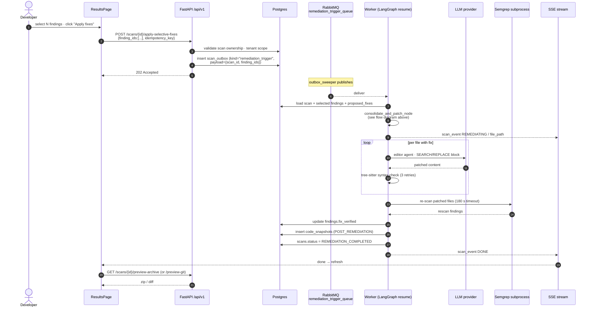

# 05 — Remediation Flow

What happens when a scan is submitted with `scan_type=REMEDIATE`, or when the user invokes **"Apply selective fixes"** on an existing AUDIT scan. Covers fix proposal, Aider-style consolidation, syntax verification, semgrep re-check, and persistence.

Inherits the prescan / cost-approval gates from diagram **04**.

---

## 1. Flow diagram



---

## 2. Sequence: "Apply selective fixes" from the UI



---

## Legend

### Where fixes come from

Every analysis agent that finds a vulnerability is also asked to return a `FixResult` (`src/app/infrastructure/agents/types.py`). These are accumulated in `WorkerState.proposed_fixes` during **Node 7 — analyze_files_parallel_node** (see diagram 14) and persisted onto each `Finding.fixes` JSONB. Remediation does **not** call new LLM rounds per finding — it only invokes the **editor** and (on conflict) the **merge** sub-agents.

### Patch format — Aider SEARCH/REPLACE

```text
<<<<<<< SEARCH
def login(user, pwd):
    query = f"SELECT * FROM users WHERE user='{user}'"
=======
def login(user, pwd):
    query = "SELECT * FROM users WHERE user = %s"
>>>>>>> REPLACE
```

The consolidator emits one or more SEARCH/REPLACE blocks per file, with at least one line of context above/below to make the match unique. If the SEARCH text doesn't appear verbatim in the file, the editor re-prompts up to **3 times**, each time widening the context window.

### Sub-agents involved

| Sub-agent     | Model (default) | Role                                                        |
|---------------|-----------------|-------------------------------------------------------------|
| Editor agent  | Sonnet 4.6      | Produces / rewrites SEARCH/REPLACE blocks                   |
| Merge agent   | Sonnet 4.6      | Unifies overlapping or contradictory blocks from peers      |
| Verifier      | (deterministic) | Runs `py_compile` / `node --check` / tree-sitter parse      |

### Syntax verification by language

| Extension              | Validator                                  |
|------------------------|--------------------------------------------|
| `.py`, `.pyi`          | `py_compile.compile(path, doraise=True)`   |
| `.js`, `.mjs`, `.cjs`  | `node --check path.js`                     |
| `.ts`, `.tsx`          | `tsc --noEmit --target ES2020`             |
| `.go`                  | `gofmt -e`                                 |
| Other (`.java`, `.rb`, `.php`, `.c`, `.cpp`, …) | tree-sitter parse with strict grammar |

A patch that fails verification three times in a row is recorded with `finding.fix_verified = false` and `finding.fixes[*].state = "INVALID"`; the original file is left unmodified.

### Regression guard (verify_patches_node)

After all patches apply cleanly, the worker re-runs **Semgrep** (only Semgrep — Bandit/Gitleaks/OSV results are already deterministic) over the patched tree. Two booleans are computed per finding:

| Column                    | Meaning                                                                       |
|---------------------------|-------------------------------------------------------------------------------|
| `findings.fix_verified`   | `true` ⇔ the original rule no longer fires at the original location           |
| `findings.fixes[*].regression_introduced` | `true` ⇔ Semgrep raised a **new** rule on the patched file       |

If a regression is introduced, the patch is rolled back and marked INVALID — the regression guard never lets a "fix" sneak in a new finding.

### Tables touched

| Table             | Write                                                                                 |
|-------------------|---------------------------------------------------------------------------------------|
| `findings`        | `UPDATE … SET fixes = ?, fix_verified = ?, is_applied_in_remediation = true`          |
| `scans`           | `UPDATE … SET status='REMEDIATION_COMPLETED', completed_at = now(), summary = ?`      |
| `code_snapshots`  | `INSERT INTO code_snapshots(type='POST_REMEDIATION', files = <patched JSONB>)`        |
| `scan_events`     | `INSERT INTO scan_events(stage_name='REMEDIATING' / 'COMPLETED', details = ?)`        |
| `llm_interactions`| One row per editor/merge call (token + cost accounting)                                |
| `auth_audit_events` | (optional) `REMEDIATION_APPLIED` event with selected finding count                  |

### Idempotency

The frontend always sends an `X-Idempotency-Key` header (`crypto.randomUUID()` by default — `secure-code-ui/src/shared/api/scanService.ts`). The backend uses it to deduplicate `apply-selective-fixes` requests so refreshing the page or double-clicking the button cannot enqueue two parallel remediation runs.

### Download endpoints

| Endpoint                                      | Returns                                                                     |
|-----------------------------------------------|------------------------------------------------------------------------------|
| `GET /scans/{id}/preview-archive`             | `application/zip` of `code_snapshots[type=POST_REMEDIATION].files`           |
| `GET /scans/{id}/preview-git`                 | Unified `git diff` between `ORIGINAL_SUBMISSION` and `POST_REMEDIATION`      |
| `GET /scans/{id}/preview-archive?source=ORIGINAL_SUBMISSION` | Zip of the originally submitted tree                          |

### Not yet implemented

- Direct **PR creation** on GitHub / GitLab / Bitbucket. The infrastructure (allowlist, project repo URL, OAuth tokens) is scoped but the "open PR" endpoint and per-provider client are out of scope for the current release. The flow above produces patched files + diff that a developer applies manually or via their own CI pipe.
- **Per-language linter** beyond syntax check (e.g., `ruff`, `eslint`) — currently a stretch goal.

---

## Source files

- `src/app/infrastructure/workflows/nodes/consolidate.py`
- `src/app/infrastructure/workflows/nodes/verify.py`
- `src/app/infrastructure/workflows/nodes/results.py`
- `src/app/infrastructure/agents/{editor_agent,merge_agent,types}.py`
- `src/app/api/v1/routers/projects.py` (`apply-selective-fixes`, `preview-archive`, `preview-git`)
- `src/app/infrastructure/scanners/semgrep_runner.py`
- `secure-code-ui/src/pages/analysis/ResultsPage.tsx` (diff viewer, apply UI)
