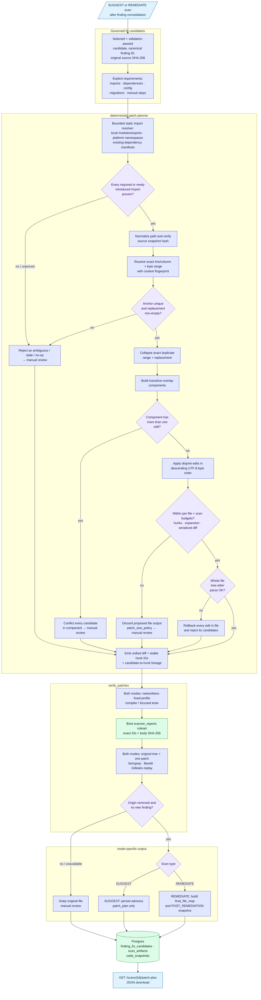

# 05 — Deterministic Patch Planning and Remediation

SUGGEST and REMEDIATE scans both turn governed fix candidates into an
immutable, versioned patch plan. The planner never asks an LLM to rewrite a
file. It resolves exact ranges against the recorded source snapshot, rejects
ambiguity and overlap, applies accepted edits atomically, and emits a unified
diff with candidate-to-hunk lineage. Only REMEDIATE promotes accepted files
into a `POST_REMEDIATION` snapshot.

There is **no separate apply-fixes trigger**. Remediation is a scan type chosen
at submission. AUDIT produces findings only; SUGGEST produces an advisory patch
plan; REMEDIATE produces the same plan and promotes its accepted file results.

---

## 1. Flow diagram

```mermaid
flowchart TB
    Start[/"SUGGEST or REMEDIATE scan<br/>after finding consolidation"/]:::edge

    subgraph Candidates["Governed fix candidates"]
      C1["Selected + validation-passed<br/>candidate, canonical finding ID,<br/>original source SHA-256"]:::app
      C2["Explicit requirements:<br/>imports · dependencies · config<br/>migrations · manual steps"]:::app
    end

    subgraph Planner["deterministic patch planner"]
      PR["Bounded static import resolver:<br/>local modules/exports · platform namespaces<br/>existing dependency manifests"]:::app
      PG{"Every required or newly<br/>introduced import<br/>proven?"}:::gate
      P1["Normalize path and verify<br/>source snapshot hash"]:::app
      P2["Resolve exact line/column + byte range<br/>with context fingerprint"]:::app
      P3{"Anchor unique<br/>and replacement<br/>non-empty?"}:::gate
      P4["Reject as ambiguous / stale / no-op<br/>→ manual review"]:::app
      P5["Collapse exact duplicate<br/>range + replacement"]:::app
      P6["Build transitive overlap<br/>components"]:::app
      P7{"Component has<br/>more than one<br/>edit?"}:::gate
      P8["Conflict every candidate<br/>in component → manual review"]:::app
      P9["Apply disjoint edits in<br/>descending UTF-8 byte order"]:::app
      PB{"Within per-file + scan budgets?<br/>hunks · expansion · serialized diff"}:::gate
      PX["Discard proposed file output<br/>patch_size_policy → manual review"]:::app
      P10{"Whole file<br/>tree-sitter<br/>parse OK?"}:::gate
      P11["Rollback every edit in file<br/>and reject its candidates"]:::app
      P12["Emit unified diff + stable hunk IDs<br/>+ candidate-to-hunk lineage"]:::app
    end

    subgraph Promote["mode-specific output"]
      M1{"Scan type"}:::gate
      M2["SUGGEST: persist advisory<br/>patch_plan only"]:::app
      M3["REMEDIATE: build final_file_map<br/>and POST_REMEDIATION snapshot"]:::app
      M4["Keep original file<br/>manual review"]:::app
    end

    subgraph Verify["verify_patches"]
      V0["Both modes: networkless fixed-profile<br/>compiler / focused tests"]:::app
      VA["Bind scanner_reports ruleset<br/>exact IDs + body SHA-256"]:::data
      V1["Both modes: original tree + one patch<br/>Semgrep · Bandit · Gitleaks replay"]:::app
      V2{"Origin removed and<br/>no new finding?"}:::gate
    end

    API["GET /scans/{id}/patch-plan<br/>JSON download"]:::edge
    DB[("Postgres<br/>finding_fix_candidates · scan_artifacts<br/>code_snapshots")]:::data

    Start --> C1 --> C2 --> PR --> PG
    PG -- no / unproven --> P4
    PG -- yes --> P1 --> P2 --> P3
    P3 -- no --> P4 --> P12
    P3 -- yes --> P5 --> P6 --> P7
    P7 -- yes --> P8 --> P12
    P7 -- no --> P9 --> PB
    PB -- no --> PX --> P12
    PB -- yes --> P10
    P10 -- no --> P11 --> P12
    P10 -- yes --> P12
    P12 --> V0 --> VA --> V1 --> V2
    V2 -- no / unavailable --> M4 --> DB
    V2 -- yes --> M1
    M1 -- SUGGEST --> M2 --> DB
    M1 -- REMEDIATE --> M3 --> DB
    DB --> API

    classDef edge fill:#e0f2fe,stroke:#0369a1,color:#082f49;
    classDef app  fill:#e0e7ff,stroke:#4338ca,color:#1e1b4b;
    classDef data fill:#dcfce7,stroke:#15803d,color:#052e16;
    classDef gate fill:#ede9fe,stroke:#6d28d9,color:#2e1065,stroke-dasharray: 4 3;
```

---

## 2. Sequence

```mermaid
sequenceDiagram
    autonumber
    actor Dev as Developer
    participant SPA as Results page
    participant API as FastAPI /api/v1
    participant W as Worker (LangGraph)
    participant P as Deterministic planner
    participant SG as Deterministic scanners
    participant DB as Postgres

    W->>W: consolidate findings and govern candidates
    W->>P: plan(snapshot, selected candidates, mode)
    P->>P: statically resolve required/new imports against snapshot + manifests
    P->>P: verify hash and resolve exact ranges
    P->>P: de-duplicate and detect transitive overlaps
    P->>P: apply disjoint edits and enforce file/scan size budgets
    P->>P: parse whole file
    P-->>W: versioned plan, unified diff, hunk lineage
    W->>W: run allowlisted compiler/tests in networkless validator
    W->>SG: re-run Semgrep, Bandit, Gitleaks on original tree + one planned file
    SG-->>W: originating-rule + regression evidence
    alt blocking checks pass
      W->>DB: persist candidate decisions + patch_plan artifact
      alt REMEDIATE
        W->>DB: patched source blobs + POST_REMEDIATION snapshot + fix_verified
      else SUGGEST
        Note over W,DB: validated advisory only; no patched snapshot
      end
    else failed or unavailable
      W->>DB: manual-review plan; original file remains authoritative
    end
    Dev->>SPA: download Patch plan
    SPA->>API: GET /scans/{id}/patch-plan
    API->>DB: read latest authorized artifact
    DB-->>API: immutable JSON plan
    API-->>SPA: attachment
```

---

## Planner guarantees

- The original source SHA-256 must match. A plan cannot silently re-anchor
  against a different checkout.
- Recorded location and surrounding context disambiguate repeated snippets.
  If deterministic line-drift correction does not yield one unique site, the
  candidate is rejected.
- Exact duplicates collapse. Disjoint edits are not conflated merely because
  they are close; true overlap is computed from resolved byte ranges. Every
  candidate in a transitive overlap component becomes manual review.
- Edits apply in descending UTF-8 byte order so one edit cannot shift another
  anchor. Parser failure, absence, skip, or infrastructure error is explicit
  evidence; a blocking non-pass rolls back the entire file. Python can use its
  built-in AST parser when tree-sitter is unavailable.
- Automatic output is limited to 64 hunks, 256 KiB positive replacement
  expansion, and 512 KiB serialized UTF-8 diff per file, plus 256 hunks,
  1 MiB expansion, and 2 MiB diff across the sorted scan plan. Overflow is a
  blocking `patch_size_policy` check; the proposed output, hunks, and diff are
  discarded before checkpoint/artifact persistence.
- The networkless validator runs fixed Python, JavaScript, TypeScript, Go, and
  Java profiles. It does not accept package-manager scripts; Java annotation
  processing is disabled and Go code is compiled without running its binary.
- Replaying the same candidate set against the same source yields the same
  plan and does not double-apply a replacement.
- Required imports may become deterministic language-specific hunks. Before a
  hunk is planned, Python, JavaScript/TypeScript, Go, and Java imports are parsed
  and resolved against bounded snapshot/module/export, platform, and existing
  manifest evidence. Replacement-embedded imports are checked even when omitted
  from `required_imports`; malformed, ambiguous, missing, or unsupported
  required imports block promotion without importing or executing project code.
  Already-declared compatible Python/npm/Go, Java/Kotlin, .NET, Ruby, and PHP
  dependencies are proven from manifests without execution. Missing or ambiguous dependencies,
  configuration/migration changes, and manual steps remain explicit and block
  source promotion under file-level atomicity.
- Vendor/generated files are excluded unless the scan explicitly opts into
  the applicable deep-coverage policy.

## Persistence and UI

| Storage | Purpose |
| --- | --- |
| `finding_fix_candidates` | Source hash, resolved range, context fingerprint, hunk ID, requirements, applicability/validation/apply state. |
| `scan_artifacts` (`patch_plan`, version 2) | Immutable JSON plan, unified diffs, and explicit validation checks for all planned files. |
| `code_snapshots` (`POST_REMEDIATION`) | REMEDIATE-only accepted file tree. |
| `findings` | Canonical finding and fix verification/application state. |

The Results page exposes **Patch plan** for SUGGEST and REMEDIATE and
**Download patched codebase** only when a remediation snapshot exists. Candidate
diagnostics show applicability, hunk, disposition, and validation state.

## Semgrep verification boundary

Before any promotion, Semgrep, Bandit, and Gitleaks are rerun for both SUGGEST
and REMEDIATE against an original repository tree with exactly one planned file
changed. Semgrep exact-loads only the prescan identities retained in the
scan-scoped scanner-report artifact, validates the ruleset digest, and rehashes
each exact historical YAML body retained by the current attempt before use.
Missing or malformed retained bodies block; removed, disabled, reassigned,
changed, or newly added live rule rows cannot affect replay. Legacy hash-only
artifacts fail closed. Native `check_id`,
`test_id`, and `RuleID` values survive as
`scanner_rule_id`. A file is blocked if the originating rule still fires at the
resolved patch-site window or a changed-file finding does not match the
line-shifted baseline. The former file+CWE match is legacy-only. OSV origins
and dependency-lockfile changes use a manifest-hashed read-only advisory
snapshot with explicit offline/no-resolve flags. CVE identity drives origin
matching; missing or invalid snapshot/report evidence blocks promotion without
querying the live service. LLM-originated fixes are checked separately by the
reasoning model using bounded before/after evidence at the resolved range. Only
an evidence-citing `resolved` verdict passes; negative, uncertain, unavailable,
or unaudited outcomes block automatic promotion without being conflated with
native scanner replay. The candidate-scoped usage identity is checked before
provider invocation: a complete, exactly bound retained verdict is reused,
while orphaned or untrustworthy retained state fails closed without a second
call. New calls require a committed, unique, attempt-bound reservation that is
never reclaimed after uncertain provider acceptance. A provider response that
loses the usage-ledger idempotency race cannot be projected onto the winner's
interaction.

## Source files

- `src/app/shared/lib/patch_planner.py` — immutable plan contracts, exact
  resolution, conflicts, atomic application, diff generation.
- `src/app/shared/lib/import_requirements.py` — bounded, non-executing local
  module/export and manifest-backed import resolution.
- `src/app/infrastructure/workflows/nodes/consolidate.py` — workflow adapter,
  parser gate, and sandbox client.
- `src/app/infrastructure/agents/patch_evidence_validator.py` — bounded,
  structured LLM-originated fix re-analysis and audit projection.
- `src/app/infrastructure/validation/sandbox_client.py` and
  `src/app/shared/lib/validation_sandbox_runner.py` — bounded job protocol and
  isolated fixed-command runner.
- `src/app/infrastructure/workflows/nodes/verify.py` — pre-promotion Semgrep,
  Bandit, and Gitleaks origin/regression replay.
- `src/app/infrastructure/workflows/nodes/results.py` — candidate, plan, and
  snapshot persistence.
- `src/app/core/schemas.py` — `FixSuggestion` and `FixResult` contracts.
- `secure-code-ui/src/pages/analysis/ResultsPage.tsx` — artifact download and
  candidate diagnostics.
