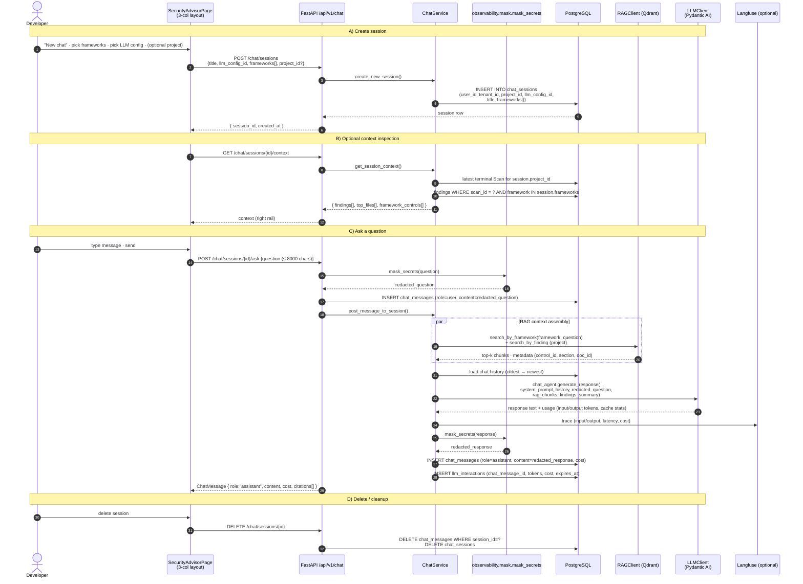
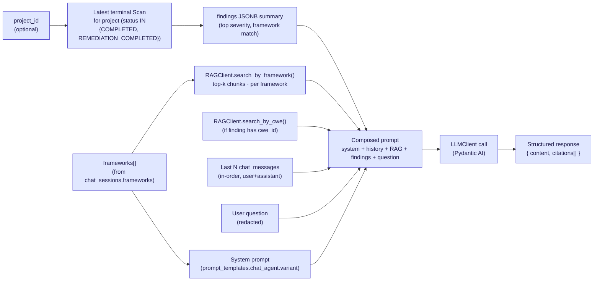

# 06 — Chat Advisor Flow

The **Security Advisor** is a project-aware, framework-aware chat surface. Each session is bound to an LLM configuration, an optional project, and 1..N frameworks (max 10). Context is assembled at every turn from the latest terminal scan's findings, the related source files, and RAG hits against the selected frameworks.

---

## Sequence diagram

---

## Context assembly — what the chat agent sees

---

## Legend

### Tables involved

| Table              | Role                                                                                   |
|--------------------|----------------------------------------------------------------------------------------|
| `chat_sessions`    | One row per conversation. Columns: `id`, `user_id`, `tenant_id`, `project_id` (nullable), `llm_config_id`, `title`, `frameworks` (`TEXT[]`, max 10), `created_at` |
| `chat_messages`    | Append-only message log. Columns: `id`, `session_id`, `role` (`user`/`assistant`), `content` (redacted), `cost`, `timestamp`, `expires_at` |
| `llm_interactions` | Observability row per LLM call. Columns: `chat_message_id`, `prompt_context` (redacted), `raw_response`, `parsed_output`, `input_tokens`, `output_tokens`, `total_tokens`, `cost`, `expires_at` |
| `prompt_templates` | Stores the `chat_agent` system prompt (provider-aware `variant: generic | anthropic`) |
| Qdrant `SECURITY_GUIDELINES_COLLECTION` | Framework control chunks (ASVS, Proactive Controls, …)                    |
| Qdrant `CWE_COLLECTION_NAME`            | CWE catalog with OWASP Top-10 cross-references                            |

### Secret masking pipeline (`src/app/infrastructure/observability/mask.py`)

Applied **twice** per turn:
1. On the user's incoming `question` before it is persisted and before it is sent to the LLM.
2. On the LLM's `response` before it is persisted.

Masks: API keys (provider-specific patterns), JWTs, AWS access keys, private keys, generic high-entropy 32+ char tokens. Audit trail of detections written under the same correlation id.

### LLM call

The `chat_agent` is instantiated through Pydantic AI with the session's `llm_config_id` → `llm_configurations` row, which determines:

| Column                       | Used for                                                  |
|------------------------------|-----------------------------------------------------------|
| `provider`                   | Picks the Pydantic AI agent class (Anthropic / OpenAI / Google) |
| `model_name`                 | Wire model id (e.g., `claude-sonnet-4-6`)                 |
| `tokenizer`                  | Token counting for cost math (LiteLLM cost map)           |
| `encrypted_api_key` (Fernet) | Decrypted per call; never logged                          |
| `input_cost_per_million`     | Cost math input side                                       |
| `output_cost_per_million`    | Cost math output side                                      |

Anthropic calls mark the **system prompt + framework controls + findings context** as a cache block via `cache_control`, and Langfuse spans record `cache_read_input_tokens` / `cache_creation_input_tokens` for observability.

### RAG context

Two retrievals happen in parallel:

1. **Per-framework search**: `RAGClient.search_by_framework(framework_name, query)` issues `qdrant-client` `search(...)` with a payload filter `{framework: framework_name}` returning top-K chunks (configurable; defaults to 4 per framework × number of frameworks ≤ 10).
2. **Per-finding / CWE search**: when a finding context is in scope, `search_by_cwe(cwe_id)` pulls related CWE definitions and known fixes.

Chunks carry metadata `{ doc_id, framework, control_id, section, language }` so the chat agent can cite the source (the SPA can hyperlink `[ASVS §5.1.3]` directly).

### Streaming

The current API is **request/response** (no SSE on chat). The SPA polls or refreshes the messages list after `askQuestion()` resolves. The infrastructure for SSE on chat exists but is intentionally not wired (consistency with retention masking).

### Retention

Both `chat_messages.expires_at` and `llm_interactions.expires_at` are populated on insert as `now() + RETENTION_DAYS_*`. The daily `retention_sweeper` purges expired rows. Defaults (overridable via `system_configurations`):

| Key                                  | Default     |
|--------------------------------------|-------------|
| `RETENTION_DAYS_CHAT_MESSAGES`       | 90 days     |
| `RETENTION_DAYS_LLM_INTERACTIONS`    | 30 days     |

### UI surface

Single page `SecurityAdvisorPage` (`secure-code-ui/src/pages/chat/SecurityAdvisorPage.tsx`) — three columns:

| Column   | Content                                                                                            |
|----------|----------------------------------------------------------------------------------------------------|
| Left     | Sessions list bucketed Today / Yesterday / Older, + "New chat" button (`POST /chat/sessions`)        |
| Center   | Message thread (user / assistant bubbles) · quick-reply chips · draft textarea · send button         |
| Right    | Context stub — referenced findings, files, knowledge sources from `/chat/sessions/{id}/context`      |

### Tools

The chat agent can call **read-only** tools if the model supports tool use:

| Tool                         | Backing call                                                       |
|------------------------------|--------------------------------------------------------------------|
| `get_findings(scan_id)`      | `FindingRepository.list_for_scan()` (tenant-scoped)                |
| `get_finding_detail(id)`     | `FindingRepository.get(...)` (tenant-scoped)                        |
| `get_control(framework, id)` | `RAGClient.search_by_control_id(...)`                              |
| `get_file_excerpt(path)`     | Reads the relevant `SourceCodeFile.content` from the latest snapshot |

Mutations (apply-fix, dismiss-finding, etc.) are **not** exposed to chat — those are first-class UI actions with their own auth / idempotency paths.

---

## Source files

- `src/app/api/v1/routers/chat.py`
- `src/app/core/services/chat_service.py`
- `src/app/infrastructure/agents/chat_agent.py`
- `src/app/infrastructure/observability/mask.py`
- `src/app/infrastructure/rag/{rag_client,qdrant_store}.py`
- `src/app/infrastructure/database/models.py` (`ChatSession`, `ChatMessage`, `LLMInteraction`)
- `secure-code-ui/src/pages/chat/SecurityAdvisorPage.tsx`
- `secure-code-ui/src/shared/api/chatService.ts`
