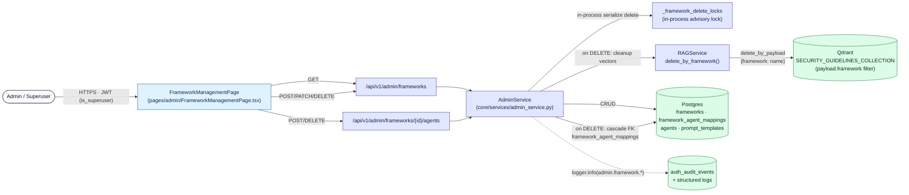
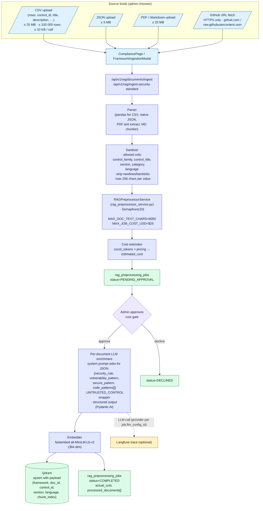
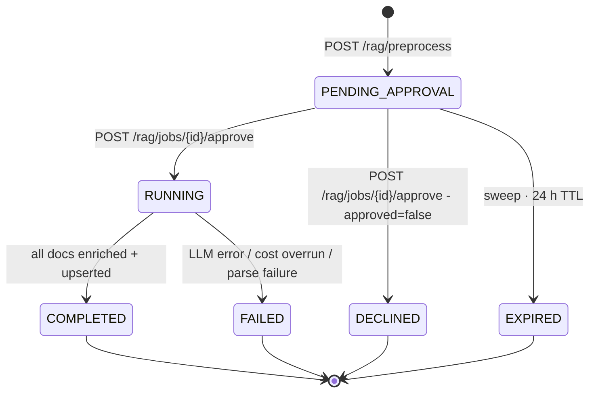

# 07 — Framework Management & RAG Ingestion

Two related concerns:

1. **Framework CRUD** — admins register ASVS / OWASP Proactive Controls / Cheatsheets / NIST / PCI / custom standards, link agents to frameworks, and inspect coverage.
2. **RAG ingestion pipeline** — turn the framework's source corpus (CSV, JSON, PDF/MD, GitHub URL) into LLM-enriched, embedded vectors in Qdrant so the analysis and chat agents can ground their answers.

---

## 1. Framework CRUD (admin console)



### Operations & invariants

| Operation                                                | Effect                                                                                              | Notes |
|----------------------------------------------------------|-----------------------------------------------------------------------------------------------------|-------|
| `POST /admin/frameworks`                                 | Insert `frameworks(name UNIQUE, description, source_url)`                                            | `name` must not collide with seed defaults `asvs`, `proactive_controls`, `cheatsheets` |
| `GET /admin/frameworks`                                  | List all                                                                                            | Admin-only |
| `GET /admin/frameworks/{id}`                             | Read one                                                                                            | — |
| `PATCH /admin/frameworks/{id}`                           | Mutate description / source_url                                                                      | Managed frameworks (`is_managed=true`) refuse rename |
| `DELETE /admin/frameworks/{id}`                          | Acquire in-process lock → DELETE row (CASCADE) → call `RAGService.delete_by_framework(name)`         | If DB delete succeeds but Qdrant cleanup fails → return `502` and log an audit event so the operator can re-trigger |
| `POST /admin/frameworks/{id}/agents` `{agent_ids:[…]}`   | Replace rows in `framework_agent_mappings`                                                          | Drives agent dispatch in analyze node |

### Built-in (managed) frameworks seeded at startup

| Name                   | Source                                                                                                   |
|------------------------|----------------------------------------------------------------------------------------------------------|
| `asvs`                 | OWASP ASVS 5.0 CSV (controls + descriptions)                                                            |
| `proactive_controls`   | OWASP Proactive Controls markdown (cloned from GitHub)                                                  |
| `cheatsheets`          | OWASP Cheat Sheet Series                                                                                 |
| `llm_top10`            | OWASP Top 10 for LLM Applications                                                                       |
| `agentic_top10`        | OWASP Top 10 for Agentic AI (early draft)                                                               |

---

## 2. RAG ingestion pipeline



### Job lifecycle — `rag_preprocessing_jobs` state machine



---

## Legend

### Endpoints

| Endpoint                                                      | Purpose                                                                                          |
|---------------------------------------------------------------|--------------------------------------------------------------------------------------------------|
| `POST /api/v1/rag/documents/ingest`                           | Upload CSV/JSON/PDF/MD for a framework — kicks off a `RAGPreprocessingJob`                       |
| `POST /api/v1/rag/ingest-security-standard`                   | Same but with a GitHub raw URL (no upload)                                                       |
| `POST /api/v1/rag/preprocess/{mode}` (mode = `csv` \| `git_url`) | Legacy / shorthand variant                                                                     |
| `POST /api/v1/rag/jobs/{job_id}/approve`                      | Approve the cost estimate · starts the enrichment phase                                          |
| `GET /api/v1/rag/jobs/{job_id}`                               | Job status, estimated/actual cost, processed_documents (when complete)                           |
| `GET /api/v1/rag/documents/{framework_name}`                  | List enriched documents indexed for a framework                                                  |
| `POST /api/v1/rag/preprocess/reprocess`                       | Re-run enrichment with a different LLM config / target languages, reusing prior `raw_content`    |
| `DELETE /api/v1/admin/frameworks/{id}`                        | Cascade: drop FK + Qdrant cleanup via `RAGService.delete_by_framework()`                          |

### Sanitization (defense against prompt injection from framework docs)

- The raw document body is wrapped in `<UNTRUSTED_CONTROL>…</UNTRUSTED_CONTROL>` before being inserted in the enrichment prompt. The system prompt instructs the LLM to ignore any instructions inside this wrapper.
- Allowed metadata columns are whitelisted: `{control_family, control_title, section, category, language}`. Anything else is dropped before the LLM ever sees it.
- Newlines, backticks and ` ` U+2028/2029 paragraph separators are stripped from metadata values, then values are truncated to **256 characters**.
- Target languages allowlisted: `{python, javascript, typescript, java, go, ruby, php, generic}`. The enriched payload's `code_patterns[].language` must match this list.

### Cost controls

| Knob                          | Value                                                            |
|-------------------------------|------------------------------------------------------------------|
| `MAX_DOC_TEXT_CHARS`          | 8 000 per chunk                                                  |
| `CONCURRENCY_SEMAPHORE`       | `asyncio.Semaphore(10)` on enrichment LLM calls                  |
| `MAX_JOB_COST_USD`            | $25 hard cap per job                                             |
| Cost math                     | `count_tokens()` (LiteLLM bundled tokenizer) × per-model pricing |

### Consent — raw content retention (V14.2.8)

When the operator unchecks "Retain raw content for re-processing", `RAGJobRepository.create_job()` refuses to persist the upload's `raw_content`. The retention sweeper additionally purges `raw_content` 30 days after a job reaches `COMPLETED`, regardless of consent (per `RETENTION_DAYS_RAG_JOBS`).

### Embedding model

- Library: **fastembed** (ONNX)
- Model: **`sentence-transformers/all-MiniLM-L6-v2`** (384-dim sentence embeddings)
- Pre-warmed at Docker build (`FASTEMBED_CACHE_PATH=/opt/fastembed-cache`) so air-gapped runtimes don't hit HuggingFace
- Batch interface: `embedder.embed(list_of_strings)` returns `np.ndarray[N, 384]`

### Qdrant payload schema

```json
{
  "framework": "asvs",
  "doc_id": "asvs-5.0::V5.1.3",
  "control_id": "V5.1.3",
  "section": "V5 Validation",
  "title": "Validate untrusted input on all server-side trust boundaries",
  "language": "generic",
  "chunk_index": 0,
  "source_url": "https://github.com/OWASP/ASVS/...",
  "version": "5.0"
}
```

Filter clauses used by callers:

| Caller                                | Filter expression                                                |
|---------------------------------------|------------------------------------------------------------------|
| Analysis agent during scan            | `framework = ?` (one per selected framework)                     |
| Chat advisor                          | `framework IN (?)` (the session's frameworks)                    |
| Framework cleanup on delete           | `framework = ?` (delete-by-payload)                              |
| CWE lookup                            | (separate collection `CWE_COLLECTION_NAME`, filter by `cwe_id`)  |

### Versioning

There is no implicit migration between framework versions. To bump ASVS from 5.0 to 5.1 the operator:

1. Creates a new framework row (or `PATCH`es `version` if the old one is to be retired).
2. Runs a fresh ingestion job — new Qdrant rows get `payload.version = "5.1"`.
3. Optionally deletes the old framework, which cascades the FK and triggers `RAGService.delete_by_framework()` to drop the stale vectors.

---

## Source files

- `src/app/api/v1/routers/admin_frameworks.py`
- `src/app/api/v1/routers/admin_rag.py`
- `src/app/core/services/admin_service.py`
- `src/app/core/services/rag_preprocessor_service.py`
- `src/app/infrastructure/rag/{embedder,qdrant_store,rag_client,factory,base}.py`
- `src/app/infrastructure/database/repositories/rag_job_repo.py`
- `src/app/infrastructure/database/models.py` (`Framework`, `Agent`, `FrameworkAgentMapping`, `RAGPreprocessingJob`)
- `secure-code-ui/src/pages/admin/FrameworkManagementPage.tsx`
- `secure-code-ui/src/pages/admin/FrameworkIngestionModal.tsx`
- `secure-code-ui/src/pages/compliance/CompliancePage.tsx`
- `secure-code-ui/src/shared/api/{frameworkService,ragService,complianceService}.ts`
