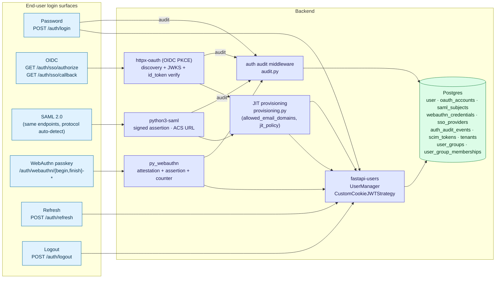
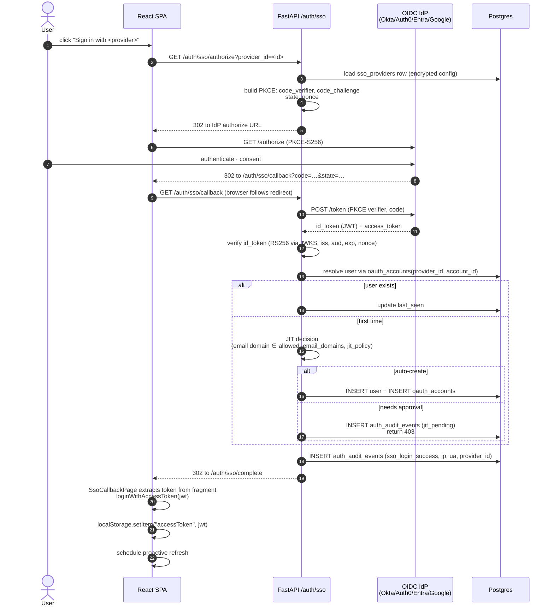
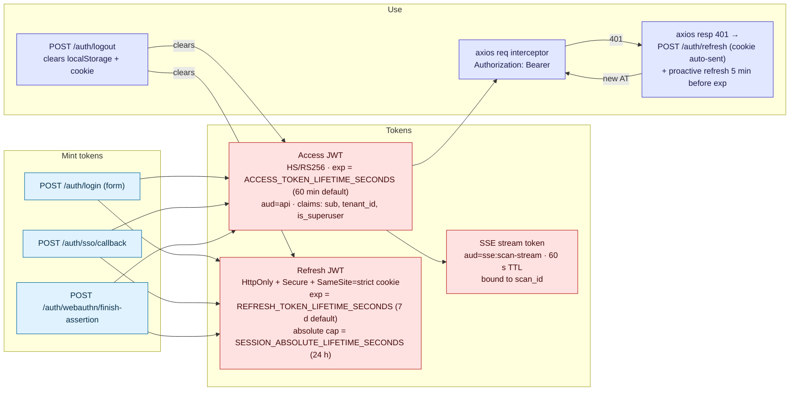
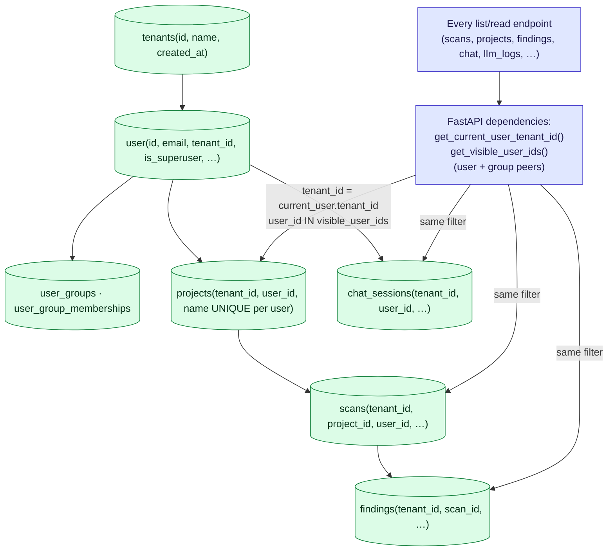
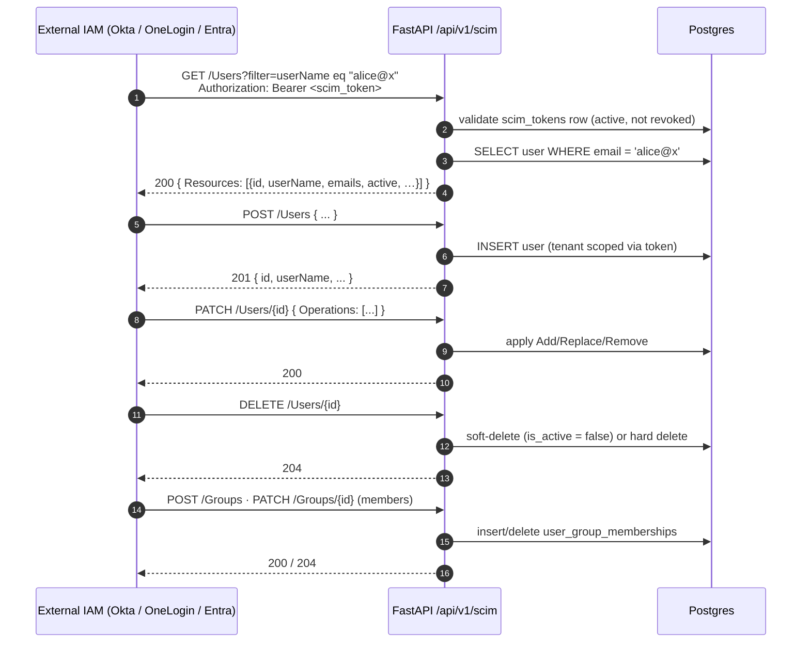

# 08 — Auth, SSO, SCIM, RBAC, Multi-tenancy

Every identity surface SCCAP exposes: password login, OIDC, SAML 2.0, WebAuthn passkeys, SCIM 2.0 provisioning, JWT token lifecycle, multi-tenant scoping, and group-based visibility.

---

## 1. Authentication surfaces (high-level)



---

## 2. OIDC SSO sequence (browser-side PKCE)



---

## 3. JWT lifecycle (access + refresh)



---

## 4. Multi-tenancy & visibility scoping



---

## 5. SCIM 2.0 provisioning



---

## Legend

### Authentication mechanisms

| Mechanism            | Library              | Endpoints                                                                                            | Persistence                           |
|----------------------|----------------------|------------------------------------------------------------------------------------------------------|---------------------------------------|
| Password             | fastapi-users + passlib bcrypt | `POST /auth/login`, `POST /auth/register`, `POST /auth/forgot-password`, `POST /auth/reset-password` | `user.hashed_password`                |
| OIDC                 | httpx-oauth          | `GET /auth/sso/authorize`, `GET /auth/sso/callback` (provider auto-detected)                          | `oauth_accounts(provider_id, account_id, account_email)` |
| SAML 2.0             | python3-saml         | Same callback path (provider's metadata decides)                                                     | `saml_subjects(provider_id, name_id, subject)`           |
| WebAuthn (FIDO2)     | py_webauthn          | `/auth/webauthn/begin-registration`, `/auth/webauthn/finish-registration`, `/auth/webauthn/begin-assertion`, `/auth/webauthn/finish-assertion` | `webauthn_credentials(credential_id, public_key, sign_count, transports[])` |
| SCIM 2.0             | (hand-rolled)        | `/api/v1/scim/{Users,Groups,Schemas,…}`                                                              | `scim_tokens(active, last_used)`      |

### Token shapes

| Token            | Where                                  | TTL                                                                  | Audience            |
|------------------|----------------------------------------|----------------------------------------------------------------------|---------------------|
| Access JWT       | `localStorage.accessToken` + `Authorization: Bearer` | `ACCESS_TOKEN_LIFETIME_SECONDS` (default 3600 s)                  | `api`               |
| Refresh JWT      | HttpOnly + Secure + SameSite cookie    | `REFRESH_TOKEN_LIFETIME_SECONDS` (default 604 800 s) capped by `SESSION_ABSOLUTE_LIFETIME_SECONDS` (default 86 400 s, max 7 d) | `refresh` |
| SSE stream token | URL query param `?access_token=…`      | 60 seconds                                                           | `sse:scan-stream`   |
| SCIM bearer      | `Authorization: Bearer <token>`        | No expiry (rotatable; revocable via admin UI)                        | `scim`              |
| Passkey assertion challenge | Server-issued per attempt    | 60 s                                                                 | n/a                 |

### Refresh logic (client side, `apiClient.ts` + `AuthProvider.tsx`)

- **Proactive**: `PROACTIVE_LEAD_MS = 5 × 60 × 1000` — schedules a refresh 5 minutes before the access JWT's `exp`.
- **Reactive**: Axios response interceptor catches `401`, calls `refreshAccessToken()`, retries the original request.
- **Single-flight**: a module-level `refreshInFlight: Promise<string> | null` ensures only one refresh runs at a time.
- **Circuit breaker**: 3 consecutive refresh failures → 30 s blackout; further calls go straight to `/login`.
- **Cross-tab sync**: `storage` event listener + 5 s polling re-reads `accessToken` so multiple tabs stay aligned.

### Multi-tenancy scoping

Every privileged list/read endpoint depends on:

| Dependency                  | What it does                                                                          |
|-----------------------------|---------------------------------------------------------------------------------------|
| `get_current_user()`        | Resolves the JWT to a `User` row                                                      |
| `get_current_user_tenant_id()` | Returns `current_user.tenant_id` (or `DEFAULT_TENANT` for legacy rows)             |
| `get_visible_user_ids()`    | `{current_user.id} ∪ {user_ids in any user_group the user belongs to}`               |

Filters applied at the repository layer:

```sql
WHERE tenant_id = :tenant_id
  AND user_id   IN :visible_user_ids
```

Admins (`is_superuser=true`) bypass these filters; the auth audit middleware records the bypass for every privileged operation.

### Multi-tenancy tables

| Table                     | Tenant column        | Notes                                                                 |
|---------------------------|----------------------|-----------------------------------------------------------------------|
| `user`                    | `tenant_id` (nullable, backfilled `default`) | Tenant scope established at sign-up / JIT provisioning  |
| `projects`                | `tenant_id`          | Inherited from creator user                                           |
| `scans`                   | `tenant_id` (indexed) | Inherited from project                                                |
| `findings`                | `tenant_id`          | Inherited from scan (faster filtering than joining)                   |
| `chat_sessions`           | `tenant_id`          | Inherited from creator                                                |
| `llm_interactions`        | `tenant_id`          | Inherited from scan / chat session                                    |

### Master admin protection (M6)

A configurable `security.master_admin_user_id` system config key designates the bootstrap admin. The user-management endpoints refuse to:

- Demote the master admin (`is_superuser = false`)
- Deactivate the master admin (`is_active = false`)
- Delete the master admin

…even when called by another superuser. This prevents an admin lock-out.

### SSO provider table (`sso_providers`)

| Column                   | Notes                                                              |
|--------------------------|--------------------------------------------------------------------|
| `protocol`               | CHECK constraint: `oidc`, `saml`, `ldap`                           |
| `enabled`                | UI toggle                                                          |
| `config`                 | Fernet-encrypted JSONB. Secret fields (`client_secret`, `sp_private_key`) are redacted in API responses |
| `allowed_email_domains`  | Array of domains permitted to auto-create via JIT                  |
| `force_for_domains`      | Array; if matched, password login is rejected (`/auth/login-guard`)|
| `jit_policy`             | `auto` · `approve` · `deny`                                        |

PATCH accepts the sentinel `"<<unchanged>>"` for any secret field so admins can update non-secret fields without re-entering keys.

### Audit (`auth_audit_events`)

Single append-only table. Sample event types:

- `login_success`, `login_failure`
- `sso_login_success`, `sso_login_failure`, `sso_jit_pending`
- `webauthn_register_success`, `webauthn_assertion_success`
- `logout`, `refresh_success`, `refresh_failure`
- `PRESCAN_OVERRIDE_CRITICAL_SECRET` (cross-cutting M10)
- `mfa_enrolled`, `mfa_disabled`
- `scim_user_created`, `scim_user_deleted`

Stored fields: `ts`, `event`, `user_id`, `provider_id`, `ip` (after `TRUSTED_PROXY_CIDRS` resolution), `user_agent`, `email_hash` (PII protection), `details` (JSONB).

Exposed for export via `GET /api/v1/admin/sso/audit?cursor=…&limit=…` (cursor-paginated).

### CORS & origin handling

- `security.allowed_origins` (system config, hot-reloaded) is the source of truth — the FastAPI CORS middleware is wired against this cached list.
- `security.cors_enabled` flag toggles the middleware entirely.
- `FRONTEND_BASE_URL` and `API_BASE_URL` allow split-origin deployments (e.g., SPA on `app.example.com`, API on `api.example.com`).
- `TRUSTED_PROXY_CIDRS` (e.g., `10.0.0.0/8`) lists ranges from which `X-Forwarded-For` is honored — outside that, the proxy header is ignored to prevent IP spoofing in audit logs.

---

## Source files

- `src/app/api/v1/routers/{auth_login_guard,sso,webauthn,scim,admin_sso,admin_scim,admin_tenants,admin_users,admin_groups}.py`
- `src/app/infrastructure/auth/{audit,oidc,saml,provisioning,scim/filter}.py`
- `src/app/infrastructure/database/models.py` (`User`, `OAuthAccount`, `SamlSubject`, `WebAuthnCredential`, `SsoProvider`, `ScimToken`, `AuthAuditEvent`, `Tenant`, `UserGroup`, `UserGroupMembership`)
- `src/app/api/dependencies.py` (`get_current_user`, `get_current_user_tenant_id`, `get_visible_user_ids`)
- `secure-code-ui/src/app/providers/{AuthContext,AuthProvider}.tsx`
- `secure-code-ui/src/shared/api/{authService,ssoService,scimService,webauthnService,userGroupService,tenantService}.ts`
- `secure-code-ui/src/pages/admin/{SsoProvidersPage,SsoAuditPage,ScimTokensPage,UserManagement,UserGroupsPage,TenantsPage}.tsx`
