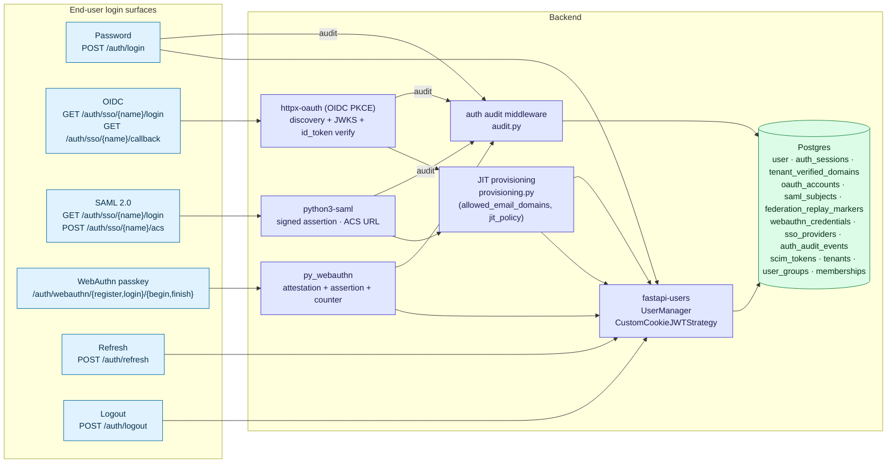
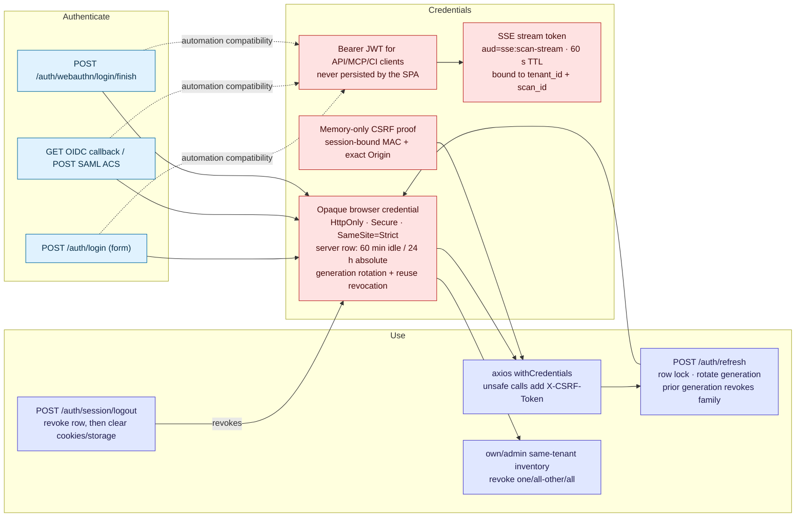
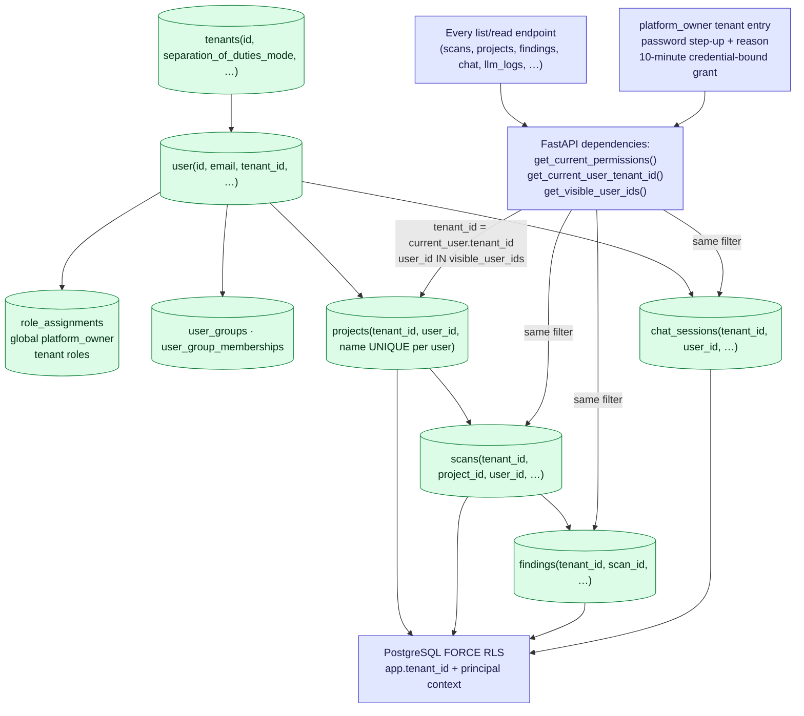
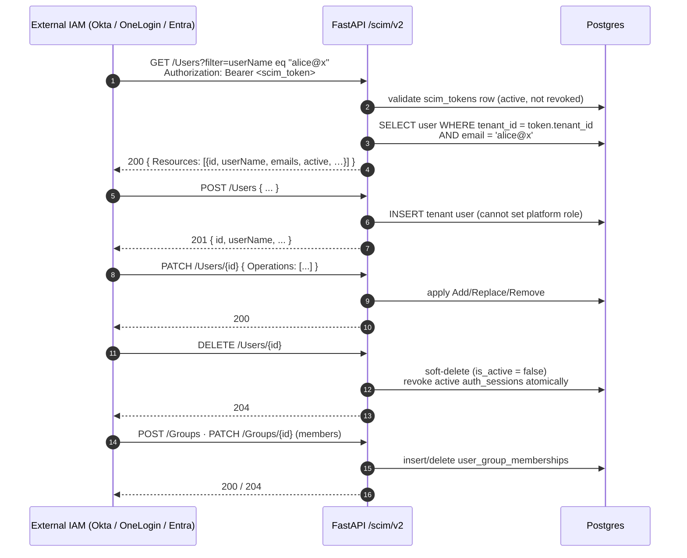

# 08 — Auth, SSO, SCIM, RBAC, Multi-tenancy

Every identity surface SCCAP exposes: password login, OIDC, SAML 2.0,
WebAuthn passkeys, SCIM 2.0 provisioning, browser/bearer lifecycle,
tenant-scoped RBAC, forced RLS, and group-based visibility.

---

## 1. Authentication surfaces (high-level)


```mermaid
flowchart LR
    subgraph Surfaces["End-user login surfaces"]
      Pwd["Password<br/>POST /auth/login"]:::edge
      OIDC["OIDC<br/>GET /auth/sso/{name}/login<br/>GET /auth/sso/{name}/callback"]:::edge
      SAML["SAML 2.0<br/>GET /auth/sso/{name}/login<br/>POST /auth/sso/{name}/acs"]:::edge
      Pass["WebAuthn passkey<br/>/auth/webauthn/{register,login}/{begin,finish}"]:::edge
      Refresh["Refresh<br/>POST /auth/refresh"]:::edge
      Logout["Logout<br/>POST /auth/logout"]:::edge
    end

    subgraph Backend
      direction TB
      FU["fastapi-users<br/>UserManager<br/>CustomCookieJWTStrategy"]:::app
      Httpx["httpx-oauth (OIDC PKCE)<br/>discovery + JWKS + id_token verify"]:::app
      Saml["python3-saml<br/>signed assertion · ACS URL"]:::app
      WA["py_webauthn<br/>attestation + assertion + counter"]:::app
      JIT["JIT provisioning<br/>provisioning.py<br/>(allowed_email_domains, jit_policy)"]:::app
      Audit["auth audit middleware<br/>audit.py"]:::app
      DB[("Postgres<br/>user · auth_sessions · tenant_verified_domains<br/>oauth_accounts · saml_subjects · federation_replay_markers<br/>webauthn_credentials · sso_providers · auth_audit_events<br/>scim_tokens · tenants · user_groups · memberships")]:::data
    end

    Pwd --> FU
    OIDC --> Httpx --> JIT --> FU
    SAML --> Saml --> JIT --> FU
    Pass --> WA --> FU
    Refresh --> FU
    Logout --> FU
    FU --> DB
    Httpx -- audit --> Audit
    Saml -- audit --> Audit
    WA -- audit --> Audit
    Pwd -- audit --> Audit
    Audit --> DB

    classDef edge fill:#e0f2fe,stroke:#0369a1,color:#082f49;
    classDef app  fill:#e0e7ff,stroke:#4338ca,color:#1e1b4b;
    classDef data fill:#dcfce7,stroke:#15803d,color:#052e16;
```

---

## 2. OIDC SSO sequence (browser-side PKCE)

```mermaid
sequenceDiagram
    autonumber
    actor U as User
    participant SPA as React SPA
    participant API as FastAPI /auth/sso
    participant IDP as OIDC IdP<br/>(Okta/Auth0/Entra/Google)
    participant DB as Postgres

    U->>SPA: click "Sign in with <provider>"
    SPA->>API: GET /auth/sso/{name}/login
    API->>DB: load sso_providers row (encrypted config)
    API->>API: build PKCE: code_verifier, code_challenge<br/>state, nonce
    API-->>SPA: 302 to IdP authorize URL
    SPA->>IDP: GET /authorize (PKCE-S256)
    U->>IDP: authenticate · consent
    IDP-->>SPA: 302 to /auth/sso/{name}/callback?code=…&state=…
    SPA->>API: GET /auth/sso/{name}/callback (browser follows redirect)
    API->>IDP: POST /token (PKCE verifier, code)
    IDP-->>API: id_token (JWT) + access_token
    API->>API: pin discovery issuer/endpoints<br/>allowlist alg · verify JWKS signature, iss, aud, exp, nonce<br/>refresh JWKS once for an unknown kid
    API->>DB: resolve user via oauth_accounts(provider_id, account_id)
    alt user exists
      API->>DB: update last_seen
    else first time
      API->>DB: require verified tenant DNS domain
      API->>API: tenant-bound JIT decision<br/>(email domain ∈ allowed_email_domains, jit_policy)
      alt auto-create
        API->>DB: INSERT user + INSERT oauth_accounts
      else needs approval
        API->>DB: INSERT auth_audit_events (jit_pending)<br/>return 403
      end
    end
    API->>DB: INSERT auth_sessions + auth_audit_events<br/>(provider, tenant, keyed network hash, coarse device)
    API-->>SPA: Set-Cookie: __Host-SCCAPSession=opaque; HttpOnly<br/>302 to /auth/sso/complete (no token in URL)
    SPA->>API: GET /auth/session/me then /auth/session/csrf
```

---

## 3. Browser-session and bearer lifecycle


```mermaid
flowchart LR
    subgraph Mint["Authenticate"]
      A1["POST /auth/login (form)"]:::edge
      A2["GET OIDC callback / POST SAML ACS"]:::edge
      A3["POST /auth/webauthn/login/finish"]:::edge
    end

    subgraph Credentials
      BS["Opaque browser credential<br/>HttpOnly · Secure · SameSite=Strict<br/>server row: 60 min idle / 24 h absolute<br/>generation rotation + reuse revocation"]:::secret
      CSRF["Memory-only CSRF proof<br/>session-bound MAC + exact Origin"]:::secret
      AT["Bearer JWT for API/MCP/CI clients<br/>never persisted by the SPA"]:::secret
      SSE["SSE stream token<br/>aud=sse:scan-stream · 60 s TTL<br/>bound to tenant_id + scan_id"]:::secret
    end

    subgraph Use
      Axios["axios withCredentials<br/>unsafe calls add X-CSRF-Token"]:::app
      Refresh["POST /auth/refresh<br/>row lock · rotate generation<br/>prior generation revokes family"]:::app
      Inventory["own/admin same-tenant inventory<br/>revoke one/all-other/all"]:::app
      Logout["POST /auth/session/logout<br/>revoke row, then clear cookies/storage"]:::app
    end

    A1 & A2 & A3 --> BS
    BS --> Axios
    CSRF --> Axios
    Axios --> Refresh --> BS
    BS --> Inventory
    A1 & A2 & A3 -. "automation compatibility" .-> AT
    AT --> SSE
    Logout -- "revokes" --> BS

    classDef edge fill:#e0f2fe,stroke:#0369a1,color:#082f49;
    classDef app  fill:#e0e7ff,stroke:#4338ca,color:#1e1b4b;
    classDef secret fill:#fee2e2,stroke:#b91c1c,color:#450a0a;
```

---

## 4. Multi-tenancy & visibility scoping


```mermaid
flowchart TB
    Tenants[("tenants(id, separation_of_duties_mode, …)")]:::data
    User[("user(id, email, tenant_id, …)")]:::data
    Roles[("role_assignments<br/>global platform_owner<br/>tenant roles")]:::data
    Groups[("user_groups · user_group_memberships")]:::data
    Project[("projects(tenant_id, user_id, name UNIQUE per user)")]:::data
    Scan[("scans(tenant_id, project_id, user_id, …)")]:::data
    Finding[("findings(tenant_id, scan_id, …)")]:::data
    Chat[("chat_sessions(tenant_id, user_id, …)")]:::data
    Dep["FastAPI dependencies:<br/>get_current_permissions()<br/>get_current_user_tenant_id()<br/>get_visible_user_ids()"]:::app
    Routers["Every list/read endpoint<br/>(scans, projects, findings, chat, llm_logs, …)"]:::app
    RLS["PostgreSQL FORCE RLS<br/>app.tenant_id + principal context"]:::app
    Entry["platform_owner tenant entry<br/>password step-up + reason<br/>10-minute credential-bound grant"]:::app

    Tenants --> User
    User --> Roles
    User --> Groups
    User --> Project --> Scan --> Finding
    User --> Chat
    Routers --> Dep
    Entry --> Dep
    Dep -- "tenant_id = current_user.tenant_id<br/>user_id IN visible_user_ids" --> Project
    Dep -- same filter --> Scan
    Dep -- same filter --> Finding
    Dep -- same filter --> Chat
    Project & Scan & Finding & Chat --> RLS

    classDef app  fill:#e0e7ff,stroke:#4338ca,color:#1e1b4b;
    classDef data fill:#dcfce7,stroke:#15803d,color:#052e16;
```

---

## 5. SCIM 2.0 provisioning


```mermaid
sequenceDiagram
    autonumber
    participant IDM as External IAM (Okta / OneLogin / Entra)
    participant API as FastAPI /scim/v2
    participant DB as Postgres

    IDM->>API: GET /Users?filter=userName eq "alice@x"<br/>Authorization: Bearer <scim_token>
    API->>DB: validate scim_tokens row (active, not revoked)
    API->>DB: SELECT user WHERE tenant_id = token.tenant_id<br/>AND email = 'alice@x'
    API-->>IDM: 200 { Resources: [{id, userName, emails, active, …}] }

    IDM->>API: POST /Users { ... }
    API->>DB: INSERT tenant user (cannot set platform role)
    API-->>IDM: 201 { id, userName, ... }

    IDM->>API: PATCH /Users/{id} { Operations: [...] }
    API->>DB: apply Add/Replace/Remove
    API-->>IDM: 200

    IDM->>API: DELETE /Users/{id}
    API->>DB: soft-delete (is_active = false)<br/>revoke active auth_sessions atomically
    API-->>IDM: 204

    IDM->>API: POST /Groups · PATCH /Groups/{id} (members)
    API->>DB: insert/delete user_group_memberships
    API-->>IDM: 200 / 204
```

---

## Legend

### Feature-flag gating (modular setup — #103–111)

The identity surfaces above are **not all present in every install** — they are gated by five feature flags. The dependency resolver enforces the chain so an enabled set is always consistent (`scim` → `sso` → `multi_user`; `user_groups` → `multi_user`; `multi_tenant` → `multi_user`):

| Feature        | Gates                                                                                       | When OFF                                                                              |
|----------------|----------------------------------------------------------------------------------------------|----------------------------------------------------------------------------------------|
| (none — `scan` floor) | Password login, WebAuthn passkeys, JWT mint/refresh/logout, the bootstrap platform owner | Always present — a single-account install still authenticates                       |
| `multi_user`   | `admin_users` router and the admin Users page                                                | Install is single-account; the §1 surfaces collapse to password + passkey for that user |
| `user_groups`  | `admin_groups` router, group CRUD, peer visibility (`get_visible_user_ids` resolves to self) | `get_visible_user_ids()` returns `{current_user.id}` only — no peer scope               |
| `sso`          | `sso` + `admin_sso` routers, the §2 OIDC/SAML flow, JIT provisioning, SSO audit log           | SSO buttons absent on `LoginPage`; only password / passkey remain                       |
| `scim`         | `scim` + `admin_scim` routers, the §5 provisioning flow, `scim_tokens`                        | External IAM cannot provision; `/scim/v2/*` is unmounted (404)                          |
| `multi_tenant` | tenant metadata, explicit platform-owner entry, and tenant management UI                       | All tenant roles resolve to `DEFAULT_TENANT`; §4 tenant and RLS filters remain active   |

Gating is enforced **server-side**: `bootstrap_enabled_features_sync()` decides which routers `main.py` mounts at import time, so a disabled surface returns 404 — the hidden nav link (diagram 03) is defence-in-depth, not the boundary. The `vibe_coder` variant ships none of these five (single-user); `developer` adds `multi_user` + `user_groups`; `enterprise` enables all five.

### Authentication mechanisms

| Mechanism            | Library              | Endpoints                                                                                            | Persistence                           |
|----------------------|----------------------|------------------------------------------------------------------------------------------------------|---------------------------------------|
| Password             | fastapi-users + passlib bcrypt | `POST /auth/login`, `POST /auth/forgot-password`, `POST /auth/reset-password` | `user.hashed_password`                |
| OIDC                 | httpx-oauth          | `GET /auth/sso/{name}/login`, `GET /auth/sso/{name}/callback`                                        | `oauth_accounts(provider_id, account_id, account_email)` |
| SAML 2.0             | python3-saml         | `GET /auth/sso/{name}/login`, `POST /auth/sso/{name}/acs`, `GET /auth/sso/{name}/metadata`            | `saml_subjects(provider_id, name_id, subject)`           |
| WebAuthn (FIDO2)     | py_webauthn          | `/auth/webauthn/register/{begin,finish}`, `/auth/webauthn/login/{begin,finish}`, `/auth/webauthn/credentials` | `webauthn_credentials(credential_id, public_key, sign_count, transports[])` |
| SCIM 2.0             | (hand-rolled)        | `/scim/v2/{Users,Groups,Schemas,…}`                                                                   | `scim_tokens(active, last_used)`      |

Public self-registration is not mounted. Initial setup creates the first user;
that user receives `platform_owner`. A tenant identity manager creates later
local users through `/admin/users`; each starts with the `analyst` role.

### Token shapes

| Token            | Where                                  | TTL                                                                  | Audience            |
|------------------|----------------------------------------|----------------------------------------------------------------------|---------------------|
| Browser session  | `__Host-SCCAPSession` HttpOnly cookie (`SCCAPSessionDev` locally) | 60 min idle / 24 h absolute by default; tenant may shorten | opaque MAC credential |
| CSRF proof       | JavaScript memory + `X-CSRF-Token`       | bound to current browser-session UUID                              | session MAC           |
| Access JWT       | Explicit `Authorization: Bearer` for API/MCP/CI; never SPA storage | `ACCESS_TOKEN_LIFETIME_SECONDS` | `fastapi-users:auth` |
| Legacy refresh JWT | HttpOnly compatibility cookie          | capped by browser-session absolute deadline                        | `fastapi-users:auth` |
| SSE stream token | URL query param `?access_token=…`      | 60 seconds; bound to selected tenant and one scan                    | `sse:scan-stream`   |
| SCIM bearer      | `Authorization: Bearer <token>`        | No expiry (rotatable; revocable via admin UI)                        | `scim`              |
| Passkey assertion challenge | Server-issued per attempt    | 60 s                                                                 | n/a                 |
| Tenant-entry grant | JavaScript memory + `X-SCCAP-Tenant-Entry` | 10 minutes; bound to principal and browser/bearer credential | one explicit tenant |

### Browser session logic (`apiClient.ts` + `AuthProvider.tsx`)

- The SPA synchronously removes the retired `localStorage.accessToken` value and never writes a replacement.
- Bootstrap calls `/auth/session/me` and `/auth/session/csrf`; the CSRF value remains module-memory only.
- Activity touches are coalesced. A warning appears two minutes before the idle or absolute deadline.
- A `401` clears SPA auth state and returns to login. Tenant-entry `403`
  responses clear only the short-lived entry grant and route to tenant
  selection; permission and CSRF `403` responses preserve the login.
- Two concurrent rotations serialize on the session row. Presenting the prior generation revokes only that family.
- A tenant may configure a per-user limit with `deny_new` (default) or explicit `revoke_oldest` enforcement.

### Multi-tenancy scoping

Every tenant surface resolves current permissions and an explicit tenant:

| Dependency                  | What it does                                                                          |
|-----------------------------|---------------------------------------------------------------------------------------|
| `get_current_permissions()` | Resolves current database role assignments into stable capability keys              |
| `get_current_user_tenant_id()` | Returns the human's exact tenant; a platform owner must present a valid tenant-entry grant |
| `get_visible_user_ids()`    | Applies ownership/group scope inside that tenant; tenant-wide read permission widens only the user filter |

Filters applied at the repository layer:

```sql
WHERE tenant_id = :tenant_id
  AND user_id   IN :visible_user_ids
```

No human role bypasses the tenant predicate or forced RLS. Platform owners must
select one tenant, pass password step-up, provide a reason, and present the
short-lived signed grant on tenant requests. Foreign and absent object IDs both
return `404`.

### Multi-tenancy tables

| Table                     | Tenant column        | Notes                                                                 |
|---------------------------|----------------------|-----------------------------------------------------------------------|
| `user`                    | `tenant_id` (non-null for tenant humans; legacy bootstrap is normalized) | Tenant scope established at creation/JIT |
| `projects`                | `tenant_id`          | Inherited from creator user                                           |
| `scans`                   | `tenant_id` (indexed) | Inherited from project                                                |
| `findings`                | `tenant_id`          | Inherited from scan (faster filtering than joining)                   |
| `chat_sessions`           | `tenant_id`          | Inherited from creator                                                |
| `llm_interactions`        | `tenant_id`          | Inherited from scan / chat session                                    |
| `role_assignments`        | nullable only for global `platform_owner` | Tenant roles require an exact tenant                         |
| `scim_tokens`             | `tenant_id`          | Service principal is bound to one tenant                              |
| `authorization_action_requests` | `tenant_id`   | Durable high-risk request and distinct-actor decision                 |

Core tenant tables and their protected children use `ENABLE ROW LEVEL
SECURITY` plus `FORCE ROW LEVEL SECURITY`. API and worker transactions set
`app.tenant_id`, `app.principal_kind`, `app.principal_id`, and the narrowly
controlled system-scope flag. Production rejects unsafe database-role posture
at startup.

### Master admin protection (M6)

A configurable `security.master_admin_user_id` system config key designates the
bootstrap recovery account. Tenant administration cannot grant or remove its
global `platform_owner` assignment. The user-management endpoints also refuse
to:

- Deactivate the master admin (`is_active = false`)
- Delete the master admin

Platform-owner tenant access is never implicit: recovery entry still requires
password step-up, a reason, a ten-minute expiry, and high-severity audit
evidence. It cannot satisfy its own critical-mode second approval.

### SSO provider table (`sso_providers`)

| Column                   | Notes                                                              |
|--------------------------|--------------------------------------------------------------------|
| `protocol`               | `oidc` or `saml`                                                     |
| `enabled`                | UI toggle                                                          |
| `config`                 | Fernet-encrypted JSONB. Secret fields (`client_secret`, `sp_private_key`) are redacted in API responses |
| `allowed_email_domains`  | Verified tenant domains permitted to link/JIT                      |
| `force_for_domains`      | Verified subset; password login is rejected (`/auth/login-guard`)  |
| `jit_policy`             | `auto` · `approve` · `deny`                                        |

PATCH accepts the sentinel `"<<unchanged>>"` for any secret field so admins can update non-secret fields without re-entering keys.
In tenant `critical` mode, deleting a provider requires a durable request and a
distinct current actor with `tenant.policy.manage`; session revocation,
provider deletion, action execution, and audit evidence commit together.

### Roles, permissions, and separation of duties

Routes check permission keys rather than role names. Built-in tenant roles are
`tenant_admin`, `security_approver`, `analyst`, `developer`, and `auditor`;
humans may hold several and receive the union of their permissions. Service
principals receive only direct allowlisted scopes and cannot open browser
sessions or approve human actions.

The tenant `separation_of_duties_mode` is `off` by default. In `critical` mode,
scan-owner gate decisions, finding waivers, permission increases, SSO-provider
deletion, SCIM credential revocation, and rule promotion/rollback require a
distinct current actor. The generic action request binds the tenant,
requester/approver permissions, HMAC target fingerprint, canonical payload
digest, idempotency key, and expiry. Execution rejects stale permissions,
expiry, changed payloads, and tenant or target mismatch.

### Audit

`auth_audit_events` is append-only. Sample event types:

- `login_success`, `login_failure`
- `sso_login_success`, `sso_login_failure`, `sso_jit_pending`
- `webauthn_register_success`, `webauthn_assertion_success`
- `logout`, `refresh_success`, `refresh_failure`
- `PRESCAN_OVERRIDE_CRITICAL_SECRET` (cross-cutting M10)
- `mfa_enrolled`, `mfa_disabled`
- `scim_user_created`, `scim_user_deleted`

Stored fields include `ts`, actor/subject/session/provider/tenant IDs, outcome,
keyed network hash (after trusted-proxy resolution), coarse browser/OS label,
`email_hash`, and allowlisted details. Cookies, bearer tokens, authorization
codes, assertions, raw claims, secrets, and plaintext email are never stored.

Exposed to callers with `audit.read` via
`GET /api/v1/admin/sso/audit?cursor=…&limit=…` (cursor-paginated).
Authorization decisions are separately recorded in append-only
`authorization_audit_events` with privacy-safe target fingerprints.

### CORS & origin handling

- `security.allowed_origins` (system config, hot-reloaded) is the source of truth — the FastAPI CORS middleware is wired against this cached list.
- `security.cors_enabled` flag toggles the middleware entirely.
- `FRONTEND_BASE_URL` and `API_BASE_URL` allow split-origin deployments (e.g., SPA on `app.example.com`, API on `api.example.com`).
- `TRUSTED_PROXY_CIDRS` (e.g., `10.0.0.0/8`) lists ranges from which `X-Forwarded-For` is honored — outside that, the proxy header is ignored to prevent IP spoofing in audit logs.

---

## Source files

- `src/app/api/v1/routers/{auth_login_guard,sso,webauthn,scim,admin_sso,admin_scim,admin_tenants,admin_users,admin_groups,authorization}.py`
- `src/app/infrastructure/auth/sso/{audit,oidc,saml,provisioning}.py`
- `src/app/infrastructure/auth/{tenant_entry,sse_token}.py`
- `src/app/infrastructure/auth/scim/{auth,filter}.py`
- `src/app/infrastructure/database/models.py` (`User`, `RoleAssignment`, `AuthorizationActionRequest`, `AuthorizationAuditEvent`, `OAuthAccount`, `SamlSubject`, `WebAuthnCredential`, `SsoProvider`, `ScimToken`, `AuthAuditEvent`, `Tenant`, `UserGroup`, `UserGroupMembership`)
- `src/app/api/v1/dependencies.py` (`get_current_permissions`, `get_current_user_tenant_id`, `get_visible_user_ids`)
- `src/app/infrastructure/database/{tenant_context,role_posture}.py`
- `src/app/infrastructure/database/repositories/authorization_repo.py`
- `secure-code-ui/src/app/providers/{AuthContext,AuthProvider}.tsx`
- `secure-code-ui/src/shared/api/{authService,ssoService,scimService,webauthnService,userGroupService,tenantService}.ts`
- `secure-code-ui/src/pages/admin/{SsoProvidersPage,SsoAuditPage,ScimTokensPage,UserManagement,UserGroupsPage,TenantsPage}.tsx`
