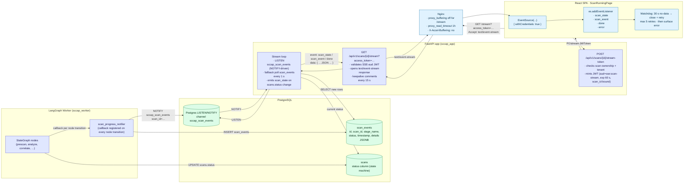
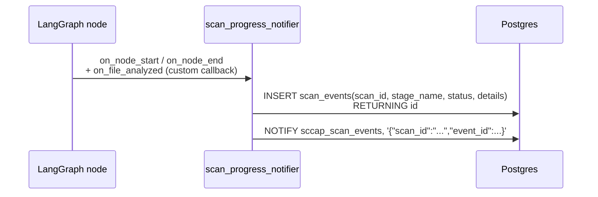

# 09 — Real-time SSE Streaming

SCCAP uses **Server-Sent Events** (one-way, server → browser) for live scan progress. No WebSocket layer. This page documents the full streaming pipeline: from the LangGraph worker emitting a `ScanEvent` row to the SPA closing its `EventSource`.

---

## Diagram



---

## Wire-format reference

```text
event: scan_state
data: {"scan_id":"…","status":"PENDING_COST_APPROVAL","cost_details":{"total_estimated_cost":1.42,"total_input_tokens":83000,"predicted_output_tokens":5200}}

event: scan_event
data: {"scan_id":"…","event_id":42,"stage_name":"FILE_ANALYZED","status":"COMPLETED","timestamp":"2026-05-12T14:01:33.221Z","details":{"file_path":"src/auth.py","findings_count":3,"fixes_count":2}}

event: scan_event
data: {"scan_id":"…","event_id":43,"stage_name":"CORRELATING","status":"STARTED","timestamp":"2026-05-12T14:01:34.012Z"}

: keepalive
event: done
data: {"scan_id":"…","status":"COMPLETED"}
```

The single `:` line is an **SSE comment**, used as a keepalive every 15 seconds so intermediate proxies don't time the connection out.

---

## Legend

### Stream-token JWT

| Claim         | Value                                                          |
|---------------|----------------------------------------------------------------|
| `iss`         | SCCAP issuer                                                   |
| `sub`         | `user_id`                                                      |
| `aud`         | `sse:scan-stream` (distinct from the API audience `api`)       |
| `scan_id`     | The scan this token can stream                                 |
| `exp`         | issued time + 60 s                                             |
| `tenant_id`   | For cross-check against the scan's tenant                       |

The same access token cannot stream scans; the SSE endpoint refuses any JWT whose `aud != sse:scan-stream`. This is a deliberate split so a leaked access token cannot tail an arbitrary scan.

### Backend stream loop (`src/app/api/v1/routers/projects.py::stream_scan`)

```python
async def stream(scan_id, request):
    yield_keepalive_every = 15  # s
    fallback_interval     = 1   # s when no LISTEN/NOTIFY
    last_event_id         = request.query_params.get("last_event_id")  # auto from EventSource
    async with db.acquire() as conn:
        await conn.execute("LISTEN sccap_scan_events")
        while not await request.is_disconnected():
            # 1. drain any new scan_events past last_event_id
            new_rows = await fetch_new(scan_id, last_event_id)
            for row in new_rows:
                yield sse_event("scan_event", payload(row))
                last_event_id = row.id
            # 2. emit scan_state on status change
            ...
            # 3. terminal? emit done; break.
            if status in TERMINAL_STATES:
                yield sse_event("done", {...})
                break
            # 4. wait for NOTIFY or fallback poll
            await wait_notify_or(fallback_interval)
            await keepalive_if_due()
```

### `scan_events` table — write path



### EventSource handling (frontend)

```ts
const { access_token } = await scanService.getStreamToken(scanId);
const url = `/api/v1/scans/${scanId}/stream?access_token=${access_token}`;
const es  = new EventSource(url, { withCredentials: true });

es.addEventListener("scan_state", (e) => setStatus(JSON.parse(e.data)));
es.addEventListener("scan_event", (e) => appendEvent(JSON.parse(e.data)));
es.addEventListener("done",       (_) => { es.close(); navigate(`/analysis/results/${scanId}`); });
es.addEventListener("error",      (_) => watchdog.bump());
```

- `withCredentials: true` so the refresh cookie travels (the Nginx/origin policy already permits it).
- Each event has its own type, so client handlers don't need to switch on `JSON.parse(e.data).kind`.
- The browser's native EventSource retry is augmented with a 30-second no-data watchdog and a max-5-retry bound surfaced as a toast.

### Nginx-side tuning (`secure-code-ui/nginx-https.conf`)

```nginx
location /api/v1/ {
    proxy_pass http://app_backend;
    proxy_http_version 1.1;
    proxy_set_header Connection "";

    # SSE-friendly
    proxy_buffering         off;
    proxy_request_buffering off;
    proxy_read_timeout      3600s;
    add_header              X-Accel-Buffering no;
}
```

### Terminal events

`done` is emitted exactly once. The server breaks out of its loop after that, and the SPA closes the `EventSource` to release the connection. Reconnecting to a terminated scan produces a single `scan_state` event with the final status followed by `done`.

### Failure modes & resilience

| Failure                                  | Handling                                                                                                                     |
|------------------------------------------|------------------------------------------------------------------------------------------------------------------------------|
| DB `LISTEN` connection drops              | Stream loop falls back to 1 s polling of `scan_events` + `scans.status`                                                       |
| Worker crashes mid-scan                   | Scan stays in non-terminal status until the orphan sweeper marks it `FAILED`; SSE keeps streaming keepalive comments         |
| User refreshes the page                   | EventSource closed by browser; on re-open the `Last-Event-ID` header is set automatically and the server resumes after that id |
| SSE token expires (60 s)                  | Endpoint returns 401 with `WWW-Authenticate: Bearer error="invalid_token"`; SPA requests a fresh stream-token and reopens     |
| Reverse-proxy buffering                   | `proxy_buffering off` + `X-Accel-Buffering: no` prevent Nginx from holding events                                            |
| LLM provider stalls                       | Worker emits no events; client watchdog kicks in after 30 s and reconnects                                                   |

---

## Source files

- `src/app/api/v1/routers/projects.py` — `stream_scan_token`, `stream_scan`
- `src/app/infrastructure/workflows/callbacks/scan_progress_notifier.py`
- `src/app/infrastructure/database/models.py` — `ScanEvent`
- `secure-code-ui/src/pages/submission/ScanRunningPage.tsx`
- `secure-code-ui/src/shared/api/scanService.ts` — `getStreamToken`
- `secure-code-ui/nginx-https.conf`
