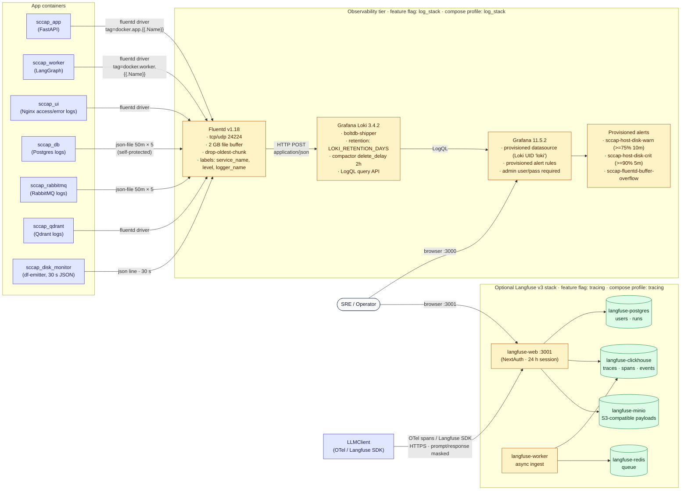
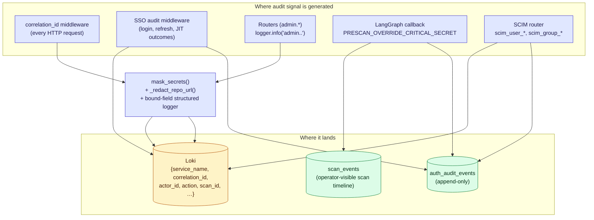

# 10 — Observability & Audit Logging

Three concerns under one roof:

1. **Logs** — every container ships to Fluentd → Loki, viewed in Grafana.
2. **LLM traces** — optional Langfuse v3 self-hosted stack records prompt/response, tokens, cache stats, cost.
3. **Audit** — `auth_audit_events` and structured `logger.info("admin.<resource>.<action>")` emits cover all privileged actions.

---

## 1. Logs / metrics pipeline

---

## 2. Audit logging — what gets recorded

---

## Legend

### Feature-flag gating (modular setup — #103–111)

Both observability tiers are **container-backed feature flags** — the only two in the catalog. A container-backed feature needs *two* things to be live: the `features.<name>` flag ON **and** its compose profile present in `COMPOSE_PROFILES` so the containers actually boot. The lifespan consistency check logs a one-time WARN when the flag is on but the profile is missing.

| Feature     | Compose profile | Gates                                                                                       | When OFF                                                                            |
|-------------|-----------------|----------------------------------------------------------------------------------------------|--------------------------------------------------------------------------------------|
| `log_stack` | `log_stack`     | The §1 Fluentd → Loki → Grafana stack **and** the LLM log viewer (`/scans/:id/llm-logs`)     | Containers don't boot; app/worker logs stay on the Docker `json-file` driver only    |
| `tracing`   | `tracing`       | The optional Langfuse v3 stack (§1 `LF` subgraph); `LLMClient` Langfuse spans                | `LANGFUSE_ENABLED` is effectively a no-op; no per-LLM-call traces; no `:3001` UI      |

Neither flag affects audit logging: `auth_audit_events` and `scan_events` are Postgres tables written regardless — §2 is part of the always-on `scan` floor. Variant defaults: `vibe_coder` / `developer` ship neither; `enterprise` enables `log_stack` but deliberately leaves `tracing` **off** (its profile ships, so an operator can flip it on without a redeploy, but a 6-container Langfuse stack does not boot unasked).

### Log fields (bound at request scope — V16.4.1)

| Field             | Source                                                                                  |
|-------------------|-----------------------------------------------------------------------------------------|
| `correlation_id`  | Generated per request, propagated via `correlation_id_var` `ContextVar`                  |
| `actor_id`        | `current_user.id` (or `null` for pre-auth endpoints)                                    |
| `tenant_id`       | `current_user.tenant_id`                                                                |
| `action`          | Dotted name, e.g. `scans.created`, `admin.framework.deleted`, `chat.session.ask`         |
| `scan_id`, `project_id`, `session_id`, `job_id` | Per-domain entity id                                                |
| `service_name`    | `app` or `worker` (env var `SERVICE_NAME`)                                              |
| `level`           | `INFO` / `WARN` / `ERROR`                                                               |
| `logger_name`     | Python logger name (`app.api.routers.projects` etc.)                                    |

### Sensitive data handling

| Risk                                     | Mitigation                                                                                   |
|------------------------------------------|----------------------------------------------------------------------------------------------|
| API keys in prompts / responses          | `mask_secrets()` regex pipeline (Anthropic / OpenAI / Google keys, JWTs, AWS keys, high-entropy 32+ char tokens) |
| Repo URLs with userinfo                  | `_redact_repo_url()` strips userinfo before persistence and logging                          |
| Email PII in audit                       | `email_hash` (SHA-256, salted) stored instead of plaintext where compatible                  |
| Attacker-controlled log lines            | All logs use structured fields (kwargs), never `%` / f-string interpolation of user input    |
| Stack traces leaking internals on errors | FastAPI `exception_handler` returns `{detail: "Internal error"}` + log full trace internally  |

### `auth_audit_events` event taxonomy

| Family       | Events                                                                                                       |
|--------------|--------------------------------------------------------------------------------------------------------------|
| Login        | `login_success`, `login_failure`, `login_locked`                                                              |
| SSO          | `sso_login_success`, `sso_login_failure`, `sso_jit_pending`, `sso_provider_created/updated/deleted`           |
| MFA / Passkey | `webauthn_register_success/failure`, `webauthn_assertion_success/failure`, `mfa_enrolled`, `mfa_disabled`     |
| Refresh      | `refresh_success`, `refresh_failure`, `refresh_circuit_open`                                                 |
| Scan         | `scans.created`, `scans.approved`, `scans.cancelled`, `scans.deleted`, `PRESCAN_OVERRIDE_CRITICAL_SECRET`     |
| Admin        | `admin.<resource>.<action>` for framework, agent, prompt, sso, scim, smtp, llm-config, system-config, seed     |
| SCIM         | `scim_user_created/updated/deleted`, `scim_group_created/updated/deleted`                                    |
| Master admin | `master_admin_protection_triggered` (M6) — recorded whenever an attempt to demote/delete the master fails    |

### Admin-visible audit surfaces

| Surface                                    | Route                                                                |
|--------------------------------------------|----------------------------------------------------------------------|
| SSO audit page                             | `/admin/sso/audit` (`GET /api/v1/admin/sso/audit?cursor=…&limit=…`)  |
| Scan timeline                              | `GET /api/v1/scans/{id}/events`                                      |
| LLM interaction log per scan               | `GET /api/v1/scans/{id}/llm-interactions` → `/scans/:id/llm-logs`    |
| Loki dashboards                            | Grafana, datasource `loki`                                           |
| Langfuse runs                              | `http://localhost:3001` (admin-only link from AdminSubNav)            |

### Provisioned Grafana alerts

| Alert id                            | Condition                                                  | Severity |
|-------------------------------------|------------------------------------------------------------|----------|
| `sccap-host-disk-warn`              | `disk_used_pct >= 75` for 10 min                            | warning  |
| `sccap-host-disk-crit`              | `disk_used_pct >= 90` for 5 min                             | critical |
| `sccap-fluentd-buffer-overflow`     | Fluentd drops chunks (`fluentd.output.buffer.drop`)        | critical |

Contact points (email / Slack / PagerDuty) are deliberately *not* provisioned — operators wire those to their own incident channels.

### Fluentd self-protection

The Fluentd container itself uses the `json-file` Docker logging driver (capped at 50 MB × 5) so a Loki outage doesn't create a log-of-logs loop. The 2 GB file buffer with `drop-oldest-chunk` overflow keeps sustained outages bounded.

### Retention

| Layer            | Default                                | Override                                                                 |
|------------------|----------------------------------------|---------------------------------------------------------------------------|
| Loki logs        | `LOKI_RETENTION_DAYS=30d`              | Set to `365d` (or more) for PCI-DSS 10.5.3 / HIPAA 164.312(b) compliance — operator must provision a larger `loki-data` volume |
| Langfuse traces  | `LANGFUSE_TRACE_RETENTION_DAYS=30`     | per-deployment                                                            |
| `auth_audit_events` | No TTL (compliance-critical)         | Operator-driven archival                                                  |
| `llm_interactions`  | `RETENTION_DAYS_LLM_INTERACTIONS`     | sweeps daily                                                              |
| `chat_messages`     | `RETENTION_DAYS_CHAT_MESSAGES`        | sweeps daily                                                              |
| `rag_preprocessing_jobs.raw_content` | 30 days post-COMPLETED   | depends on user consent flag (V14.2.8)                                    |

### Langfuse v3 stack composition

| Service                | Role                                                                                                       |
|------------------------|------------------------------------------------------------------------------------------------------------|
| `langfuse-postgres`    | Users, runs, projects metadata                                                                              |
| `langfuse-clickhouse`  | High-throughput trace / span analytics; retention enforced via partition drop                              |
| `langfuse-redis`       | Job queue (`langfuse-worker`), session cache                                                                |
| `langfuse-minio`       | S3-compatible blob store for large prompt/response payloads; bucket `langfuse` auto-created                |
| `langfuse-web`         | Next.js UI on port `3001` (NextAuth, 24 h session)                                                          |
| `langfuse-worker`      | Async aggregation jobs (no exposed port)                                                                    |

Enable via `LANGFUSE_ENABLED=true`; the SCCAP `LLMClient` then emits OTel spans on every call. When disabled the SDK is a no-op — no traffic leaves the host.

---

## Source files

- `docker-compose.yml` (every service's `logging:` block + `obs` tier)
- `fluentd/Dockerfile`, `fluentd/fluentd.conf`
- `loki/loki-config.yaml`
- `grafana/provisioning/datasources/loki.yml`
- `grafana/provisioning/alerting/disk-alert.yaml`
- `tools/df-emitter/{Dockerfile,emit.sh}`
- `src/app/config/logging_config.py`
- `src/app/infrastructure/observability/{langfuse_client,mask}.py`
- `src/app/infrastructure/auth/audit.py`
- `src/app/api/middleware/correlation.py`
