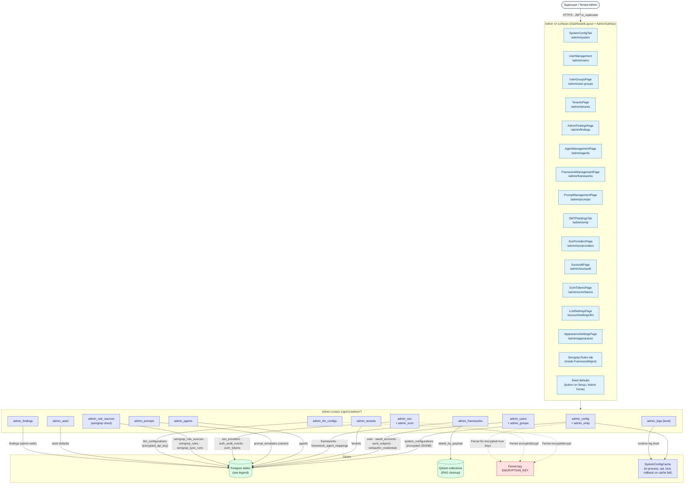

# 11 — Admin Console Operations

Every operation exposed to a superuser, grouped by concern. Each row of the admin console targets one of the cards below.

---

## Diagram

---

## Legend

### Endpoints by section

#### System config (`admin_config.py`)

| Method & path                                | Effect                                                                                |
|----------------------------------------------|---------------------------------------------------------------------------------------|
| `GET /admin/system-config`                   | List all keys (secrets redacted by `is_secret=true`)                                  |
| `GET /admin/system-config/{key}`             | Read one (with optimistic version)                                                    |
| `PUT /admin/system-config/{key}`             | Upsert value + `expected_version` for optimistic locking. Encrypted at rest when `encrypted=true`. Cache invalidation; if cache update fails the DB row is rolled back (V02.3.3) |

Notable keys:

| Key                                  | Type     | Notes                                                                              |
|--------------------------------------|----------|------------------------------------------------------------------------------------|
| `security.allowed_origins`           | `List[URL]` | Drives FastAPI CORS middleware; warn-audited on change                          |
| `security.cors_enabled`              | bool     | Master switch                                                                       |
| `security.session_lifetime_hours`    | int 1..168 | Hard-capped at 7 d (M11)                                                          |
| `security.master_admin_user_id`      | int      | Master admin protection (M6) — locked once set                                      |
| `system.log_level`                   | str      | DEBUG / INFO / WARN / ERROR; applied after lifespan                                |
| `system.smtp` (group)                | JSONB    | Host, port, user, password (encrypted), TLS toggle                                  |
| `features.*`                         | various  | Feature flags                                                                       |
| `RETENTION_DAYS_*`                   | int      | Retention sweeper inputs                                                            |
| `LOKI_RETENTION_DAYS`                | str      | Read by Loki container; needs container restart                                    |

#### Users & access (`admin_users.py`, `admin_groups.py`, `admin_tenants.py`)

| Endpoint                                       | Effect                                                                            |
|------------------------------------------------|-----------------------------------------------------------------------------------|
| `POST /admin/users`                            | Create user; triggers password-setup email via `UserManager.forgot_password()`    |
| `GET /admin/users`                             | List (pagination)                                                                  |
| `PATCH /admin/users/{user_id}`                 | Mutate `is_active`, `is_superuser`, `is_verified`; refuses master admin demotion  |
| `DELETE /admin/users/{user_id}`                | Hard delete; refuses master admin                                                  |
| `POST /admin/user-groups`                      | Create user group                                                                  |
| `GET /admin/user-groups`                       | List                                                                               |
| `POST /admin/user-groups/{id}/members`         | Add user                                                                           |
| `DELETE /admin/user-groups/{id}/members/{uid}` | Remove                                                                             |
| `POST /admin/tenants`                          | Create tenant                                                                      |
| `GET /admin/tenants`                           | List                                                                               |
| `PATCH/DELETE /admin/tenants/{id}`             | Update / delete                                                                    |

#### Frameworks, agents, prompts

(Detailed in diagrams **07** and **14**.) Standard CRUD; framework delete cascades to `framework_agent_mappings` and triggers Qdrant cleanup. `prompt_templates` carries a `variant` column (`generic | anthropic`) so admins can ship a cache-optimized Anthropic prompt and a portable prompt side-by-side.

#### SSO providers (`admin_sso.py`)

| Endpoint                                                       | Effect                                                                                 |
|----------------------------------------------------------------|----------------------------------------------------------------------------------------|
| `GET /admin/sso/providers`                                     | List (secrets redacted)                                                                |
| `POST /admin/sso/providers`                                    | Create OIDC / SAML / LDAP provider                                                     |
| `PATCH /admin/sso/providers/{id}`                              | Update — secret fields accept the sentinel `"<<unchanged>>"`                            |
| `DELETE /admin/sso/providers/{id}`                             | Revoke                                                                                  |
| `POST /admin/sso/providers/{id}/test`                          | Preflight: OIDC discovery fetch + ID-token signature test, or SAML metadata parse      |
| `GET /admin/sso/audit?cursor=…&limit=…`                        | Cursor-paginated `auth_audit_events` for SIEM export                                    |

#### SCIM tokens (`admin_scim.py`)

| Endpoint                                | Effect                                                                                   |
|-----------------------------------------|------------------------------------------------------------------------------------------|
| `POST /admin/scim/tokens`               | Mint a new bearer token (returned **once**)                                              |
| `GET /admin/scim/tokens`                | List (no token plaintext; metadata only — `last_used`, `created_by`, `is_active`)        |
| `DELETE /admin/scim/tokens/{id}`        | Revoke                                                                                    |

#### LLM configurations (`admin_llm_configs.py`)

| Endpoint                                       | Effect                                                                              |
|------------------------------------------------|-------------------------------------------------------------------------------------|
| `POST /admin/llm-configurations`               | Register provider (`anthropic`, `openai`, `google`), model, tokenizer, costs        |
| `GET /admin/llm-configurations`                | List (API key marked `info={"sensitive": True}` — never returned)                   |
| `PATCH /admin/llm-configurations/{id}`         | Update name / cost / token limits / API key (re-encrypted)                          |
| `DELETE /admin/llm-configurations/{id}`        | Retire (refused if referenced by an active scan or chat session)                    |

#### Semgrep rule sources (`admin_rule_sources.py`)

| Endpoint                                                  | Effect                                                                              |
|-----------------------------------------------------------|-------------------------------------------------------------------------------------|
| `POST /admin/rule-sources`                                | Register Semgrep Cloud org + API key (encrypted)                                    |
| `GET /admin/rule-sources`                                 | List                                                                                 |
| `PATCH /admin/rule-sources/{id}`                          | Update                                                                               |
| `POST /admin/rule-sources/{id}/sync`                      | Force pull; otherwise the `semgrep_sync_sweeper` runs hourly                         |
| `GET /admin/rule-sources/{id}/runs`                       | Inspect `semgrep_sync_runs` audit trail                                              |

#### Seed defaults (`admin_seed.py`)

| Endpoint                          | Effect                                                                                            |
|-----------------------------------|---------------------------------------------------------------------------------------------------|
| `POST /admin/seed/defaults`       | Idempotent re-seed of built-in frameworks (ASVS, Proactive, Cheatsheets), agents, prompt templates |

#### Findings (`admin_findings.py`)

| Endpoint                                 | Effect                                                                                  |
|------------------------------------------|-----------------------------------------------------------------------------------------|
| `GET /admin/findings?status=&severity=&framework=&cursor=` | Tenant-wide finding browser with filters; CSV export                       |

#### Log level (`admin_logs.py`)

| Endpoint                          | Effect                                                                                  |
|-----------------------------------|-----------------------------------------------------------------------------------------|
| `PATCH /admin/logs/level`         | Runtime log level (applies after lifespan; updates `system.log_level` system config)   |

### Encryption (`ENCRYPTION_KEY` — Fernet)

Stored encrypted at rest:

- `llm_configurations.encrypted_api_key`
- `sso_providers.config.{client_secret, sp_private_key, …}`
- `system_configurations` rows where `encrypted=true` (e.g. `system.smtp.password`)
- `semgrep_rule_sources.api_key`

Encryption is mandatory: the app refuses to start if `ENCRYPTION_KEY` is missing or matches the placeholder in `.env.example`.

### Optimistic locking

`system_configurations` has a `version` column. `PUT /admin/system-config/{key}` requires `expected_version`. Concurrent updates from two admins lose the race with a `409 Conflict`. The cache update happens **after** the DB write — if it fails the row is rolled back so the cache and DB never diverge (V02.3.3).

### Master admin protection (M6)

The single user designated by `security.master_admin_user_id`:

- Cannot be demoted (`is_superuser=false`)
- Cannot be deactivated (`is_active=false`)
- Cannot be deleted
- Cannot have their tenant changed

Every blocked attempt writes an `auth_audit_events` row with event `master_admin_protection_triggered` plus the actor.

### Setup wizard (`/setup`)

Pre-auth surface (no JWT required for `GET /setup/status`). Four steps:

1. **Deployment mode** — local / cloud (drives Let's Encrypt offer in `setup.sh`)
2. **Admin user** — creates the first superuser (becomes master admin via `security.master_admin_user_id`)
3. **LLM mode** — pick built-in provider mix (Anthropic-only, OpenAI-only, multi-provider)
4. **LLM config** — paste API key(s) for the selected providers; values are immediately Fernet-encrypted into `llm_configurations`

After step 4, `POST /admin/seed/defaults` is called automatically to populate frameworks, agents, prompts. `/setup` then redirects to `/account/dashboard`.

---

## Source files

- `src/app/api/v1/routers/admin_*.py` (12 files)
- `src/app/core/services/{admin_service,default_seed_service,system_config_cache}.py`
- `src/app/core/utils/crypto.py` (Fernet wrapper)
- `src/app/infrastructure/database/models.py` (every admin-managed table)
- `secure-code-ui/src/pages/admin/*.tsx` (every admin page)
- `secure-code-ui/src/widgets/AdminSubNav.tsx`
- `secure-code-ui/src/shared/api/{systemConfigService,llmConfigService,ssoService,scimService,frameworkService,agentService,promptService,ruleSourcesService,seedService,tenantService,userGroupService,authService,adminFindings}.ts`
