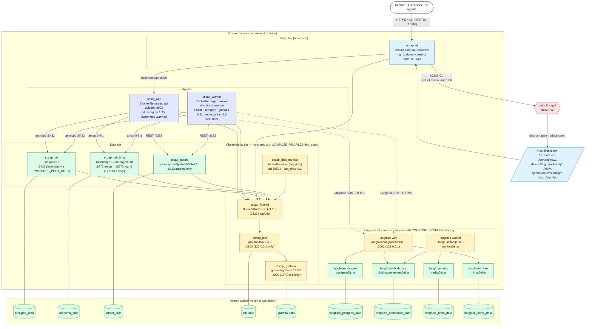

# 12 — Infrastructure & Deployment

Single-host Docker-Compose topology. Every named container, every volume, every config file mapped to its container, and the `setup.sh` flow that brings the stack up from a fresh checkout.

---

## Diagram

---

## `setup.sh` flow

```mermaid
flowchart TB
    S0([./setup.sh]):::edge
    S1["Prerequisite check<br/>docker · python3 · node"]:::app
    S2["Lock + copy .env.example → .env<br/>(flock prevents concurrent runs)"]:::app
    S3["Generate secrets via scripts/generate_secrets.py<br/>SECRET_KEY · ENCRYPTION_KEY (Fernet)<br/>POSTGRES_PASSWORD · RABBITMQ_DEFAULT_PASS<br/>QDRANT_API_KEY"]:::app
    S4["Upgrade fix-ups<br/>· replace placeholder QDRANT_API_KEY<br/>· remove retired RAG_VECTOR_STORE"]:::app
    S5["Setup wizard<br/>· install variant: vibe_coder / developer / enterprise / custom<br/>  → write SCCAP_VARIANT + matching COMPOSE_PROFILES<br/>· Local / Cloud → (if Cloud) Let's Encrypt Y/N<br/>· (if LE) domain validation [a-zA-Z0-9.-]{1,253}"]:::gate
    S6["Optional: write /etc/docker/daemon.json<br/>(max-size 50m, max-file 5)<br/>backup .bak.sccap-<ts><br/>restart Docker daemon"]:::app
    S7["docker compose up -d --build"]:::app
    S8["Wait for sccap_db healthcheck<br/>(max 30 × 2 s)"]:::app
    S9["docker compose exec app<br/>alembic upgrade head"]:::app
    S10["Print URLs"]:::app
    S11["Operator opens /setup wizard in browser"]:::edge

    S0 --> S1 --> S2 --> S3 --> S4 --> S5 --> S6 --> S7 --> S8 --> S9 --> S10 --> S11

    classDef app  fill:#e0e7ff,stroke:#4338ca,color:#1e1b4b;
    classDef edge fill:#e0f2fe,stroke:#0369a1,color:#082f49;
    classDef gate fill:#ede9fe,stroke:#6d28d9,color:#2e1065,stroke-dasharray: 4 3;
```

---

## Legend

### Containers

| Service             | Image / build context                                                | Internal ports          | Host ports                  | Health check                                              | Volumes                                                                                                            |
|---------------------|----------------------------------------------------------------------|-------------------------|------------------------------|-----------------------------------------------------------|--------------------------------------------------------------------------------------------------------------------|
| `sccap_ui`          | `secure-code-ui/Dockerfile` (builder → nginx:alpine + certbot)        | 80, 443                 | 80, 443                      | depends_on health                                          | `./certbot/conf`, `./certbot/www`                                                                                  |
| `sccap_app`         | `Dockerfile` target `api`                                            | 8000                    | none (proxied through ui)    | depends_on `sccap_db`/`rabbitmq`/`fluentd` healthy         | `./src`, `./scripts`, `./alembic`, `./alembic.ini` (ro), `./tests`, `./data` (ro), `./pyproject.toml` (ro)         |
| `sccap_worker`      | `Dockerfile` target `worker`                                         | none                    | none                         | depends_on data deps                                       | `./src`                                                                                                            |
| `sccap_db`          | `postgres:16`                                                        | 5432                    | `${POSTGRES_PORT_HOST:-5432}`| `pg_isready -U $POSTGRES_USER -d $POSTGRES_DB`             | `postgres_data:/var/lib/postgresql/data`                                                                          |
| `sccap_rabbitmq`    | `rabbitmq:3.12-management`                                           | 5672, 15672             | 5672 (lo), 15672 (lo)        | `rabbitmq-diagnostics -q ping`                            | `rabbitmq_data:/var/lib/rabbitmq/`, `./rabbitmq/{rabbitmq.conf,definitions.json,init.sh}` (ro)                     |
| `sccap_qdrant`      | `qdrant/qdrant@sha256:9472…`                                         | 6333                    | none                         | TCP `/dev/tcp/127.0.0.1/6333`                              | `qdrant_data:/qdrant/storage`                                                                                      |
| `sccap_fluentd`     | `fluentd/Dockerfile`                                                  | 24224 tcp+udp           | 24224 (lo)                   | `pgrep -f 'fluentd worker'`                                | `./fluentd/log:/fluentd/log`                                                                                       |
| `sccap_loki`        | `grafana/loki:3.4.2`                                                  | 3100                    | 3100 (lo)                    | n/a                                                        | `loki-data:/loki`, `./loki/loki-config.yaml` (ro)                                                                  |
| `sccap_grafana`     | `grafana/grafana:11.5.2`                                              | 3000                    | 3000 (lo)                    | n/a                                                        | `grafana-data:/var/lib/grafana`, `./grafana/provisioning:/etc/grafana/provisioning`                                |
| `sccap_disk_monitor`| `tools/df-emitter/Dockerfile` (busybox)                              | none                    | none                         | n/a (`pgrep df-emitter`)                                  | `/` (ro)                                                                                                           |
| `langfuse-postgres` | `postgres@sha`                                                       | 5432                    | none                         | `pg_isready -U langfuse -d langfuse`                       | `langfuse_postgres_data:/var/lib/postgresql/data`                                                                  |
| `langfuse-clickhouse` | `clickhouse/clickhouse-server@sha`                                 | 8123, 9000              | none                         | `wget /ping`                                              | `langfuse_clickhouse_data:/var/lib/clickhouse`                                                                     |
| `langfuse-redis`    | `redis@sha`                                                          | 6379                    | none                         | `redis-cli -a $REDIS_PASSWORD ping`                        | `langfuse_redis_data:/data`                                                                                        |
| `langfuse-minio`    | `minio/minio@sha`                                                    | 9000, 9001              | none                         | `mc ready local`                                          | `langfuse_minio_data:/data`                                                                                        |
| `langfuse-web`      | `langfuse/langfuse@sha`                                              | 3000                    | 3001 (lo)                    | n/a                                                        | none (stateless)                                                                                                   |
| `langfuse-worker`   | `langfuse/langfuse-worker@sha`                                       | none                    | none                         | n/a                                                        | none                                                                                                                |

All containers join the `scpnetwork` bridge. Internal DNS resolves `app`, `db`, `rabbitmq`, `qdrant`, `loki`, `fluentd`, `grafana` to the right container.

### Edge config files

| File                                              | Purpose                                                                                       |
|---------------------------------------------------|-----------------------------------------------------------------------------------------------|
| `secure-code-ui/nginx-http.conf`                  | HTTP-only profile for `SSL_ENABLED=false` (local dev)                                          |
| `secure-code-ui/nginx-https.conf`                 | HTTPS profile: TLSv1.2/1.3, OCSP stapling, `limit_req` zones, `proxy_buffering off` for `/stream` |
| `secure-code-ui/nginx-entrypoint.sh`              | Templates the chosen config (`__SSL_DOMAIN__` sed); `flock`-guarded Certbot renew loop (12 h, max 24 h backoff); fail-closed if `SSL_ENABLED=true` and cert missing |
| `certbot/conf/`, `certbot/www/`                   | Let's Encrypt material — `fullchain.pem`, `privkey.pem`, ACME challenge dir                    |

### Critical secrets (must rotate before non-laptop deploy)

| `.env` variable                       | Used by                                                       |
|---------------------------------------|---------------------------------------------------------------|
| `POSTGRES_PASSWORD`                   | Postgres + asyncpg DSN                                        |
| `RABBITMQ_DEFAULT_PASS`               | RabbitMQ users + aio-pika DSN                                 |
| `SECRET_KEY`                          | JWT signing                                                   |
| `ENCRYPTION_KEY`                      | Fernet key for LLM configs, SSO secrets, SMTP password, etc.  |
| `QDRANT_API_KEY`                      | Qdrant auth (app refuses to start with placeholder)            |
| `GRAFANA_ADMIN_PASSWORD`              | Grafana admin                                                  |
| `CLICKHOUSE_PASSWORD`                 | Langfuse ClickHouse                                            |
| `REDIS_PASSWORD`                      | Langfuse Redis                                                 |
| `MINIO_ROOT_PASSWORD`                 | Langfuse MinIO                                                 |
| `LANGFUSE_POSTGRES_PASSWORD`          | Langfuse Postgres                                              |
| `LANGFUSE_ENCRYPTION_KEY` (hex 64)    | Langfuse                                                       |
| `LANGFUSE_SALT`                       | Langfuse                                                       |
| `LANGFUSE_INIT_USER_PASSWORD`         | Langfuse initial admin                                         |
| `NEXTAUTH_SECRET` (hex 64)            | Langfuse web NextAuth                                          |
| LLM provider keys (Anthropic, OpenAI, Google) | **NOT** in `.env`. Stored encrypted in `llm_configurations` |

### Non-secret config knobs

| Variable                                              | Purpose                                                                  |
|-------------------------------------------------------|--------------------------------------------------------------------------|
| `POSTGRES_HOST`, `POSTGRES_HOST_ALEMBIC`, `POSTGRES_PORT`, `POSTGRES_DB`, `POSTGRES_USER` | DB DSN                                                |
| `RABBITMQ_HOST`, `RABBITMQ_DEFAULT_USER`              | Broker DSN                                                               |
| `RABBITMQ_SUBMISSION_QUEUE`, `RABBITMQ_APPROVAL_QUEUE` | Queue names                                                             |
| `QDRANT_HOST`, `QDRANT_PORT`, `QDRANT_USE_TLS`        | Vector DB                                                                |
| `ALLOWED_ORIGINS`, `FRONTEND_BASE_URL`, `API_BASE_URL`, `TRUSTED_PROXY_CIDRS` | CORS & proxy                                              |
| `ACCESS_TOKEN_LIFETIME_SECONDS`, `REFRESH_TOKEN_LIFETIME_SECONDS`, `SESSION_ABSOLUTE_LIFETIME_SECONDS` | JWT lifetimes                  |
| `LOGIN_BODY_MAX_BYTES`                                | Anti-DoS                                                                 |
| `SCAN_WORKFLOW_TIMEOUT_SECONDS`                       | Worker max (default 7200, 2 h)                                          |
| Per-provider `*_REQUESTS_PER_MINUTE`, `*_TOKENS_PER_MINUTE` | Rate limiter token buckets                                          |
| `LANGFUSE_ENABLED`, `LANGFUSE_TRACE_RETENTION_DAYS`   | Opt-in observability                                                     |
| `LOKI_RETENTION_DAYS`                                 | Log retention (default 30 d; set 365 d for PCI/HIPAA)                    |
| `SSL_ENABLED`, `SSL_DOMAIN`, `SSL_DEV_INSECURE`       | TLS profile                                                              |
| `DEPLOYMENT_TYPE=local|cloud`                         | Drives Certbot offer + UI banners                                        |
| `SCCAP_VARIANT`, `COMPOSE_PROFILES`                   | Modular setup (#103–#106) — install variant + which optional container profiles (`log_stack`, `tracing`) docker-compose starts |
| `LITELLM_LOCAL_MODEL_COST_MAP=true`                   | Pin cost lookups to bundled JSON (no network on cost math)               |

### Migrations

Alembic config at `/alembic.ini`, scripts at `/alembic/versions/`. Naming convention `YYYY_MM_DD_HHMM_<slug>.py`. Run via `docker compose exec app alembic upgrade head`. Highlights:

- `2025_07_07_1944_create_project_centric_schema.py` — base
- `2026_02_19_1121_create_users_table.py` — fastapi-users
- `2026_04_26_0459_add_findings_source.py` — `findings.source` normalization
- `2026_05_01_1401_add_expires_at_columns_for_retention_.py` — retention sweeper
- `2026_05_08_0121_add_oauth_accounts_idp_token_expiry.py` — OIDC/IDP token expiry
- `2026_05_08_0140_add_webauthn_credentials.py` — passkey support
- `2026_05_08_0300_add_tenant_id_to_data_tables.py` — multi-tenancy

### Backups

Persistence is the 9 named Docker volumes. There is no built-in cron backup — operators are expected to snapshot the volumes (`docker run --rm -v <vol>:/data -v $PWD:/backup busybox tar czf /backup/<vol>.tgz -C / data`) or replicate via their own tooling. For PCI / HIPAA 365-day log retention, replace the `loki-data` volume with a backed-by-block-storage path before first start.

### Setup scripts

| Script                                | Role                                                                     |
|---------------------------------------|--------------------------------------------------------------------------|
| `setup.sh`                            | Linux/macOS bring-up (POSIX shell)                                       |
| `setup.bat`                           | Windows equivalent                                                       |
| `scripts/generate_secrets.py`         | Random / Fernet key generation                                           |
| `scripts/create_superuser.py`         | Bootstrap a master admin if `/setup` UI is unavailable                   |
| `scripts/reset_superuser.py`          | Rotate the master admin's password                                       |
| `scripts/reset_app_state.py`          | Dev tool: truncate scans, findings, snapshots                            |
| `scripts/verify_setup_and_cors.py`    | Post-deploy smoke check                                                  |
| `scripts/extract_eval_prompts.py`     | Materializes eval inputs for promptfoo                                    |

### CI / pre-commit

| Path                                       | Purpose                                                                                   |
|--------------------------------------------|-------------------------------------------------------------------------------------------|
| `.github/workflows/ci.yml`                 | PR + push: ruff 0.11.11 · black 25.1.0 · poetry lock check · bandit · pip-audit · ESLint · Vite build |
| `.github/workflows/docs.yml`               | mkdocs build                                                                              |
| `.github/workflows/evals.yml`              | promptfoo eval suite (mock + opt-in live)                                                  |
| `.pre-commit-config.yaml`                  | end-of-file-fixer · trailing-whitespace · check-merge-conflict · ruff · black · gitleaks 8.21.2 |

### No Kubernetes / Helm / Terraform

The current deployment story is Docker Compose on a single host (laptop, VM, or bare metal). Multi-host orchestration is left to the operator (Swarm, k8s manifests, Nomad jobs) using the same images.

---

## Source files

- `docker-compose.yml`
- `Dockerfile`, `secure-code-ui/Dockerfile`, `fluentd/Dockerfile`, `tools/df-emitter/Dockerfile`
- `secure-code-ui/{nginx-http.conf,nginx-https.conf,nginx-entrypoint.sh}`
- `rabbitmq/{rabbitmq.conf,definitions.json,init.sh}`
- `loki/loki-config.yaml`
- `grafana/provisioning/{datasources/loki.yml,alerting/disk-alert.yaml}`
- `alembic.ini`, `alembic/versions/*.py`
- `setup.sh`, `setup.bat`
- `scripts/*.py`
- `.env.example`
- `.github/workflows/*.yml`, `.pre-commit-config.yaml`
