# 13 — Data Model

Postgres entity-relationship view of every domain table in `src/app/infrastructure/database/models.py`. Multi-tenancy columns, retention columns, and Fernet-encrypted columns are called out in the legend.

The `checkpoints` table (LangGraph `AsyncPostgresSaver`) is shown because the worker depends on it, but its schema is owned by LangGraph upstream and not re-listed here.

---

## ER diagram

```mermaid
erDiagram
    %% ============ Identity & Tenancy ============
    TENANTS ||--o{ USER : "scopes"
    USER ||--o{ OAUTH_ACCOUNTS : "linked"
    USER ||--o{ SAML_SUBJECTS : "linked"
    USER ||--o{ WEBAUTHN_CREDENTIALS : "owns"
    USER ||--o{ USER_GROUP_MEMBERSHIPS : "member"
    USER_GROUPS ||--o{ USER_GROUP_MEMBERSHIPS : "groups"
    SSO_PROVIDERS ||--o{ OAUTH_ACCOUNTS : "issued"
    SSO_PROVIDERS ||--o{ SAML_SUBJECTS : "issued"
    USER ||--o{ SCIM_TOKENS : "created by"
    USER ||--o{ AUTH_AUDIT_EVENTS : "subject of"
    SSO_PROVIDERS ||--o{ AUTH_AUDIT_EVENTS : "context of"

    %% ============ Scan domain ============
    USER ||--o{ PROJECTS : "owns"
    TENANTS ||--o{ PROJECTS : "scopes"
    PROJECTS ||--o{ SCANS : "scanned"
    USER ||--o{ SCANS : "submitted"
    TENANTS ||--o{ SCANS : "scopes"
    SCANS ||--o{ SCAN_EVENTS : "timeline"
    SCANS ||--o{ SCAN_OUTBOX : "messages"
    SCANS ||--o{ CODE_SNAPSHOTS : "before/after"
    SCANS ||--o{ FINDINGS : "yields"
    SCANS ||--o{ LLM_INTERACTIONS : "spend"
    SOURCE_CODE_FILES ||--o{ CODE_SNAPSHOTS : "referenced"
    CWE_DETAILS ||--o{ FINDINGS : "categorizes"
    CWE_DETAILS ||--o{ CWE_OWASP_MAPPINGS : "maps"
    LLM_CONFIGURATIONS ||--o{ SCANS : "reasoning_llm"

    %% ============ Framework / Agent / Prompt ============
    FRAMEWORKS ||--o{ FRAMEWORK_AGENT_MAPPINGS : "uses"
    AGENTS ||--o{ FRAMEWORK_AGENT_MAPPINGS : "in"
    AGENTS ||--o{ PROMPT_TEMPLATES : "uses"
    LLM_CONFIGURATIONS ||--o{ RAG_PREPROCESSING_JOBS : "enriches with"
    USER ||--o{ RAG_PREPROCESSING_JOBS : "submitted"

    %% ============ Chat ============
    USER ||--o{ CHAT_SESSIONS : "owns"
    TENANTS ||--o{ CHAT_SESSIONS : "scopes"
    PROJECTS ||--o{ CHAT_SESSIONS : "optional"
    LLM_CONFIGURATIONS ||--o{ CHAT_SESSIONS : "uses"
    CHAT_SESSIONS ||--o{ CHAT_MESSAGES : "thread"
    CHAT_MESSAGES ||--o{ LLM_INTERACTIONS : "spend"

    %% ============ Semgrep ingestion ============
    SEMGREP_RULE_SOURCES ||--o{ SEMGREP_RULES : "yields"
    SEMGREP_RULE_SOURCES ||--o{ SEMGREP_SYNC_RUNS : "history"

    %% ============ System config / Seed ============
    USER ||--o{ SYSTEM_CONFIGURATIONS : "updated by"

    %% ============ Entity definitions ============
    TENANTS {
        uuid id PK
        text name
        timestamp created_at
    }
    USER {
        uuid id PK
        text email UK
        text hashed_password
        bool is_active
        bool is_superuser
        bool is_verified
        uuid tenant_id FK
        timestamp created_at
    }
    OAUTH_ACCOUNTS {
        uuid id PK
        uuid user_id FK
        uuid provider_id FK
        text account_id
        text account_email
        timestamp idp_token_expiry
    }
    SAML_SUBJECTS {
        uuid id PK
        uuid user_id FK
        uuid provider_id FK
        text name_id UK
        text subject
    }
    WEBAUTHN_CREDENTIALS {
        uuid id PK
        uuid user_id FK
        bytea credential_id UK
        bytea public_key
        int sign_count
        text[] transports
        timestamp created_at
    }
    USER_GROUPS {
        uuid id PK
        text name UK
        text description
        uuid created_by FK
    }
    USER_GROUP_MEMBERSHIPS {
        uuid group_id FK
        uuid user_id FK
    }
    SSO_PROVIDERS {
        uuid id PK
        text name
        text display_name
        text protocol "oidc|saml|ldap"
        bool enabled
        jsonb config "FERNET-encrypted"
        text[] allowed_email_domains
        text[] force_for_domains
        text jit_policy "auto|approve|deny"
    }
    SCIM_TOKENS {
        uuid id PK
        uuid created_by FK
        text token_hash "bcrypt"
        bool is_active
        timestamp last_used
    }
    AUTH_AUDIT_EVENTS {
        bigserial id PK
        timestamp ts
        text event
        uuid user_id FK
        uuid provider_id FK
        text email_hash
        inet ip
        text user_agent
        jsonb details
    }

    PROJECTS {
        uuid id PK
        uuid user_id FK
        uuid tenant_id FK
        text name "UNIQUE per (user_id,name)"
        text repository_url "redacted"
        timestamp created_at
    }
    SCANS {
        uuid id PK
        uuid project_id FK
        uuid user_id FK
        uuid tenant_id FK
        text scan_type "AUDIT|SUGGEST|REMEDIATE"
        text status "see diagram 04"
        text[] frameworks
        uuid reasoning_llm_config_id FK
        jsonb summary
        jsonb cost_details
        jsonb bom_cyclonedx "≤5 MB"
        jsonb repository_map
        jsonb dependency_graph
        jsonb initial_file_map
        jsonb final_file_map
        text error_message
        timestamp created_at
        timestamp completed_at
    }
    SCAN_EVENTS {
        bigserial id PK
        uuid scan_id FK
        text stage_name
        text status
        timestamp timestamp
        jsonb details
    }
    SCAN_OUTBOX {
        bigserial id PK
        uuid scan_id FK
        text queue_name
        jsonb payload
        text correlation_id
        int failure_count
        timestamp created_at
        timestamp published_at
    }
    SOURCE_CODE_FILES {
        uuid id PK
        text path
        text content_hash UK
        bytea content
        bigint size_bytes
    }
    CODE_SNAPSHOTS {
        uuid id PK
        uuid scan_id FK
        text type "ORIGINAL_SUBMISSION|POST_REMEDIATION"
        jsonb files "map: path → hash"
    }
    FINDINGS {
        uuid id PK
        uuid scan_id FK
        uuid tenant_id FK
        text file_path
        int line_number
        text title
        text description
        text severity "Critical|High|Medium|Low|Info"
        text remediation
        text source "bandit|semgrep|gitleaks|osv|agent"
        text cwe FK
        text cve_id
        numeric cvss_score
        text cvss_vector
        jsonb references
        jsonb fixes
        bool is_applied_in_remediation
        bool fix_verified
        text framework
        timestamp expires_at
    }
    CWE_DETAILS {
        text cwe_id PK
        text name
        text description
        text parent
    }
    CWE_OWASP_MAPPINGS {
        text cwe_id FK
        text owasp_top10
    }
    LLM_CONFIGURATIONS {
        uuid id PK
        text name UK
        text provider "anthropic|openai|google"
        text model_name
        text tokenizer
        bytea encrypted_api_key "FERNET"
        numeric input_cost_per_million
        numeric output_cost_per_million
        timestamp created_at
        timestamp updated_at
    }
    LLM_INTERACTIONS {
        bigserial id PK
        uuid scan_id FK
        uuid chat_message_id FK
        text agent_name
        text file_path
        jsonb prompt_context "redacted"
        jsonb raw_response
        jsonb parsed_output
        int input_tokens
        int output_tokens
        int total_tokens
        numeric cost
        timestamp timestamp
        timestamp expires_at
    }
    FRAMEWORKS {
        uuid id PK
        text name UK
        text description
        text source_url
        text version
        bool is_managed
        timestamp created_at
    }
    AGENTS {
        uuid id PK
        text name UK
        text description
        jsonb domain_query
    }
    FRAMEWORK_AGENT_MAPPINGS {
        uuid framework_id FK
        uuid agent_id FK
    }
    PROMPT_TEMPLATES {
        uuid id PK
        text name UK
        text template_type "QUICK_AUDIT|CHAT|REMEDIATE|MERGE|EDITOR"
        text agent_name
        text variant "generic|anthropic"
        int version
        text template_text
    }
    RAG_PREPROCESSING_JOBS {
        uuid id PK
        uuid user_id FK
        text framework_name
        uuid llm_config_id FK
        text original_file_hash
        bytea raw_content "consent-gated"
        text status "PENDING_APPROVAL|RUNNING|COMPLETED|DECLINED|EXPIRED|FAILED"
        numeric estimated_cost
        numeric actual_cost
        jsonb processed_documents
        text error_message
        timestamp expires_at
        timestamp created_at
        timestamp completed_at
    }

    CHAT_SESSIONS {
        uuid id PK
        uuid user_id FK
        uuid tenant_id FK
        uuid project_id FK
        uuid llm_config_id FK
        text title
        text[] frameworks "max 10"
        timestamp created_at
    }
    CHAT_MESSAGES {
        bigserial id PK
        uuid session_id FK
        text role "user|assistant"
        text content "redacted"
        numeric cost
        timestamp timestamp
        timestamp expires_at
    }

    SEMGREP_RULE_SOURCES {
        uuid id PK
        text name
        text org
        bytea api_key "FERNET"
        bool enabled
        timestamp last_sync
    }
    SEMGREP_RULES {
        uuid id PK
        uuid source_id FK
        text rule_id
        text title
        text severity
    }
    SEMGREP_SYNC_RUNS {
        bigserial id PK
        uuid source_id FK
        timestamp started_at
        timestamp finished_at
        text status
        int rules_added
        int rules_updated
        int rules_removed
        text error_message
    }

    SYSTEM_CONFIGURATIONS {
        text key PK
        jsonb value
        bool encrypted
        bool is_secret
        int version
        text description
        uuid updated_by FK
        timestamp updated_at
    }
```

---

## Legend

### Tenancy columns

`tenant_id` is present on these tables and enforced at the dependency layer (`get_current_user_tenant_id`):

`user`, `projects`, `scans`, `findings`, `chat_sessions`, `llm_interactions`.

Backfill for legacy rows uses a synthetic `default` tenant (`tenants.name = 'default'`). New tenants are created via `POST /admin/tenants` and inherited downwards (project ↤ user, scan ↤ project, finding ↤ scan, etc.).

### Retention columns (sweeper inputs)

| Table                      | Column        | Default retention                       |
|----------------------------|---------------|------------------------------------------|
| `findings`                 | `expires_at`  | `RETENTION_DAYS_FINDINGS` (off by default; opt-in) |
| `llm_interactions`         | `expires_at`  | `RETENTION_DAYS_LLM_INTERACTIONS`        |
| `chat_messages`            | `expires_at`  | `RETENTION_DAYS_CHAT_MESSAGES`           |
| `rag_preprocessing_jobs`   | `expires_at`  | 30 d post-COMPLETED (raw_content only)   |

The daily `retention_sweeper` runs `DELETE … WHERE expires_at <= now()`.

### Fernet-encrypted columns

| Table                       | Column                   |
|-----------------------------|---------------------------|
| `llm_configurations`        | `encrypted_api_key`       |
| `sso_providers`             | `config` (JSONB; secret subfields) |
| `semgrep_rule_sources`      | `api_key`                 |
| `system_configurations`     | `value` (when `encrypted=true`) — e.g. `system.smtp.password` |

The Fernet key is `ENCRYPTION_KEY` from `.env`. The app refuses to start without a strong key.

### Indexes (notable, beyond PKs / UKs)

| Table                | Index                                                                  |
|----------------------|------------------------------------------------------------------------|
| `scans`              | `(tenant_id, status, created_at DESC)` — dashboard + history queries   |
| `scan_events`        | `(scan_id, id DESC)` — SSE polling + `Last-Event-ID` resume            |
| `scan_outbox`        | `(published_at) WHERE published_at IS NULL` — partial, fast sweep      |
| `findings`           | `(scan_id)`, `(tenant_id, severity, framework)`                        |
| `llm_interactions`   | `(scan_id)`, `(chat_message_id)`, `(expires_at)` — sweep efficiency     |
| `projects`           | `(user_id, name)` UNIQUE                                                |
| `chat_sessions`      | `(user_id, created_at DESC)`                                            |
| `auth_audit_events`  | `(user_id, ts DESC)`, `(event, ts DESC)`                                |

### Constraint highlights

- `projects (user_id, name)` is UNIQUE — submitting the same project name a second time upserts into the same row.
- `sso_providers.protocol` CHECK in `('oidc','saml','ldap')`.
- `scans.scan_type` CHECK in `('AUDIT','SUGGEST','REMEDIATE')`.
- `code_snapshots.type` CHECK in `('ORIGINAL_SUBMISSION','POST_REMEDIATION')`.
- `chat_sessions.frameworks` length ≤ 10 (enforced application-side; not a DB check, kept for portability).

### Table sizes / cardinality intuition

| Table                  | Rough scale per active org                                                                  |
|------------------------|----------------------------------------------------------------------------------------------|
| `findings`             | Largest growth surface; bulk-insert per scan; partitioned candidate                          |
| `llm_interactions`     | One row per LLM call → dominant by row count; retention-mandatory                           |
| `scan_events`          | One row per stage transition + per analyzed file                                              |
| `checkpoints`          | LangGraph snapshots per node; cleaned on terminal status via `adelete_thread()`              |
| `auth_audit_events`    | Bounded by user activity; preserved indefinitely                                              |

---

## Source files

- `src/app/infrastructure/database/models.py` — all SQLAlchemy classes
- `alembic/versions/*.py` — migration history
- `src/app/infrastructure/database/repositories/*.py` — query layer
