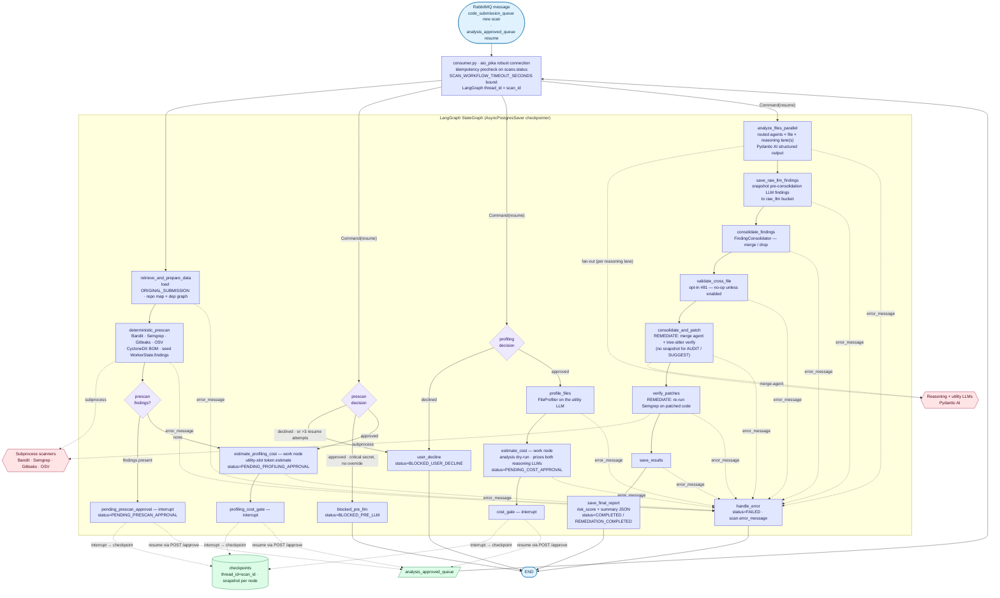
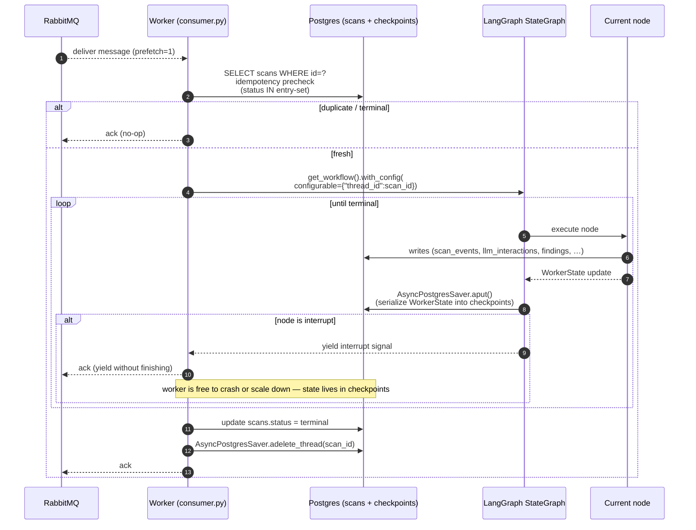
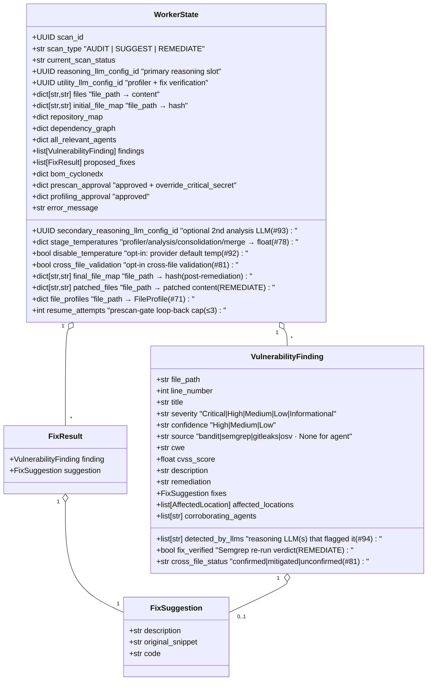

# 14 — LangGraph Worker State Machine

Deep dive into `sccap_worker` — the heart of every scan. Built on **LangGraph 1.1.9** with an `AsyncPostgresSaver` checkpointer so a scan can be paused at an approval gate, the worker can restart, and the flow resumes exactly where it left off.

---

## 1. Node graph



---

## 2. Worker lifecycle



---

## 3. `WorkerState` (typed)



---

## Legend

### Node responsibilities (one-line each)

| #   | Node                          | Reads                                              | Writes                                                                                              |
|-----|-------------------------------|----------------------------------------------------|-----------------------------------------------------------------------------------------------------|
| 1   | `retrieve_and_prepare_data`   | `scans`, `code_snapshots`, `source_code_files`     | `WorkerState.files/initial_file_map/repository_map/dependency_graph`, `scan_events(RETRIEVE)`        |
| 2   | `deterministic_prescan`       | `WorkerState.files`                                | `WorkerState.findings (prescan)`, `WorkerState.bom_cyclonedx`, `scan_events(PRESCAN_ANALYSIS)`       |
| 3   | `pending_prescan_approval`    | prescan findings, resume payload                   | `scans.status = PENDING_PRESCAN_APPROVAL`, LangGraph interrupt + checkpoint                          |
| 4   | `estimate_profiling_cost`     | `WorkerState.files`                                | `scans.cost_details (profiling)`, `scans.status = PENDING_PROFILING_APPROVAL`                        |
| 5   | `profiling_cost_gate`         | resume payload                                     | LangGraph interrupt + checkpoint; routes on the profiling decision                                   |
| 6   | `profile_files`               | files + repository map                             | `WorkerState.file_profiles` (FileProfiler on the utility LLM slot)                                   |
| 7   | `estimate_cost`               | `file_profiles`, routed agents, reasoning configs  | `scans.cost_details (analysis)`, `scans.status = PENDING_COST_APPROVAL`                              |
| 8   | `cost_gate`                   | resume payload                                     | LangGraph interrupt + checkpoint; routes to `analyze_files_parallel`                                 |
| 9   | `analyze_files_parallel`      | files + routed agents + dep summary (RAG)          | `WorkerState.findings`, `proposed_fixes`, `llm_interactions`, per-file `scan_events(FILE_ANALYZED)` |
| 10  | `consolidate_findings`        | per-agent findings                                 | `FindingConsolidator` reasoning-LLM pass — merge same-defect findings, drop demonstrable FPs        |
| 11  | `validate_cross_file`         | consolidated findings                              | opt-in #81 — stamps `cross_file_status`/`cross_file_rationale`; no-op unless `Scan.cross_file_validation` |
| 12  | `consolidate_and_patch`       | `WorkerState.findings + proposed_fixes`            | REMEDIATE only — `WorkerState.patched_files`, `final_file_map`; merge agent + tree-sitter verify     |
| 13  | `verify_patches`              | `patched_files` vs original                        | REMEDIATE only — `finding.fix_verified`, Semgrep regression detection                                |
| 14  | `save_results`                | `WorkerState.findings`                             | `findings` (bulk insert), fixes JSONB                                                                |
| 15  | `save_final_report`           | findings + fixes                                   | `scans.summary`, `scans.risk_score`, `scans.status = COMPLETED \| REMEDIATION_COMPLETED`, `adelete_thread()` |
| —   | `user_decline`                | resume payload (declined)                          | `scans.status = BLOCKED_USER_DECLINE`                                                                |
| —   | `blocked_pre_llm`             | resume payload (non-overridable critical secret)   | `scans.status = BLOCKED_PRE_LLM`, audit event                                                        |
| —   | `handle_error`                | `WorkerState.error_message`                        | `scans.status = FAILED`, `scans.error_message`, `scan_events(FAILED)`                                |

### Two cost gates

The graph pauses for cost approval **twice**, because profiling (#71) itself spends utility-LLM tokens:

1. **`PENDING_PROFILING_APPROVAL`** — `estimate_profiling_cost` prices the FileProfiler pass on the utility-LLM slot; `profiling_cost_gate` is the bare `interrupt()`.
2. **`PENDING_COST_APPROVAL`** — `estimate_cost` prices the per-agent analysis fan-out (across both reasoning-LLM slots when a secondary is configured); `cost_gate` is the bare `interrupt()`.

The estimate node and its gate node are deliberately split (#84): the estimate node does the work and persists `cost_details`, the gate node only carries the `interrupt()` so a resume re-enters a side-effect-free node.

### Concurrency

- **CONCURRENT_LLM_LIMIT**: 5 — `analyze_files_parallel` bounds file × chunk × agent calls with a single `asyncio.Semaphore`. With a secondary reasoning LLM configured, each lane gets its own pool. Backpressure is also enforced by the per-provider rate limiter token bucket (`*_TOKENS_PER_MINUTE`).
- **Merge agent (REMEDIATE)**: when proposed fixes overlap within a file, `consolidate_and_patch` makes a single reasoning-LLM call (`_run_merge_agent`) to unify them; the merged file is tree-sitter parse-checked, and on a parse failure the file is left unpatched rather than emitting broken code (see diagram 05).
- **`SCAN_WORKFLOW_TIMEOUT_SECONDS`**: 7200 (2 h default). The consumer wraps the entire workflow run in `asyncio.wait_for()` — exceeding the bound forces a `handle_error` transition.

### Resume semantics

When an interrupt fires, the node persists the partial `WorkerState` into the `checkpoints` table and the worker ACKs the message. To resume, the API (in response to `POST /scans/{id}/approve`) inserts a message into `analysis_approved_queue` whose payload includes the approval decision. The consumer reads it and re-invokes the **same** graph thread with a `Command`:

```python
config = {"configurable": {"thread_id": str(scan_id)}}
await graph.ainvoke(Command(resume=payload), config)   # continues from the checkpoint
```

`payload` is the approval decision (`{"kind": "prescan_approval" | "profiling_approval" | "cost_approval", "approved": ...}`). The interrupt site receives it as the `interrupt()` return value, and the gate's routing function moves the state graph past the interrupt.

### Idempotency precheck

```python
ENTRY_STATUSES = {
    "QUEUED",
    "QUEUED_FOR_SCAN",
    "PENDING_APPROVAL",
    "PENDING_PRESCAN_APPROVAL",
    "PENDING_PROFILING_APPROVAL",
    "PENDING_COST_APPROVAL",
}
if scan.status not in ENTRY_STATUSES:
    log.info("worker.duplicate_delivery", scan_id=scan.id, status=scan.status)
    return  # ack and drop
```

This guards against RabbitMQ re-delivery (network hiccup, container restart) without doing double work.

### Checkpoint cleanup

When the workflow reaches a terminal status (`COMPLETED`, `REMEDIATION_COMPLETED`, `CANCELLED`, `BLOCKED_*`, `EXPIRED`, `FAILED`):

```python
await checkpointer.adelete_thread(thread_id=str(scan_id))
```

…which deletes all `checkpoints` rows for that scan. Mitigates **M5** (`checkpoints` table growth) — the table only retains live scans + the most recent interrupted scans.

### Per-call observability

Every LLM call goes through `LLMClient`, which:

1. Acquires a token from the per-provider rate limiter.
2. Calls the Pydantic AI agent for the configured provider.
3. Captures usage: `input_tokens`, `output_tokens`, `cache_read_input_tokens`, `cache_creation_input_tokens` (Anthropic), `total_tokens`, `latency_ms`, `cost` (LiteLLM cost map).
4. Inserts an `llm_interactions` row with `expires_at = now() + RETENTION_DAYS_LLM_INTERACTIONS`.
5. Emits a Langfuse span when `LANGFUSE_ENABLED=true`.

### Failure handling

- Subprocess scanners are wrapped with timeouts (Bandit 120 s; Semgrep / Gitleaks / OSV 180 s). A failed scanner does not fail the whole scan — its findings are simply missing and an audit log row records the failure.
- LLM 5xx / rate-limit responses are retried with exponential backoff (Pydantic AI's `validation_with_retry`) up to 2 attempts.
- A panic anywhere in the graph triggers `handle_error_node`, which sets `scans.status=FAILED`, persists `scans.error_message`, and emits a `scan_event(FAILED)` so the SSE stream surfaces the failure before terminating.

### Outputs available to the UI

| Path                                                  | Result                                                                            |
|-------------------------------------------------------|-----------------------------------------------------------------------------------|
| `GET /scans/{id}`                                     | Full result (findings + fixes + summary + cost_details + risk_score)              |
| `GET /scans/{id}/prescan-findings`                    | Just the deterministic prescan output (for the approval gate UI)                  |
| `GET /scans/{id}/events`                              | Cursor-paginated timeline                                                          |
| `GET /scans/{id}/llm-interactions`                    | Per-LLM-call log (cost + token breakdown; redacted prompts)                       |
| `GET /scans/{id}/stream` (SSE)                        | Live progress — see diagram 09                                                    |
| `GET /scans/{id}/preview-archive` / `/preview-git`    | Patched output download (REMEDIATE only)                                          |

---

## Source files

- `src/app/workers/consumer.py`
- `src/app/infrastructure/workflows/state.py` — `WorkerState`, `VulnerabilityFinding`, `FixResult` types
- `src/app/infrastructure/workflows/graph.py` — `get_workflow()` factory
- `src/app/infrastructure/workflows/nodes/{retrieve,prescan,profile,cost,analyze,consolidate_findings,validate_cross_file,consolidate,verify,results,error}.py`
- `src/app/infrastructure/workflows/callbacks/scan_progress_notifier.py`
- `src/app/infrastructure/messaging/{publisher,outbox_sweeper}.py`
- `src/app/infrastructure/llm_client.py`, `llm_client_rate_limiter.py`
- `src/app/infrastructure/agents/{generic_specialized_agent,chat_agent,finding_consolidator,file_profiler,cross_file_validator}.py`
- `src/app/infrastructure/scanners/{bandit_runner,semgrep_runner,gitleaks_runner,osv_runner,staging,registry}.py`
- `src/app/shared/lib/agent_routing.py`
- `src/app/infrastructure/database/models.py` (`Scan`, `ScanEvent`, `Finding`, `LLMInteraction`)
