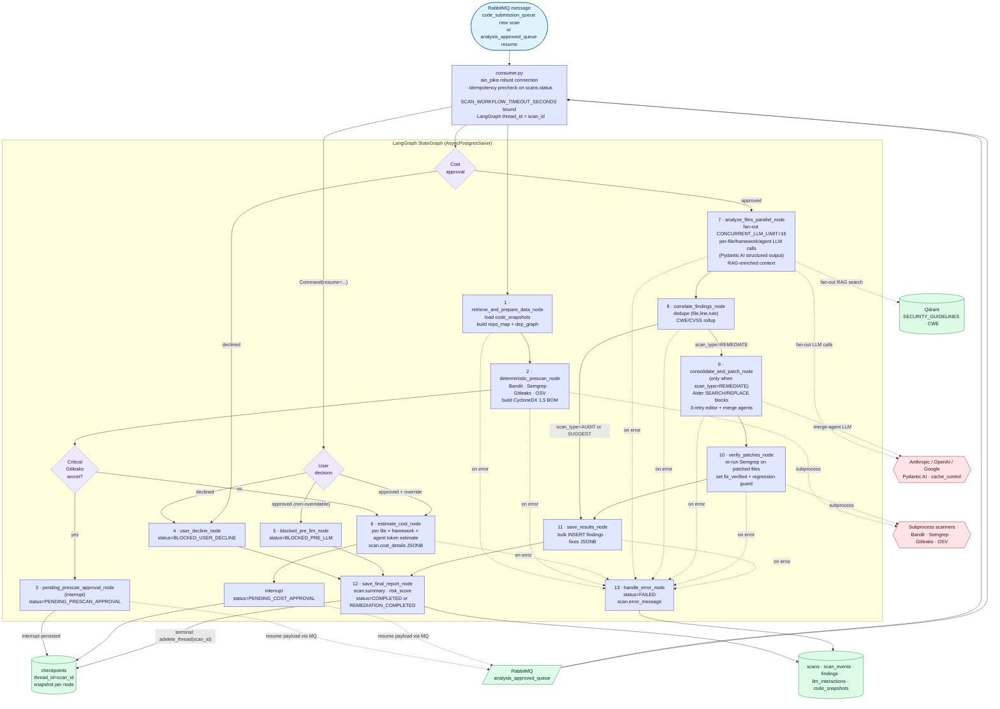
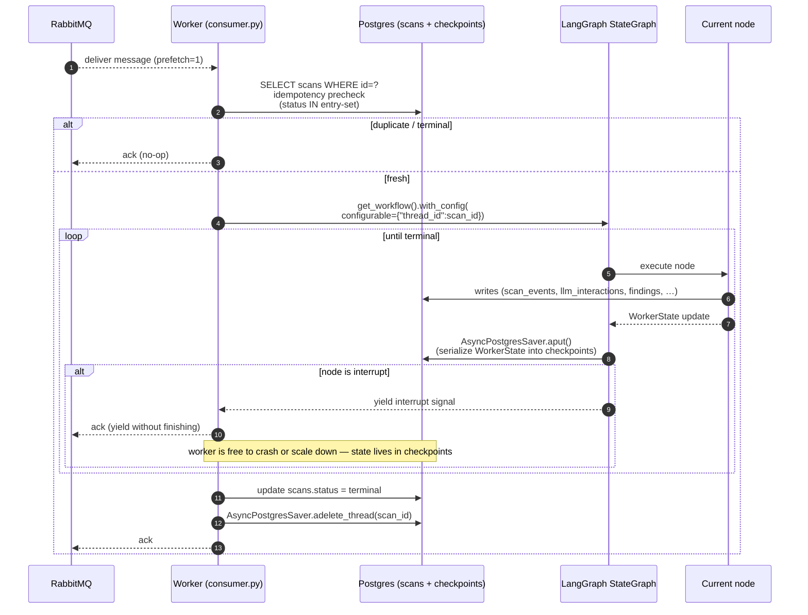
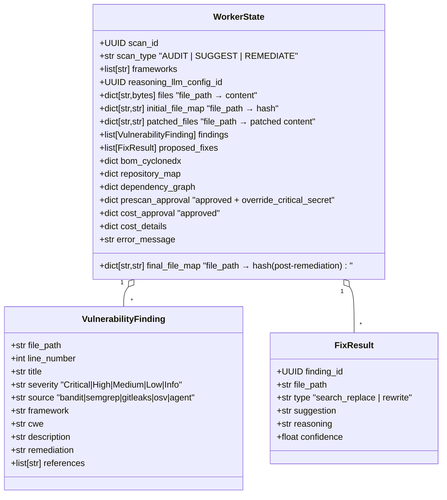

# 14 — LangGraph Worker State Machine

Deep dive into `sccap_worker` — the heart of every scan. Built on **LangGraph 1.1.9** with an `AsyncPostgresSaver` checkpointer so a scan can be paused at an approval gate, the worker can restart, and the flow resumes exactly where it left off.

---

## 1. Node graph



---

## 2. Worker lifecycle



---

## 3. `WorkerState` (typed)



---

## Legend

### Node responsibilities (one-line each)

| #   | Node                                       | Reads                                                | Writes                                                                                              |
|-----|--------------------------------------------|------------------------------------------------------|-----------------------------------------------------------------------------------------------------|
| 1   | `retrieve_and_prepare_data_node`           | `scans`, `code_snapshots`, `source_code_files`       | `WorkerState.files/initial_file_map/repo_map/dep_graph`, `scan_events(RETRIEVE)`                    |
| 2   | `deterministic_prescan_node`               | `WorkerState.files`                                  | `WorkerState.findings (prescan)`, `WorkerState.bom_cyclonedx`, `scan_events(PRESCAN_ANALYSIS)`       |
| 3   | `pending_prescan_approval_node`            | prescan findings                                     | `scans.status = PENDING_PRESCAN_APPROVAL`, LangGraph interrupt + checkpoint                          |
| 4   | `user_decline_node`                        | resume payload                                       | `scans.status = BLOCKED_USER_DECLINE`                                                                |
| 5   | `blocked_pre_llm_node`                     | resume payload (non-overridable critical secret)     | `scans.status = BLOCKED_PRE_LLM`, audit event                                                       |
| 6   | `estimate_cost_node`                       | `WorkerState.files`, frameworks, agent registry      | `scans.cost_details`, interrupt                                                                      |
| 7   | `analyze_files_parallel_node`              | files + framework controls (RAG)                     | `WorkerState.findings`, `proposed_fixes`, `llm_interactions`, per-file `scan_events(FILE_ANALYZED)` |
| 8   | `correlate_findings_node`                  | per-agent findings                                   | dedup + CWE/CVSS roll-up on `WorkerState.findings`                                                  |
| 9   | `consolidate_and_patch_node`               | `WorkerState.findings + proposed_fixes`              | `WorkerState.patched_files`, `final_file_map`                                                       |
| 10  | `verify_patches_node`                      | `patched_files` vs original                          | `finding.fix_verified`, regression detection                                                         |
| 11  | `save_results_node`                        | `WorkerState.findings`                               | `findings` (bulk insert), `scans.summary`                                                            |
| 12  | `save_final_report_node`                   | `scans.summary`                                      | `scans.status = COMPLETED \| REMEDIATION_COMPLETED`, `adelete_thread()`                              |
| 13  | `handle_error_node`                        | exception                                            | `scans.status = FAILED`, `scans.error_message`, audit event                                          |

### Concurrency

- **CONCURRENT_LLM_LIMIT**: 16 (env var) — `analyze_files_parallel_node` fans out up to this many concurrent agent calls. Backpressure is enforced by the per-provider rate limiter token bucket (`*_TOKENS_PER_MINUTE`).
- **Merge agent (REMEDIATE)**: when proposed fixes overlap within a file, `consolidate_and_patch_node` makes a single reasoning-LLM call (`_run_merge_agent`) to unify them; the merged file is tree-sitter parse-checked, and on a parse failure the file is left unpatched rather than emitting broken code (see diagram 05).
- **`SCAN_WORKFLOW_TIMEOUT_SECONDS`**: 7200 (2 h default). The consumer wraps the entire workflow run in `asyncio.wait_for()` — exceeding the bound forces a `handle_error_node` transition.

### Resume semantics

When an interrupt fires, the node persists the partial `WorkerState` into the `checkpoints` table and the worker ACKs the message. To resume, the API (in response to `POST /scans/{id}/approve`) inserts a message into `analysis_approved_queue` whose payload includes the approval decision. The consumer reads it, calls:

```python
await graph.aupdate_state(
    {"configurable": {"thread_id": scan_id}},
    {"prescan_approval": {...}}  # or "cost_approval"
)
await graph.ainvoke(None, config)   # continues from the checkpoint
```

…which moves the state graph past the interrupt.

### Idempotency precheck

```python
ENTRY_STATUSES = {
    "QUEUED",
    "QUEUED_FOR_SCAN",
    "PENDING_APPROVAL",
    "PENDING_PRESCAN_APPROVAL",
}
if scan.status not in ENTRY_STATUSES:
    log.info("worker.duplicate_delivery", scan_id=scan.id, status=scan.status)
    return  # ack and drop
```

This guards against RabbitMQ re-delivery (network hiccup, container restart) without doing double work.

### Checkpoint cleanup

When the workflow reaches a terminal status (`COMPLETED`, `REMEDIATION_COMPLETED`, `CANCELLED`, `BLOCKED_*`, `EXPIRED`, `FAILED`):

```python
await checkpointer.adelete_thread(thread_id=str(scan_id))
```

…which deletes all `checkpoints` rows for that scan. Mitigates **M5** (`checkpoints` table growth) — the table only retains live scans + the most recent interrupted scans.

### Per-call observability

Every LLM call goes through `LLMClient`, which:

1. Acquires a token from the per-provider rate limiter.
2. Calls the Pydantic AI agent for the configured provider.
3. Captures usage: `input_tokens`, `output_tokens`, `cache_read_input_tokens`, `cache_creation_input_tokens` (Anthropic), `total_tokens`, `latency_ms`, `cost` (LiteLLM cost map).
4. Inserts an `llm_interactions` row with `expires_at = now() + RETENTION_DAYS_LLM_INTERACTIONS`.
5. Emits a Langfuse span when `LANGFUSE_ENABLED=true`.

### Failure handling

- Subprocess scanners are wrapped with timeouts (Bandit 120 s; Semgrep / Gitleaks / OSV 180 s). A failed scanner does not fail the whole scan — its findings are simply missing and an audit log row records the failure.
- LLM 5xx / rate-limit responses are retried with exponential backoff (Pydantic AI's `validation_with_retry`) up to 2 attempts.
- A panic anywhere in the graph triggers `handle_error_node`, which sets `scans.status=FAILED`, persists `scans.error_message`, and emits a `scan_event(FAILED)` so the SSE stream surfaces the failure before terminating.

### Outputs available to the UI

| Path                                                  | Result                                                                            |
|-------------------------------------------------------|-----------------------------------------------------------------------------------|
| `GET /scans/{id}`                                     | Full result (findings + fixes + summary + cost_details + risk_score)              |
| `GET /scans/{id}/prescan-findings`                    | Just the deterministic prescan output (for the approval gate UI)                  |
| `GET /scans/{id}/events`                              | Cursor-paginated timeline                                                          |
| `GET /scans/{id}/llm-interactions`                    | Per-LLM-call log (cost + token breakdown; redacted prompts)                       |
| `GET /scans/{id}/stream` (SSE)                        | Live progress — see diagram 09                                                    |
| `GET /scans/{id}/preview-archive` / `/preview-git`    | Patched output download (REMEDIATE only)                                          |

---

## Source files

- `src/app/workers/consumer.py`
- `src/app/infrastructure/workflows/state.py` — `WorkerState`, `VulnerabilityFinding`, `FixResult` types
- `src/app/infrastructure/workflows/graph.py` — `get_workflow()` factory
- `src/app/infrastructure/workflows/nodes/{retrieve,prescan,prescan_approval,user_decline,blocked_pre_llm,cost,analyze,correlate,consolidate,verify,results,error}.py`
- `src/app/infrastructure/workflows/callbacks/scan_progress_notifier.py`
- `src/app/infrastructure/messaging/{publisher,outbox_sweeper}.py`
- `src/app/infrastructure/llm_client.py`, `llm_client_rate_limiter.py`
- `src/app/infrastructure/agents/{generic_specialized_agent,chat_agent,finding_consolidator,file_profiler,cross_file_validator}.py`
- `src/app/infrastructure/scanners/{bandit_runner,semgrep_runner,gitleaks_runner,osv_runner,staging,registry}.py`
- `src/app/shared/lib/agent_routing.py`
- `src/app/infrastructure/database/models.py` (`Scan`, `ScanEvent`, `Finding`, `LLMInteraction`)
