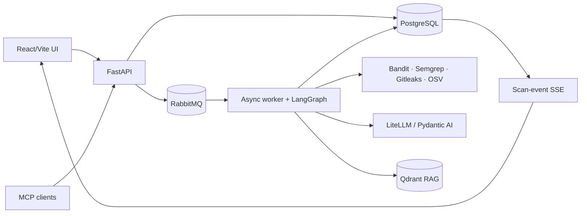

# Architecture overview

SCCAP combines deterministic security scanners and LLM-based analysis behind a resumable,
operator-approved scan lifecycle.



## Runtime modules

- **FastAPI module** — authentication, setup, submissions, approvals, cancellation, result/query
  interfaces, administration, SSO/SCIM/WebAuthn, chat, compliance, MCP, and event streaming.
- **Worker module** — consumes submission/approval notifications and runs resumable LangGraph
  threads. Up to three analysis workflows may run concurrently in one worker process.
- **PostgreSQL adapter** — authoritative application records, outbox, durable tasks, findings,
  artifacts, snapshots, audits, and LangGraph checkpoints.
- **RabbitMQ adapter** — delivery notification for new and resumed scan work; database state remains
  authoritative.
- **Qdrant adapter** — dense+sparse framework retrieval using the pre-bundled FastEmbed model.
- **Scanner adapters** — isolated subprocess wrappers that stage selected source and parse bounded,
  allowlisted output.
- **React module** — handcrafted CSS/UI primitives, TanStack Query, React Router, Axios, React Flow,
  and feature-gated pages. Ant Design is not installed.

## Data ownership

| Data | Owner |
| --- | --- |
| Users, identity links, tenants, groups | PostgreSQL auth/identity tables |
| Projects and scan configuration | PostgreSQL Project/Scan records |
| Original and remediated source | SourceCodeFile + CodeSnapshot records |
| Workflow progress | Scan status, ScanEvent, ScanTask, LangGraph checkpoints |
| Findings and provenance | Finding buckets + ScanArtifact lineage |
| LLM prompts, outputs, usage, cost | LLMInteraction |
| Framework knowledge | PostgreSQL metadata + Qdrant vectors |
| Scanner rule catalog | PostgreSQL Semgrep source/rule/sync records |

## Reliability model

Submission, approval/decline, and manual run-control atomically write their scan changes, audit
events, cleanup where applicable, and ScanOutbox intent, then return without contacting RabbitMQ.
Cancellation atomically writes its terminal status and event. A background sweeper is the sole
publisher and retries unpublished rows. Compare-and-set claims reject racing or duplicate lifecycle
decisions before they can create duplicate dispatch work.

LangGraph checkpoints and ScanTasks make deep analysis resumable. ScanEvents provide replayable
activity to the SSE interface. Cancellation is cooperative: API state becomes authoritative and
worker stages must observe it before performing further work.

All scan-status writers use the transition policy in `shared/lib/scan_status.py`; terminal states
have no normal exits. Each successful graph node persists its registered node identifier in
`WorkerState.completed_stages` with the same checkpoint as its outputs. Resume retains that durable
thread, while restart deletes it before starting over.

## Security and tenancy

- Bearer JWT access and refresh tokens back password authentication.
- OIDC and SAML providers, SCIM provisioning, WebAuthn credentials, and forced-SSO domains are
  implemented and feature/configuration gated where applicable.
- Fernet encryption protects persisted LLM and SMTP secrets.
- Tenant scope and group-derived visible-user scope must pass through every user-owned list query.
- Correlation identifiers propagate from HTTP requests through messages and worker logs.
- Audit records include ScanEvents, LLMInteractions, finding disposition events, and auth audit
  events.

## Scan workflow

The implemented sequence is:

```text
retrieve → classify → deterministic prescan
  → optional prescan approval
  → profiling estimate → profiling approval → profile
  → analysis estimate → cost approval
  → durable parallel analysis → persist raw LLM findings
  → durable per-file consolidation → deterministic global consolidation
  → optional cross-file validation
  → deterministic patch planning → optional remediation promotion
  → patch verification
  → consolidated results → report + lineage artifact
```

See [Data Flow](data-flow.md) for transaction, event, and limitation details.

## Feature packaging

Installation variants seed a runtime feature catalog rather than separate application builds. Scan
is always enabled. Chat, compliance, users/groups, SSO, SCIM, multi-tenancy, email, observability,
MCP, and admin authoring may be enabled according to dependency rules.

## Current verification posture

CI currently enforces backend formatting/lint, the focused replacement unit suite, frontend
compilation, dependency lock consistency, security checks, and Docker image construction. A strict
documentation build and generated OpenAPI drift check are not yet CI gates. Broader database,
worker, browser, tenancy, and event-stream coverage is still being added at verified production seams.
